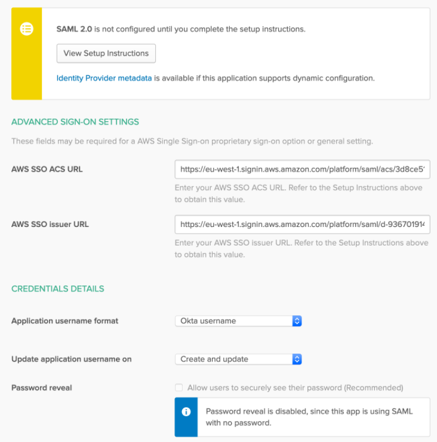
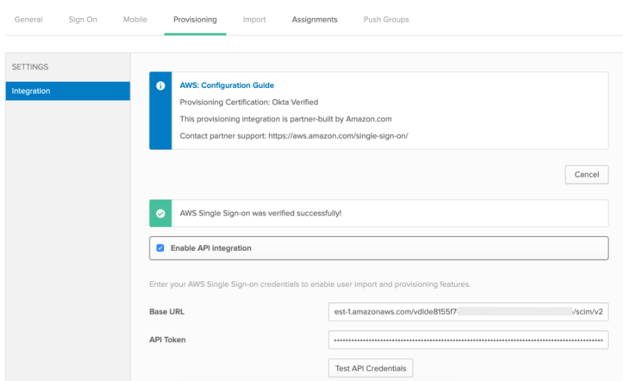
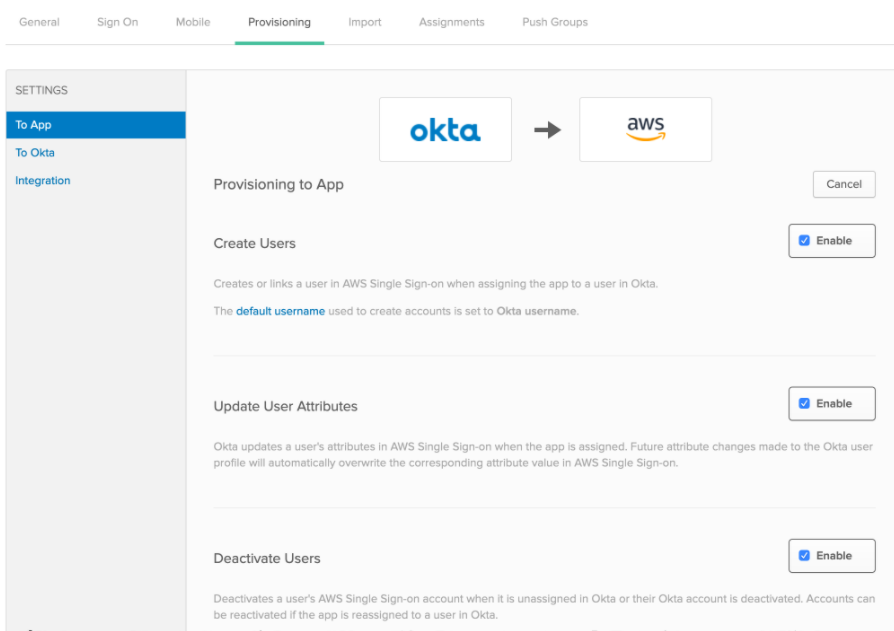

Okta AWS SSO Configuration
==========

Below are steps to create an application with aws sso.

1. Login to Okta portal.
2. Browse App Catalog.

.. figure:: ../../../_assets/configuration/aws-sso/browse_app.PNG
   :alt: aws sso
   :width: 60%

3. Search with AWS Single Sign-on.

.. figure:: ../../../_assets/configuration/aws-sso/aws_single_signon.PNG
   :alt: aws sso
   :width: 60%

4. Add General Settings, like Label etc.

.. figure:: ../../../_assets/configuration/aws-sso/aws_add.PNG
   :alt: aws sso
   :width: 80%

5. In Okta select the Sign On tab for the AWS Single Sign-On SAML app, then click Edit:

::

    Enter your AWS SSO ACS URL and AWS SSO issuer URL values you made a copy of in Previous steps into the corresponding fields.

    Application username format: Select one of the options from the dropdown menu.

    Note: All users in AWS SSO require a unique username, so the mapped value should be unique within your organization.

    Click Save:
    

    
click Save to complete the configuration.

6. Configuring Automatic Provisioning

click on Provisioning tab under the AWS SSO Application. select Enable API Integration. Then copy / paste the values Base URL (paste the value copied in AWS Single Sign-On Console SCIM endpoint) and API Token (paste the value copied AWS Single Sign-On Console Access token). be sure to remove the trailing / at the end of the URL. The URL ends with scim/v2

7. click Test API Credentials to verify everything works as expected. Then I click To App to enable users creation, update, and deactivate.

