Setting up HTTPS certificates on AWS
================================

With AWS Certificate Manager (ACM) you can provision and manage SSL/TLS certificates for your AWS based websites and applications. You use ACM to create or import and then manage a certificate.

Pre-requisite
--------

You need to have:

1. AWS account with required access to the resources
2. Register Domain names
3. Load Balancer
4. Route 53

Register Domain names
------------------

A fully qualified domain name (FQDN) is the unique name of an organization or individual on the Internet followed by a top-level domain extension such as .com or .org. If you do not already have a registered domain name, you can register one through Amazon Route 53.

When you want to get a new domain name, such as the example.com part of the URL http://example.com, you can register it with Amazon Route 53.

Reference link : https://docs.aws.amazon.com/Route53/latest/DeveloperGuide/registrar.html

AWS Certificate Manager (ACM)
----------------

This service is for enterprise customers who need a secure web presence using TLS. ACM certificates are deployed through Elastic Load Balancing, Amazon CloudFront, Amazon API Gateway, and other integrated AWS services. The most common application of this kind is a secure public website with significant traffic requirements.

Request a certificate by filling below details::

    Domain names : Fully qualified domain name
    Validation method : Select a method for validating domain ownership
    Key algorithm : Key algorithm

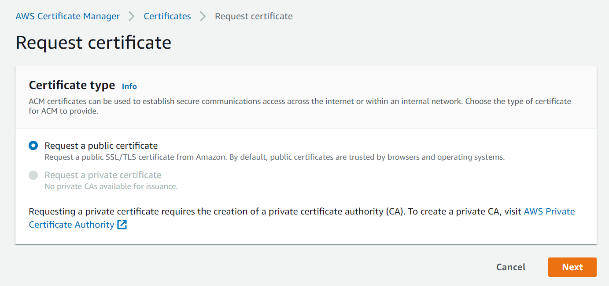
   
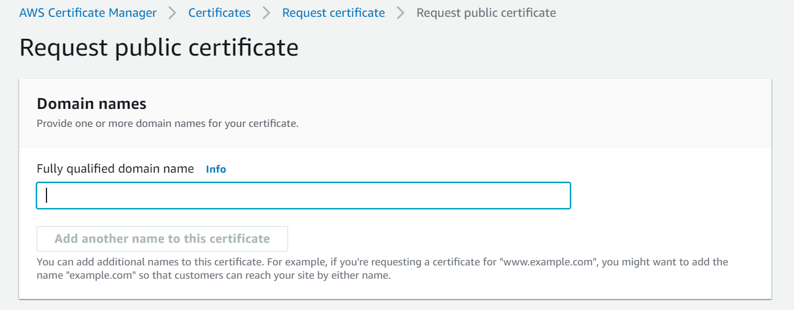
   
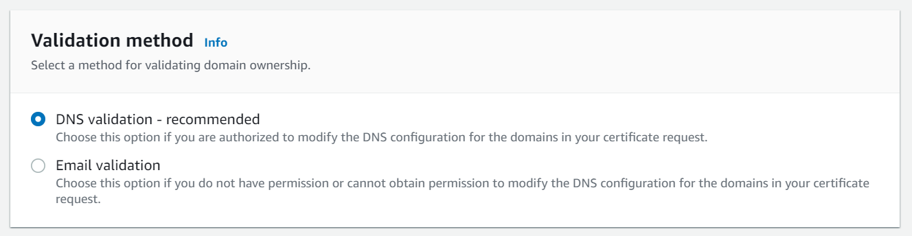
   
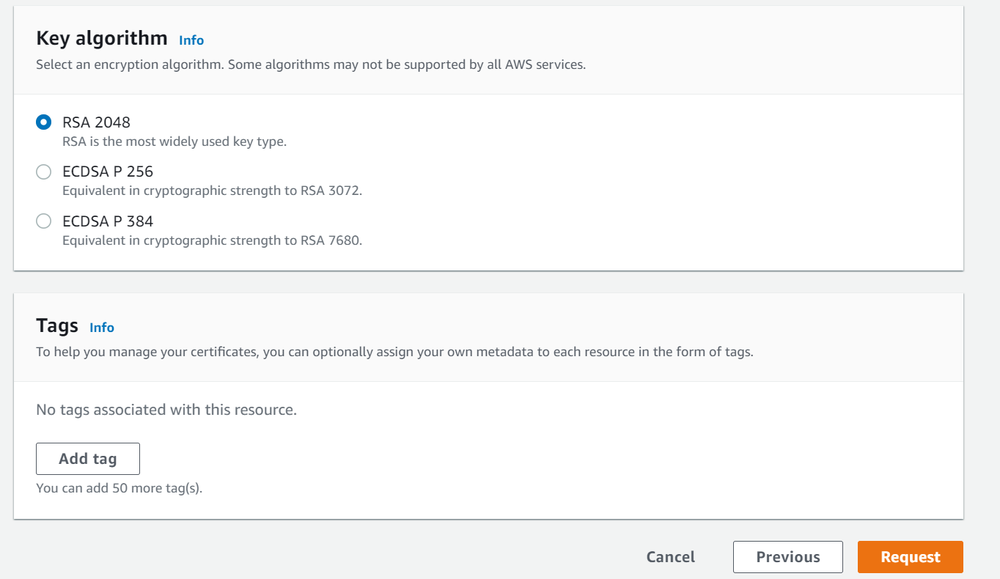

Create a Load Balancer
------

Create a Load Balancer and configure target group with Fire Insights running on that instance.

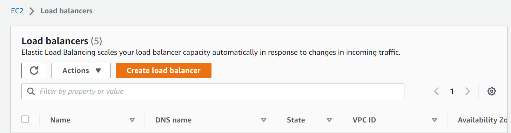

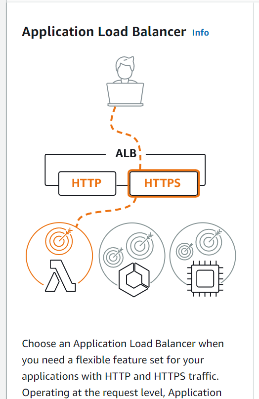
   
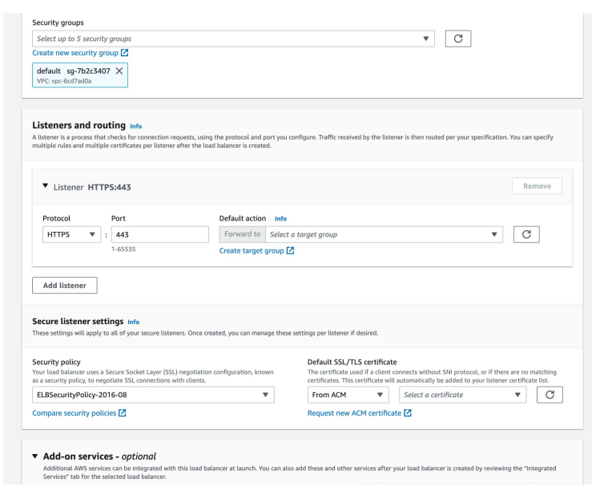
   
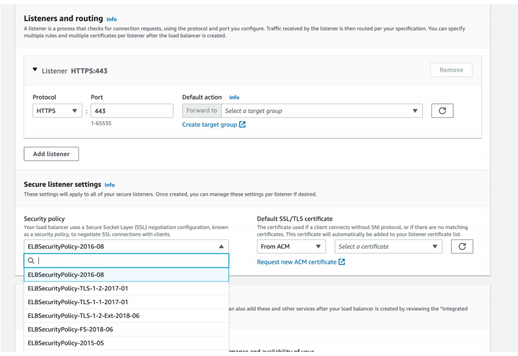
   
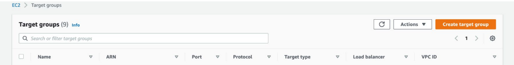
   
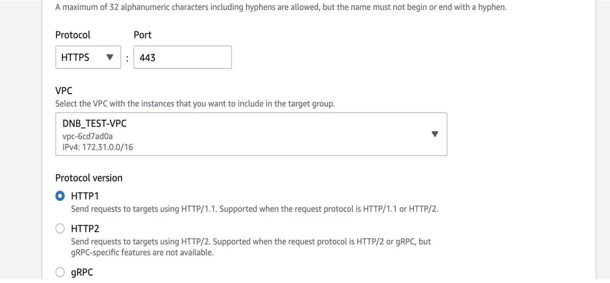
   
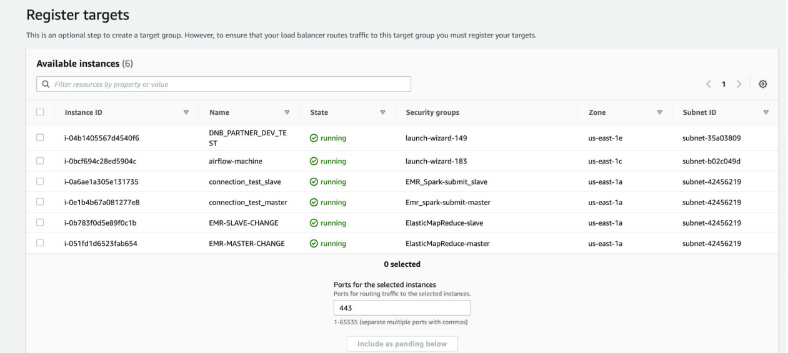

Create a record and map to the Load Balancer
-----------------------------------
 
Goto Route 53 to create a record and map to the Load Balancer.

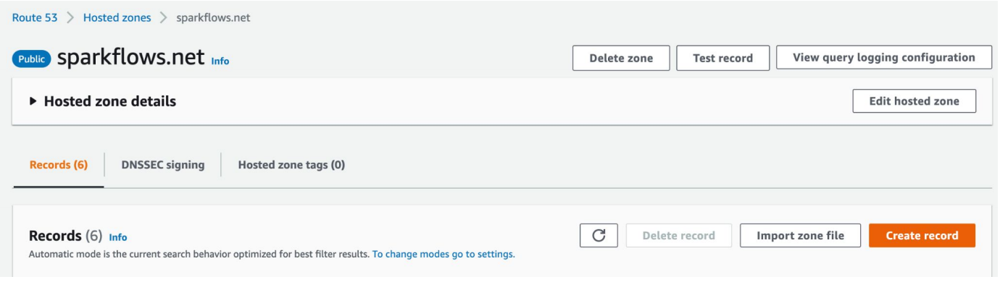
   
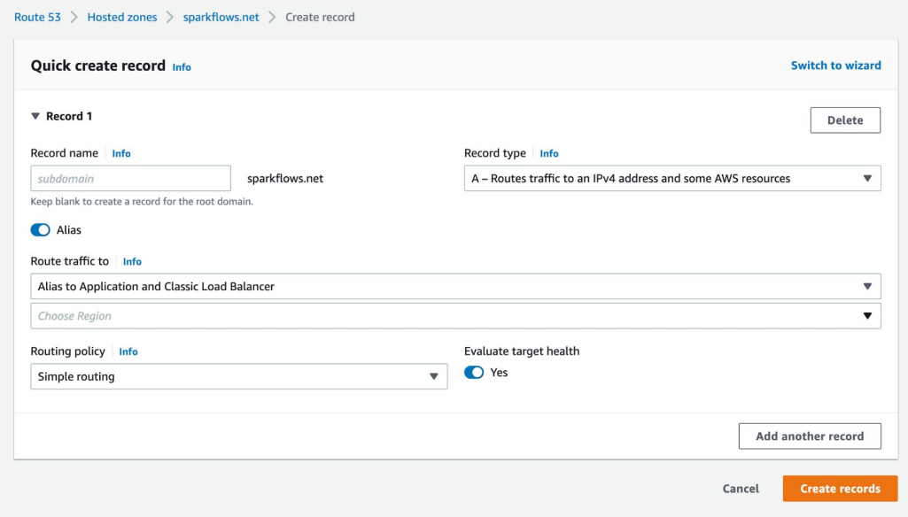
   
Once the above steps got successfully updated, you can login to Domain name with ``HTTPS`` and able to access Fire Insights application.

.. note:: Above steps verified with Fire Insights running on HTTPS(443) on port 8443
