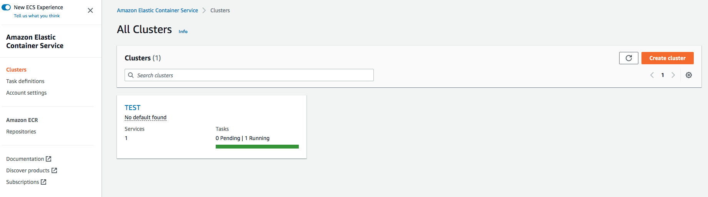
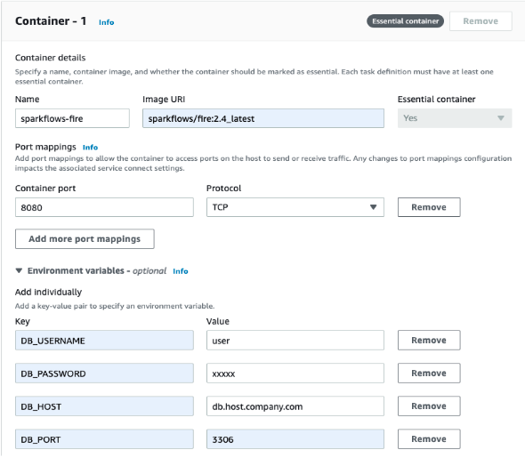
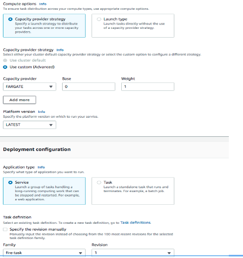
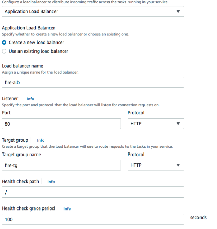
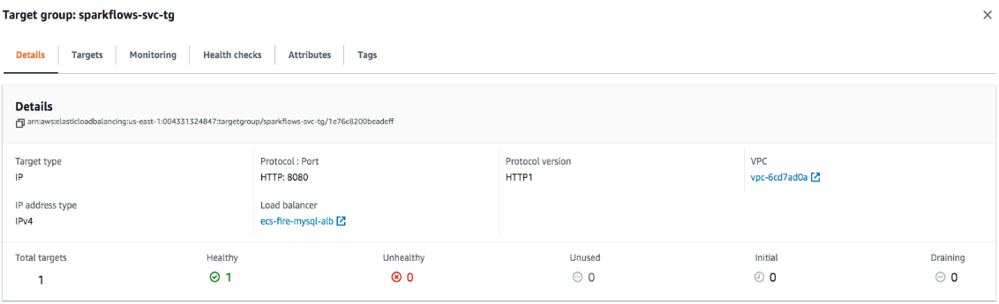
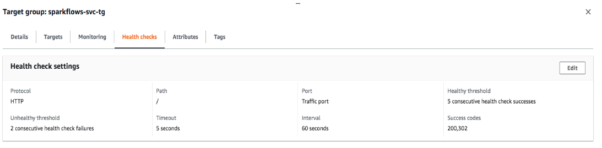
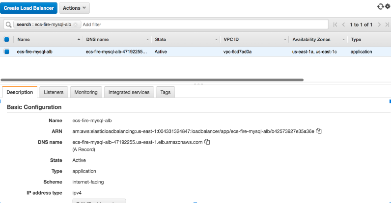

Fire Insights Deployment on ECS Fargate
=======================================

Follow the below steps to configure the task, service, application load balancer and task groups to run Fire Insights on ECS Fargate.

Pre-requisite
--------

You need to have an AWS account with required access to the resources.

ECS CLuster
----------

Create the ECS cluster wih VPC and security group. (Any pre-existing ECS cluster can also be used for this purpose).

Task Definition
--------------
Create the task by attaching the **ecsTaskExecutionRole** with all the policies and image name.

Add the ENV variable to use external MySQL otherwise the task will create and use the H2 database, by default. Also, an external database is mandatory when multiple replicas of the same task are running.

**Tasks deployed on container would run the following processes:**
 Web Server : Main fire UI and Fire Process : Helper processes for spark jobs

   

Service
-------
Deploy the service by selecting the tasks, application load balancer and target groups.

   

**Application Load Balancer:**

1. Internet facing ALB listens to port 80.
2. Container running the Fire task listens to port 8080.
3. In target group, map the target port to 8080.
   

   
**Target Group:**

 
Target type is IP and and target port is 8080.
 
 

   

Health is checked with path / and success code 200, 302.
  

Service is deployed with containers running the tasks, ALB and target group.

      

Use the DNS name from the running application load balancer.
  
  
  

