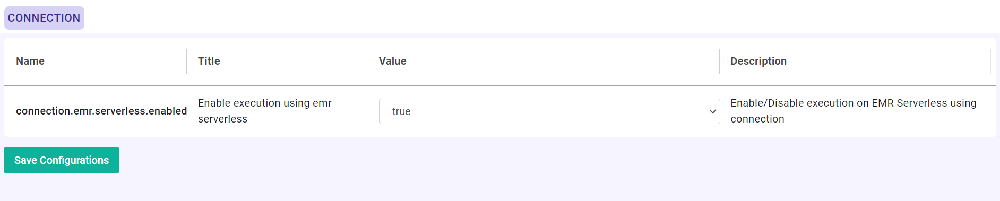
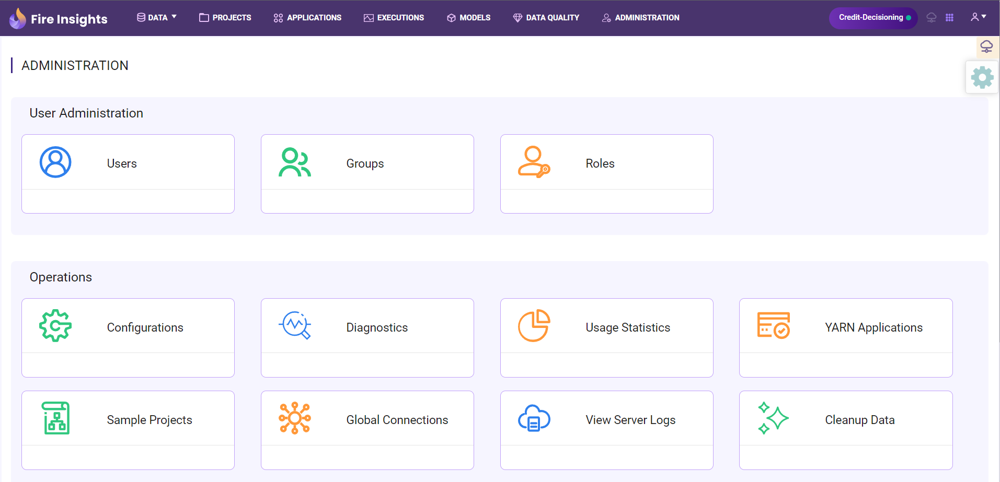
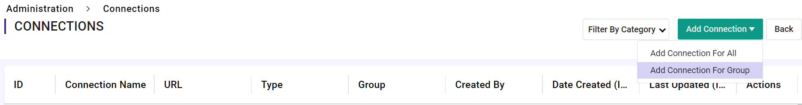
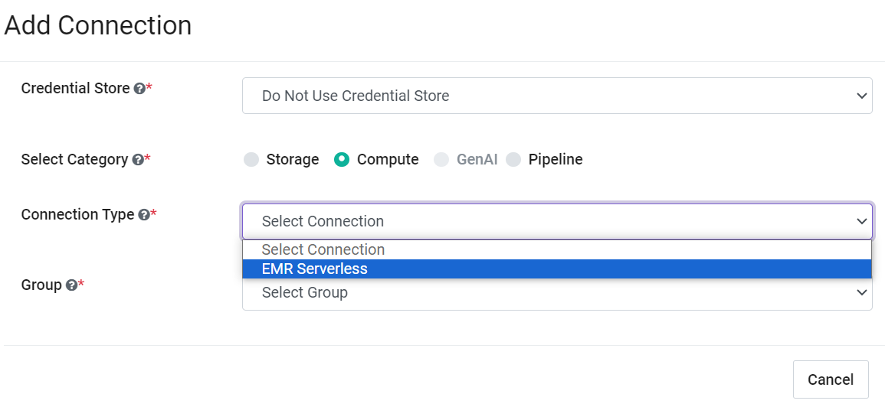
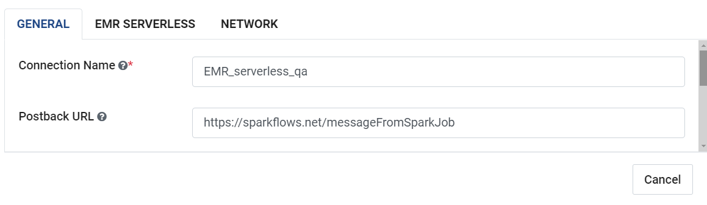
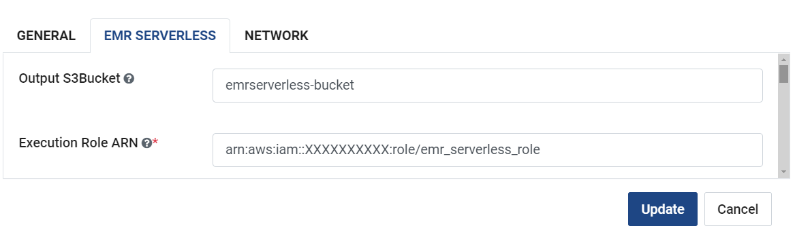
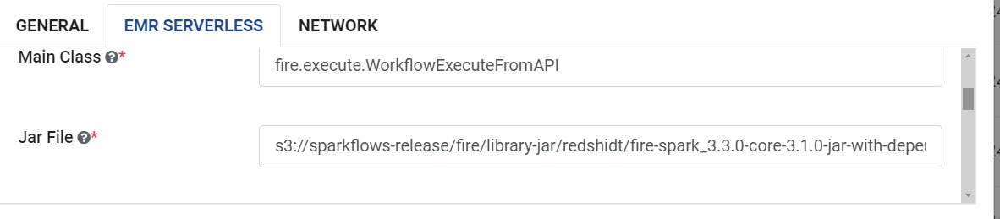
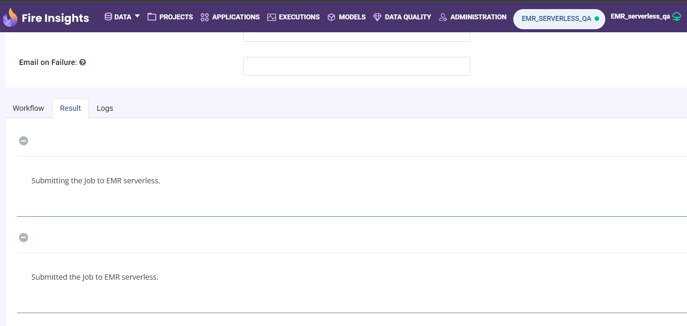
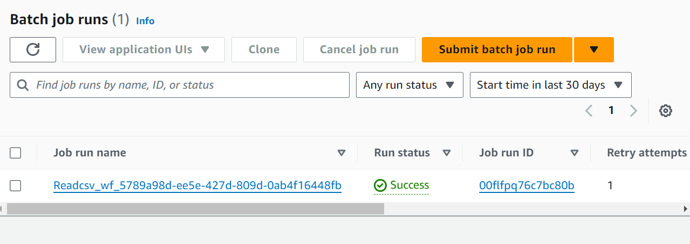

Amazon EMR Serverless Connection
============

Sparkflows enables you to create "Amazon EMR Serverless Connection" and use it to submit Spark Job. Connections can be at various levels:

  * Global  : Everyone has access to these connections.
  * Group   : Users belonging to the group have access to these connections.
  * Project : The owner of the project and the groups with which the project has been shared with have access to the project level connections.

This page show how to create a "Amazon EMR Serverless Connection" in Fire Insights.

Enable Amazon EMR Serverless Connection in Sparkflows
===========

Login to ``Sparkflows`` application -> ``Administration`` -> ``Configurations`` -> ``Connection`` -> and enable Airflow by setting the below parameter:

::

    connection.emr.serverless.enabled		: true

Navigate to Add Connections
===========

Once you save the above Configuration, navigate to ``Administration`` -> ``Global Connections`` -> ``Add Connections`` as shown below:

   
Add connection for group
========

Navigate to ``Administration`` -> ``Global Connections`` -> ``Add Connections`` -> ``Add Connection For Group`` which pop up a new windows -> Select ``Compute`` and other parameters as shown below:

Add additional parameters as per your environment
======

Once you have selected  the connection type & groups, add the additional connection parameters needed. For more details refer the following tables and images:

For GENERAL tab
++++

.. list-table:: 
   :widths: 10 20 30
   :header-rows: 1

   * - Title
     - Description
     - Value
   * - Connection name
     - Connection Name
     - Name of Connection
   * - Postback Url
     - Postback Url
     - Postback Url through which Airflow sent result back to Fire Insights
   * - Title 
     - Title of Selected Connection
     - Title of Selected Connection  
   * - Description 
     - Connection Description 
     - Connection Description

For EMR SERVERLESS tab
++++++
.. list-table:: 
   :widths: 10 20 30
   :header-rows: 1

   * - Title
     - Description
     - Value
   * - Output S3Bucket
     - Auth Type
     - The bucket to use for storage and logs
   * - Execution Role ARN
     - Execution Role ARN
     - The Execution Role ARN while submitting Spark job
   * - Main Class
     - Main Class to Exceute
     - fire.execute.WorkflowExecuteFromAPI
   * - Jar File
     - The Entrypoint for Spark Job
     - The Entrypoint for Spark Job
   * - Release Label
     - The EMR Release associated with application
     - EMR 6.9.0
   * - Application Type
     - The Type of Application to start
     - SPARK
   * - Spark Config
     - The Spark config parameter
     - The Spark config parameter
   * - Jars
     - Environment Name
     - Environment Name of aws mwaa resources
   * - Files 
     - Environment Name
     - Environment Name of aws mwaa resources
   * - Custom EMR Image URI 
     - Environment Name
     - Environment Name of aws mwaa resources

For NETWORK tab
++++

.. list-table:: 
   :widths: 10 20 30
   :header-rows: 1

   * - Title
     - Description
     - Value
   * - Subnet Ids
     - Subnet Ids
     - Subnet Ids for accessing EMR SERVER LESS
   * - Security Group Ids
     - Security Group Ids
     - Security Group Ids for accessing EMR SERVER LESS

.. figure:: ../../../_assets/aws/emrserverless/emrserverless_13.png
         :alt: emrserverless
         :width: 60%

.. note:: Make sure that ``Subnet Ids & Security Group Ids`` created in previous steps being used here and it should have ecs or ec2 machine where Fire Insigts application running have access to it.

Submit Job on Amazon EMR Serverless
=========

Now you have Amazon EMR Serverless Connection ready, you can submit the Spark job and see response back to UI and Validate same from AWS Console.

.. figure:: ../../../_assets/aws/emrserverless/emrserverless_15.png
         :alt: emrserverless
         :width: 60%

