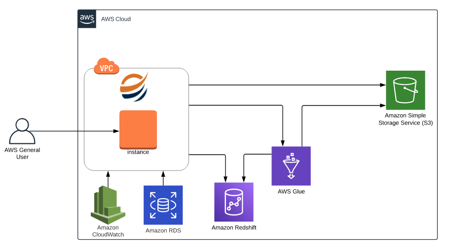

Architecture diagram
=================

Sparkflows can be configured to AWS Glue cluster with the aid of architecture diagram as below:

   

The above architecture depicts the below steps::

1. Sparkflows is installed on an EC2 instance.
2. Users create Analytics and Data Prep workflows via a web interface.
3. Sparkflows submits the job onto AWS Glue through Rest API.
4. It reads in data from AWS S3.
5. The jobs running on AWS Glue also send back results to Sparkflows via HTTP.
6. IAM Roles is used to access AWS Glue, S3, etc.
