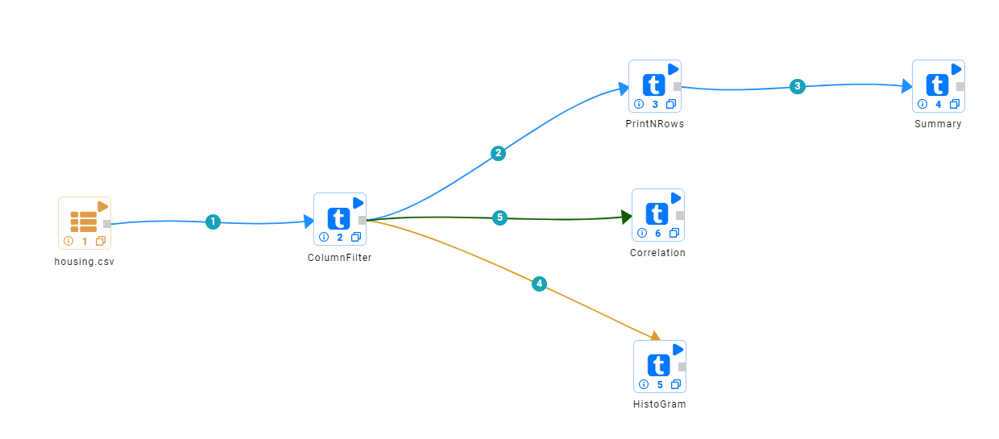
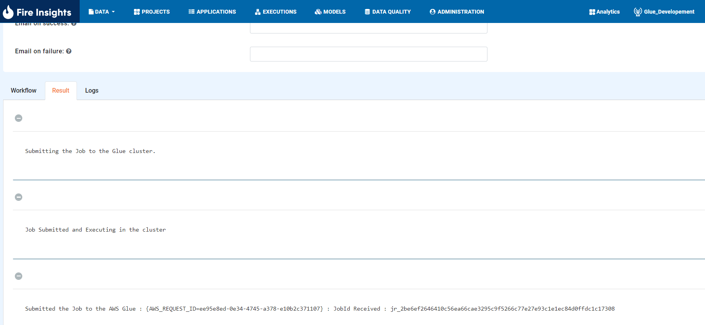
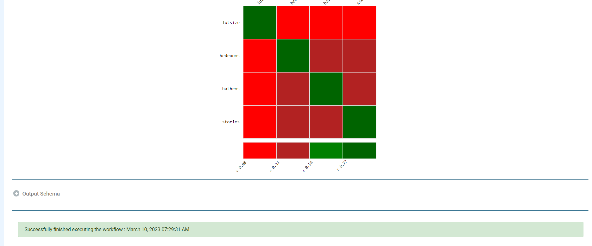
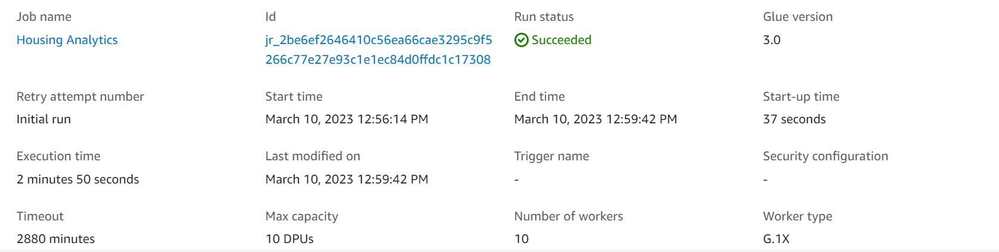

Fire Configurations & Job Submission on AWS Glue
==========================

After you have successfully established a connection between EC2 Machine on which Fire Insights is running and AWS Glue, you are now ready to create connection for Glue in Fire Insights and create workflow and submit the job on AWS Glue.

**1. Login to Fire Insights application and Create Glue Connection.**

Refer the below page for connecting Fire Insights to AWS Glue:

https://docs.sparkflows.io/en/latest/installation/connection/compute-connection/glue.html

**2. Create workflow in Fire.**

You can go inside any project to create a Housing Analytics workflow in Fire which reads from S3 bucket doing some filter and calculations and save the workflow.

.. note:: Make sure that data reading from S3 in workflow should be accessible.

**3. Submit the Job.**

After saving Housing Analytics workflow, you can execute the job which will be submitted on AWS Glue Cluster using connection dropdown and you will see response in Fire Insights.

.. note::  Make sure to use Glue Connection while Execution.   

**4. Verify the Job on AWS Glue Cluster.**

Now, you may verify the Job run on Fire Insights from AWS Glue Job by accessing the AWS Portal.

   
