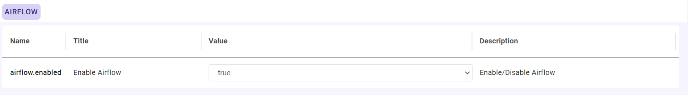
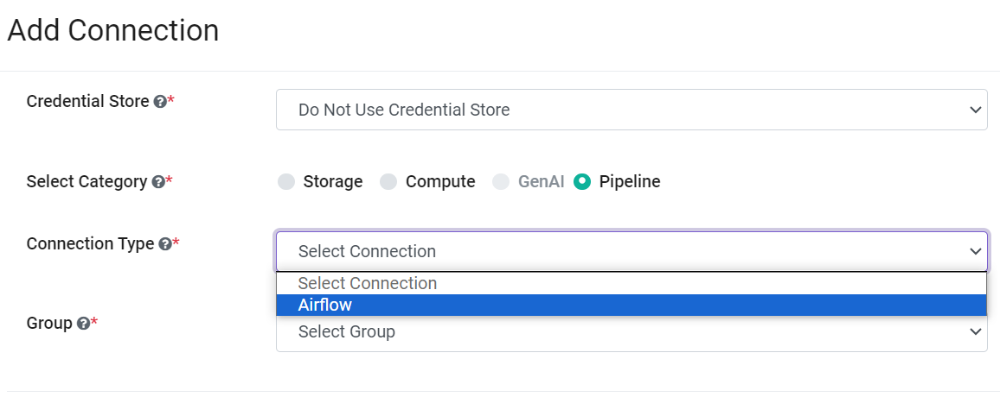
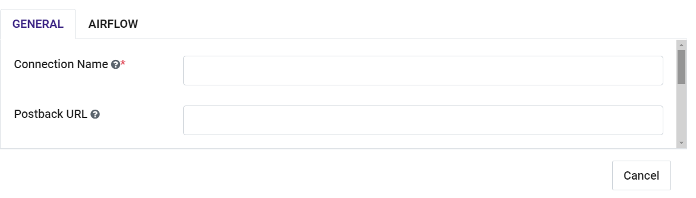
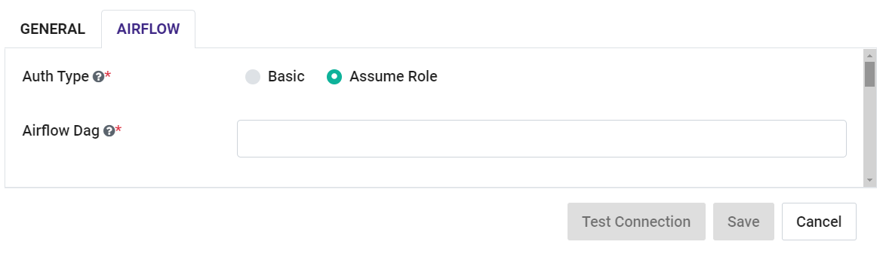

Airflow Connection
--------------

Sparkflows enables you to create "AWS MWAA Airflow Connection" and use it to submit Pipeline. Connections can be at various levels:

  * Global  : Everyone has access to these connections.
  * Group   : Users belonging to the group have access to these connections.
  * Project : The owner of the project and the groups with which the project has been shared with have access to the project level connections.

This page show how to create a "Livy Connection" in Fire Insights.

Enable Airflow in Sparkflows
===========

Login to ``Sparkflows`` application -> ``Administration`` -> ``Configurations`` -> ``Connection`` -> and enable Livy connection by setting the below parameter:

::

    airflow.enabled	: true

Navigate to Add Connections
===========

Once you save the above Configuration, navigate to ``Administration`` -> ``Global Connections`` -> ``Add Connections`` as shown below:

.. figure:: ../../../_assets/aws/livy/administration.png
   :alt: livy
   :width: 60%
   
Add connection for group
========

Navigate to ``Administration`` -> ``Global Connections`` -> ``Add Connections`` -> ``Add Connection For Group`` which pop up a new windows -> Select ``Compute Connection`` and other parameters as shown below:

.. figure:: ../../../_assets/aws/mwaa/mwaa-addconnection.png
   :alt: mwaa
   :width: 60%

Add additional parameters as per your environment
======

Once you have selected  the connection type & groups, add the additional connection parameters needed. For more details refer the following tables and images:

For GENERAL tab
++++

.. list-table:: 
   :widths: 10 20 30
   :header-rows: 1

   * - Title
     - Description
     - Value
   * - Connection name
     - Connection Name
     - Name of Connection
   * - Postback Url
     - Postback Url
     - Postback Url through which Airflow sent result back to Fire Insights
   * - Title 
     - Title of Selected Connection
     - Title of Selected Connection  
   * - Description 
     - Connection Description 
     - Connection Description

For AIRFLOW tab
++++++
.. list-table:: 
   :widths: 10 20 30
   :header-rows: 1

   * - Title
     - Description
     - Value
   * - Auth Type
     - Auth Type
     - Assume Role
   * - Airflow Dag
     - Airflow Dag
     - Airflow Dag path configured in AWS MWAA
   * - Airflow Endpoint URL
     - Airflow Endpoint URL
     - Airflow Endpoint URL in AWS MWAA
   * - Airflow IAMRole
     - Airflow IAMRole
     - Airflow IAMRole being assume for accessing aws mwaa resources
   * - Airflow Jar Location
     - Airflow Jar Location
     - Fire Core Jar Location path added in s3
   * - Airflow Python Script Location
     - Airflow Python Script Location
     - Fire Python Script Location path added in s3
   * - AWS Region
     - AWS Region
     - AWS Region of aws mwaa resources
   * - Environment Name
     - Environment Name
     - Environment Name of aws mwaa resources

.. note:: Make sure that ``Execution role`` role attached with Amazon MWAA should assumed by ``ecs, ec2 instance`` where Fire Insights application is running

Test and Save Airflow Connection
===========

Once the Updated Parameter is added, you can ``Test Connection`` & ``Save`` it.

.. figure:: ../../../_assets/aws/mwaa/mwaa_testconnection.png
   :alt: mwaa
   :width: 60%

