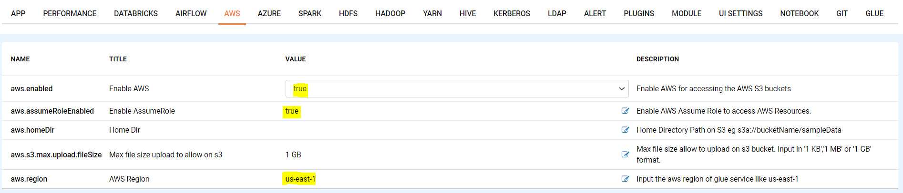
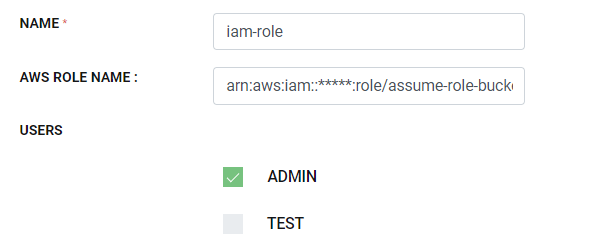
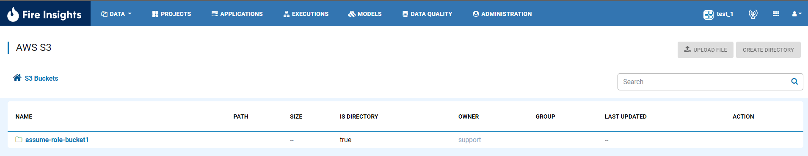

Fire Configurations for Assuming Role
==============

Now you have IAM Assume role set up ready, so you can configure in the Fire Insights.

1. Login to Fire Insights application and go inside Configurations

Once you login to Fire Insights application Click on ''ADMINISTRATION'' tab on top, it will take you to configuration page, on clicking, it will take to configuration page.

.. figure:: ../../_assets/aws/glue/config.PNG
   :alt: aws
   :width: 60%

2. Update below parameter as per our configurations

Now update below parameter as per AWS configurations

.. list-table:: 
   :widths: 10 20 30
   :header-rows: 1

   * - Title
     - Description
     - Value
   * - Enable AWS
     - Enable AWS for accessing the AWS S3 buckets
     - true
   * - Enable AssumeRole
     - Enable AWS Assume Role to access AWS Resources
     - true
   * - Home Dir
     - Home Directory Path on S3 
     - s3a://bucketName/sampleData 
   * - AWS Region
     - As per resource in the region
     - Input the aws region

3. Create/Update Group in Fire Insights

Copy the ''ARN'' set up for assume role in AWS IAM Role and Update in ''AWS ROLE NAME'' text field.

::

    arn:aws:iam::<account-1-id>:role/assume-role-bucket1
    
    

Once the Group is attached to any User in Fire Insights application, save the Configurations.

4. Open DATA/AWS S3, you will see the S3 Bucket added for Assume Role will be Listed.

Now you can use it for Creating workflow in the Node.

