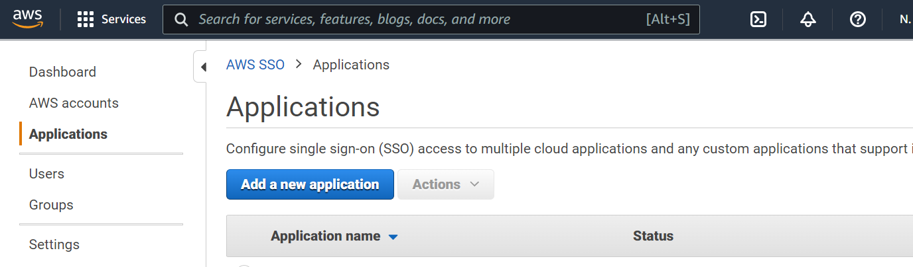

Application
=======

Now both aws sso/Okta Configured successfully.

you can Configure single sign-on (SSO) access to cloud applications and any custom applications that support identity federation with SAML 2.0.

Below are steps involved in it:

1. Login to Aws Console.
2. Open AWS Single Sign-On service and click on Applications.

3. Add a custom SAML 2.0 application

Configure Custom SAML 2.0 application with some details:

