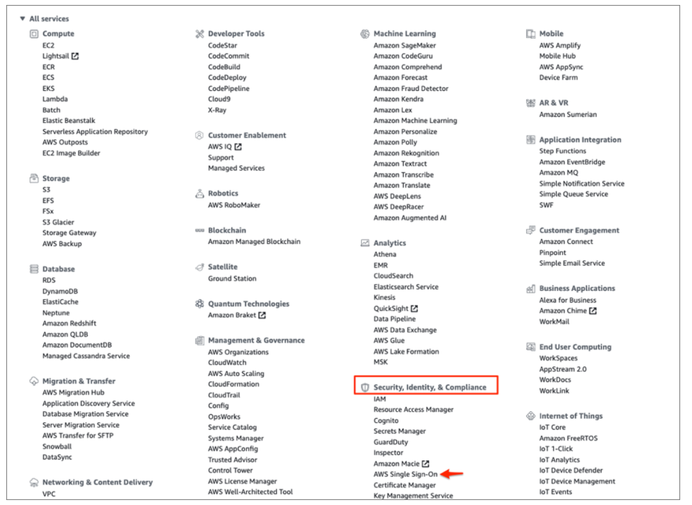

Configuration Steps
===========

Below are Configurations Steps on how to Configure Aws SSO.

1. Log in to the AWS Management Console.
2. Navigate to Security, Identity, & Compliance > AWS Single Sign-On:

   
   
3. Click Enable AWS SSO:
4. Select Settings:
5. Under Identity source, select Change:
6. Enter the following:
::

    Select External identity provider.
    Click Show individual metadata values.
    Make a copy of the AWS SSO Sign-in URL, AWS SSO ACS URL, and AWS SSO issuer URL values. These values will be used later on.
    IdP SAML metadata: Save the following file as metadata.xml, then upload it into AWS.
    Click Next: Review.
    
7. Review the list of changes. Once you are ready to proceed, type CONFIRM, then click Change identity source.    
    
