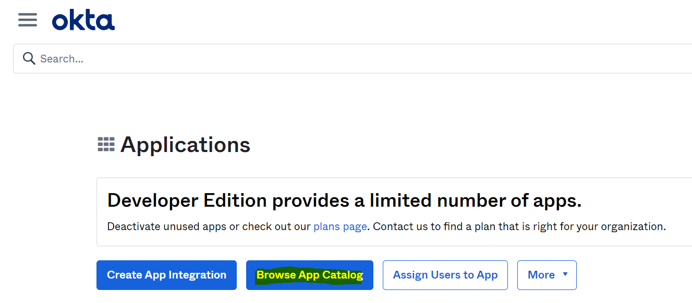
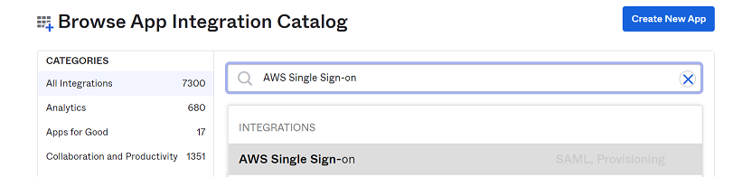
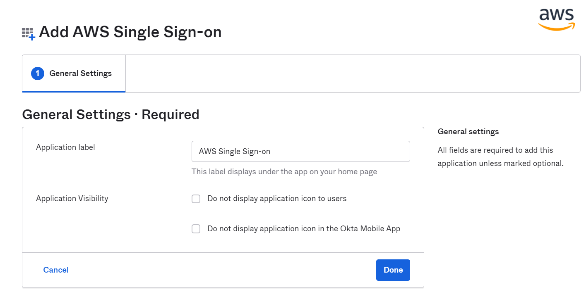
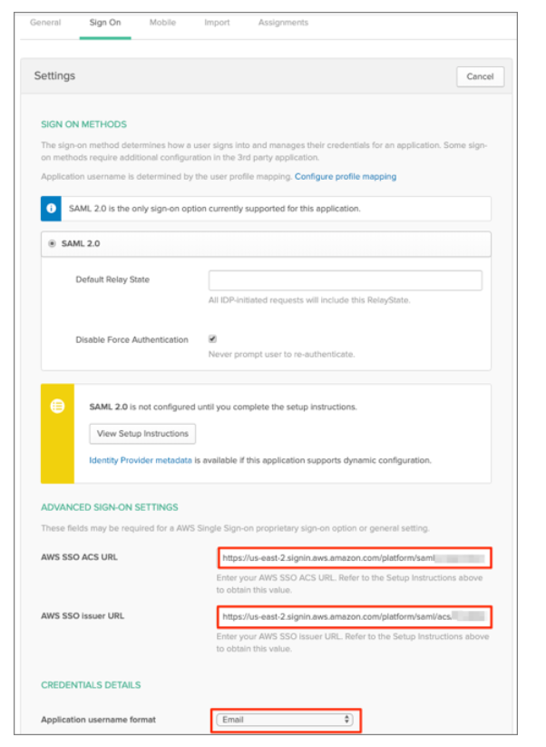

Okta AWS SSO Configuration
==========

Below are steps to create an application with aws sso.

1. Login to Okta portal.
2. Browse App Catalog.

3. Search with AWS Single Sign-on.

4. Add General Settings, like Label etc.

5. In Okta select the Sign On tab for the AWS Single Sign-On SAML app, then click Edit:

::

    Enter your AWS SSO ACS URL and AWS SSO issuer URL values you made a copy of in Previous steps into the corresponding fields.

    Application username format: Select one of the options from the dropdown menu.

    Note: All users in AWS SSO require a unique username, so the mapped value should be unique within your organization.

    Click Save:
    

    
