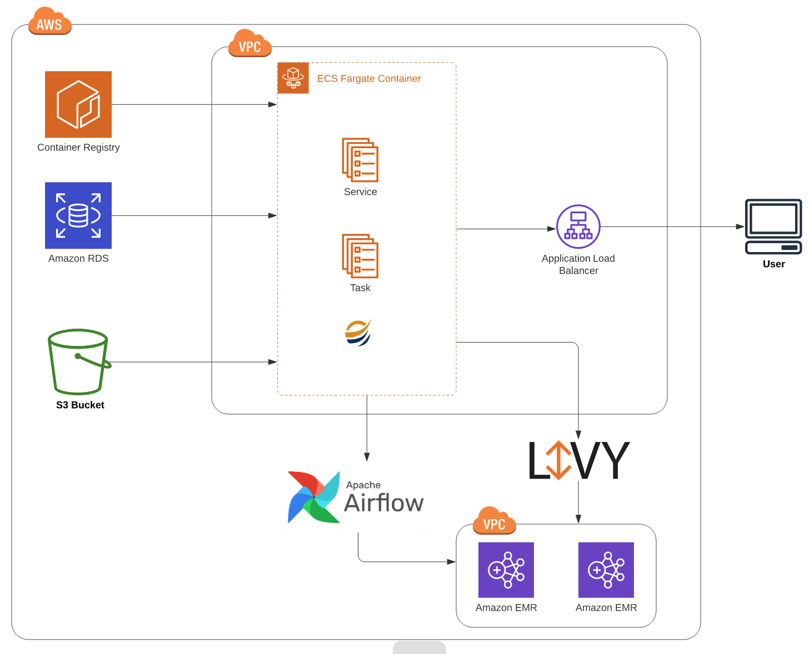

Overivew And Architecture
=========================

Fire Insights deployment on ECS Fargate.

   

1. Fire Insights tasks running on ECS Fargate containers.
2. Metadata stored in RDS MySql instance.
3. In web interface create workflows, pipelines etc with interactive executon.
4. worfklows and pipelines are executed on EMR Cluster through livy/airflow.
