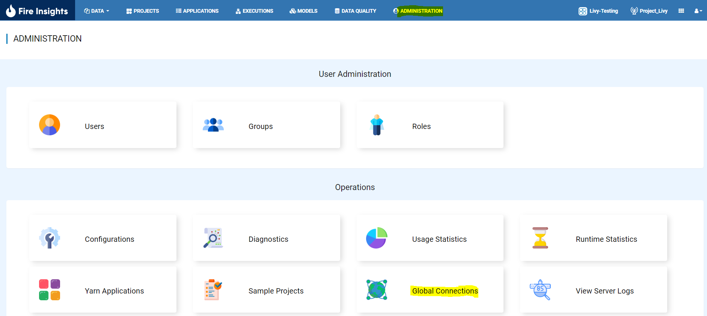
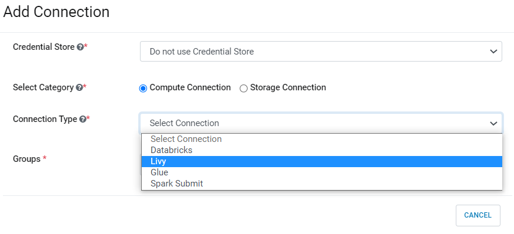
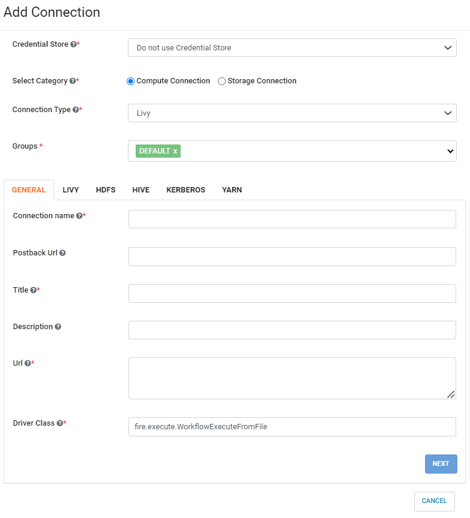
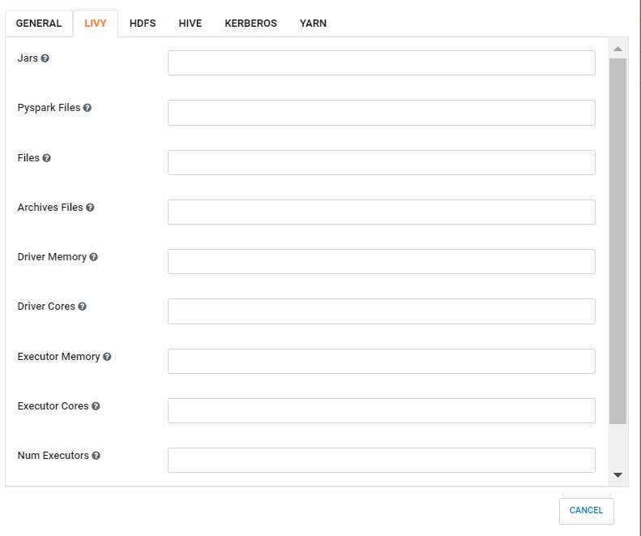

EMR LIVY CONNECTION
=============

Fire Insights enable you to create Livy Connection and use the Connection to submit the Job.

Below are steps on how to create Livy Connection in Fire Insights.

1. Login to Fire Insights application and go inside Global Connections

Once you login to Fire Insights application Click on ''ADMINISTRATION'' tab on top, it will take you to Global Connections page, on clicking, it will take to configuration page.

   
2. Add Connection For Group

Once on Global Connections page Click on ''Add Connection For Group'' which pop up a new windows with Different ``Compute & Storage`` Connection, Select Compute Connection.

.. figure:: ../../_assets/aws/livy/add_connection.PNG
   :alt: livy
   :width: 60%
   

   
3. Update below parameter as per your Configurations

Once you Selected ''Connection Type & Groups'', Add the Connection parameters needed.

For GENERAL tab :

.. list-table:: 
   :widths: 10 20 30
   :header-rows: 1

   * - Title
     - Description
     - Value
   * - Connection name
     - Connection Name
     - Name of Connection
   * - Postback Url
     - Postback Url
     - Postback Url through which Livy sent result back to Fire Insights
   * - Title 
     - Title of Selected Connection
     - Title of Selected Connection  
   * - Description 
     - Connection Description 
     - Connection Description
   * - Url
     - Url for selected COnnection type
     - Add URL for Livy Connection
   * - Driver Class
     - Driver Class for selected Connection type 
     - it Comes with default value  
     

For LIVY tab :

.. list-table:: 
   :widths: 10 20 30
   :header-rows: 1

   * - Title
     - Description
     - Value
   * - Jars
     - Jars to be used in emr livy session
     - Jars path located in S3 Location
   * - Pyspark Files
     - Pyspark Files to be used in emr livy session
     - Pysaprk file located in S3 Location  
   * - Files
     - Files to be used in emr livy session
     - Any Files if needed
   * - Archives Files
     - Archives Files to be used in emr livy session
     - Value  
   * - Driver Memory 
     - Driver Memory to be used in emr livy session
     - Driver Memory if any specific memory you need to pass
   * - Driver Cores
     - Driver Cores to be used in emr livy session
     - Driver Cores if any specific Cores you need to pass  
   * - Executor Memory
     - Executor Memory to be used in emr livy session
     - Executor Memory if any specific Executor Memory you need to pass  
   * - Executor Cores
     - Executor Cores to be used in emr livy session
     - Executor Cores if any specific Executor Cores you need to pass  
   * - Num Executors
     - Num Executors to be used in emr livy session
     - Num Executors if any specific Num Executors you need to pass  
     

For HDFS tab :

.. list-table:: 
   :widths: 10 20 30
   :header-rows: 1

   * - Title
     - Description
     - Value
   * - NameNode URI
     - NameNode URI 
     - NameNode URI for HDFS
   * - Home Dir
     - Home Dir under which various directories exist
     - Value  
 
.. figure:: ../../_assets/aws/livy/add_hdfs.PNG
   :alt: livy
   :width: 60%

For HIVE tab :

.. list-table:: 
   :widths: 10 20 30
   :header-rows: 1

   * - Title
     - Description
     - Value
   * - JDBC Driver
     - JDBC Driver
     - JDBC Driver for Hive
   * - JDBC DB URL
     - JDBC DB URL
     - JDBC DB URL for Hive
     
.. figure:: ../../_assets/aws/livy/add_hive.PNG
   :alt: livy
   :width: 60%    

For KERBEROS tab :

.. list-table:: 
   :widths: 10 20 30
   :header-rows: 1

   * - Title
     - Description
     - Value
   * - Keytab
     - Keytab
     - Kerberos Keytab for Fire user   
   * - Principal
     - Principal 
     - Kerberos Principal for Fire user  
   * - REALM
     - REALM
     - Value   
   * - KDC
     - KDC
     - Value 
   * - HiveServer2 Principal
     - Kerberos Principal for HiveServer2
     - Value  
     
.. figure:: ../../_assets/aws/livy/add_kerberos.PNG
   :alt: livy
   :width: 60%      

For YARN tab :

.. list-table:: 
   :widths: 10 20 30
   :header-rows: 1

   * - Title
     - Description
     - Value
   * - Resource Manager URL
     - Resource Manager URL
     - Value  
     
.. figure:: ../../_assets/aws/livy/add_yarn.PNG
   :alt: livy
   :width: 60%      
