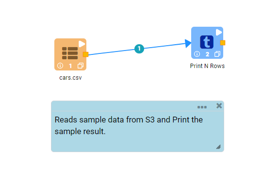
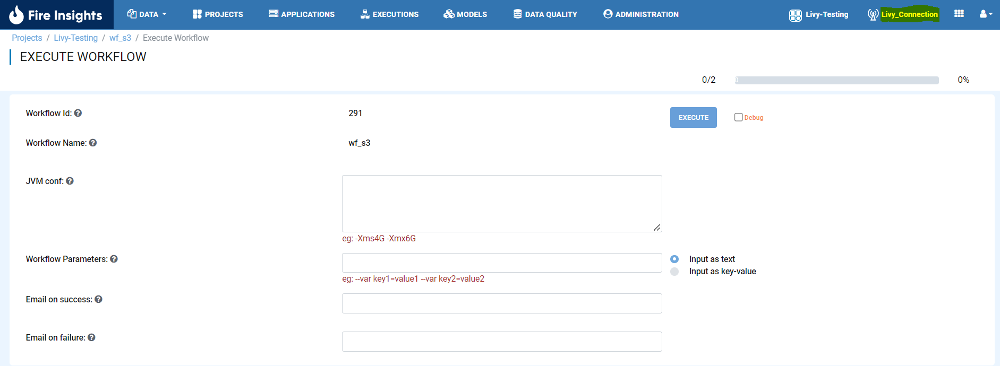
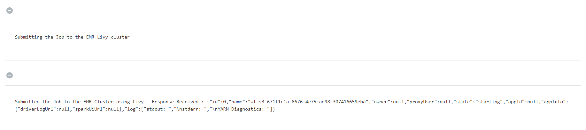
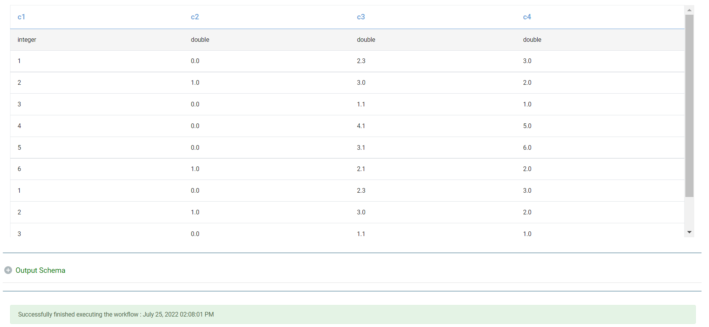
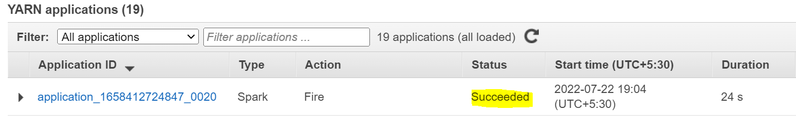

EMR LIVY JOB SUBMISSION
===============

You have Created Livy Connection in earlier step, Now you can use that Connection to submit the Job on Livy.

Below are steps:

1. Login to Fire Insights application and Create an example workflow as below:

Create a workflow which reads some sample data from S3 and Print some sample output.

2. Execute the workflow

Once you saved the workflow, Execute it and select the Connection as LIvy

   

   

3. You Can view the Job from YARN application from AWS Console

