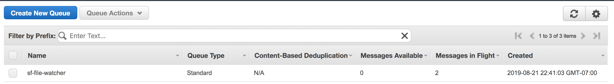
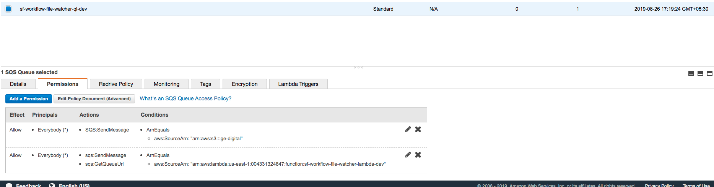
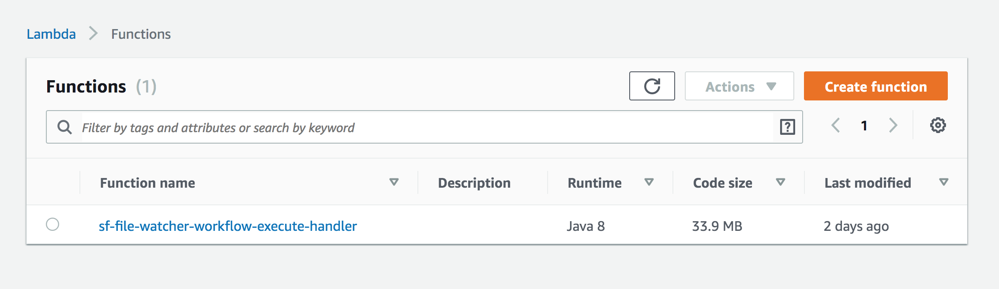
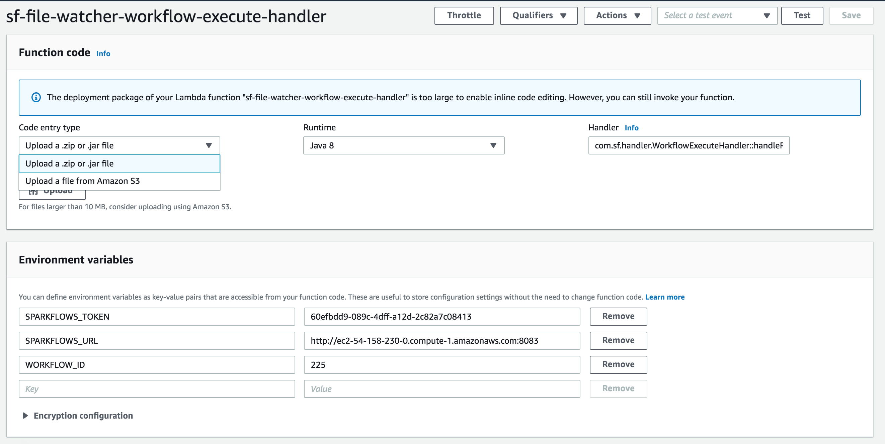

File Watcher with AWS & Sparkflows
=================

Overview
--------

There are many use cases where we have to process the incoming files on S3. This document describes one way to achieve it with SQS, Lambda and using the REST API of Fire Insights.

Design
------

The below diagram captures the high level design:

.. figure:: ../_assets/aws/file-watcher-1.png
   :alt: File Watcher
   :align: center
   :width: 60%

Below is the flow of execution:

* New files arrives on S3
* Finally a _SUCCESS file gets written in the S3 bucket
* It triggers an event which is send to a configures SQS queue.
* Once the event reaches SQL, it triggers an AWS Lambda.
* The AWS Lambda uses the Fire Insights REST API to execute a workflow to process the new incoming files in the AWS S3 bucket.

Create an SQS Queue
-------------------

Create an SQS Queue for receiving the events from S3 and triggering the AWS Lambda function.

Below we see the SQS queue : ``sf-file-watcher``.

It has the below permissions to receive the messages from S3 bucket and invoke the AWS Lambda function.

Configure AWS S3 bucket to generate events
------------------------------------------

Configure the AWS S3 bucket to send events for the new files coming in to AWS SQS queue.

Below, it looks for the new files with prefix of ``events`` and suffix of ``_SUCCESS``. It sends these events to ``sf-file-watcher`` SQS Queue.

.. figure:: ../_assets/aws/file-watcher-s3-events.png
   :alt: S3 Events
   :align: center
   :width: 60%
   
   

Create the AWS Lambda function
------------------------------

Create the AWS Lambda function to take the SQL Event and kick off the workflow in Fire Insights. This workflow would process the new files which came in.

First create an IAM role. An example is shown below.

We add 3 Environment variables as shown below. Instead of the Sparkflows token, users can encrypt the token using KMS and use the kms arn as the Environment variable and decrypt the token using kms inside the Lamdba.

   

   
Upload the jar file for the RequestHandler. It can also be placed into S3 location and the Lambda configured for it.

WorkflowExecuteHandler::

   package com.sf.handler

   import com.amazonaws.services.lambda.runtime.events.SQSEvent
   import com.amazonaws.services.lambda.runtime.events.SQSEvent.SQSMessage
   import com.amazonaws.services.lambda.runtime.{Context, LambdaLogger, RequestHandler}
   import com.amazonaws.services.s3.event.S3EventNotification
   import com.amazonaws.services.s3.event.S3EventNotification.S3EventNotificationRecord
   import com.sf.WorkflowExecute

   import scala.collection.JavaConverters._

   class WorkflowExecuteHandler extends  RequestHandler[SQSEvent, Unit] {

     private val token = System.getenv("SPARKFLOWS_TOKEN")
     private val sparkflowsURL = System.getenv("SPARKFLOWS_URL")
     private val workflowId = System.getenv("WORKFLOW_ID")

     def handleRequest(sqsEvent: SQSEvent, context: Context): Unit = {

       implicit val logger: LambdaLogger = context.getLogger

       logger.log(s"sparkflowsURL: $sparkflowsURL")
       logger.log(s"workflowId: $workflowId")

       sqsEvent
         .getRecords
         .asScala.map(sqsMessageToS3Event)
         .foreach(_.getRecords.asScala.foreach(processS3Record))
     }

     private[handler] def sqsMessageToS3Event(sqsMessage: SQSMessage): S3EventNotification = {
       S3EventNotification.parseJson(sqsMessage.getBody)
     }

     private[handler] def processS3Record(s3EventRecord: S3EventNotificationRecord)
                                         (implicit logger: LambdaLogger): Unit = {

       val s3Entity = s3EventRecord.getS3
       val inputBucketName: String = s3Entity.getBucket.getName
       val inputObjectKey: String = s3Entity.getObject.getUrlDecodedKey
       val eventName: String = s3EventRecord.getEventName
       val path = s"s3://$inputBucketName/$inputObjectKey".replace("/_SUCCESS", "")

       logger.log(s"Event record $eventName; path $path")

       val body = s"""
                     |{
                     |  "workflowId": "${workflowId}",
                     |  "parameters": "--var datapath=${path}"
                     |}
          """.stripMargin

        val workflowStatus = WorkflowExecute.executeWorkflow(body, token, sparkflowsURL)

        logger.log(s"Status of workflow $workflowStatus")
     }
   }

WorkflowExecute::

   package com.sf

   import com.mashape.unirest.http.Unirest

   object WorkflowExecute {

     def executeWorkflow(body: String, token: String, sparkflowsHostName: String) = {

       val workflow = Unirest.post(s"$sparkflowsHostName/api/v1/workflow/execute")
         .header("Content-Type", "application/json")
         .header("Cache-Control", "no-cache")
         .header("Authorization", s"Bearer $token")
         .body(body)
         .asString

       workflow match {
         case s if workflow.getStatus >= 200 && workflow.getStatus <= 300 => workflow.getBody
         case f => throw SubmissionFailedException(s"Job submissions failed, status code is ${f.getStatus}")
       }
     }
     case class SubmissionFailedException(message:String) extends Exception(message)
   }

