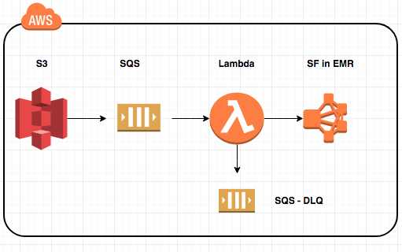
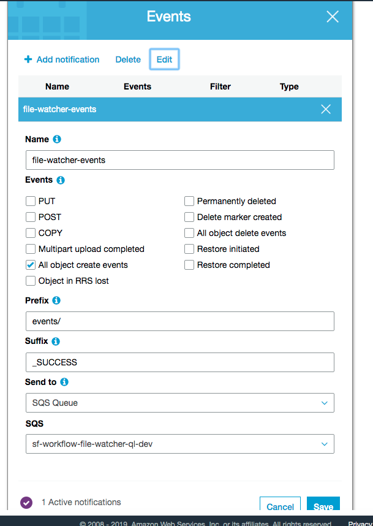

File Watcher with AWS & Sparkflows
=================

Overview
--------

There are many use cases where we have to process the incoming files on S3. This document describes one way to achieve it with SQS, Lambda and using the REST API of Fire Insights.

Design
------

The below diagram captures the high level design:

Below is the flow of execution:

* New files arrives on S3
* Finally a _SUCCESS file gets written in the S3 bucket
* It triggers an event which is send to a configures SQS queue.
* Once the event reaches SQL, it triggers an AWS Lambda.
* The AWS Lambda uses the Fire Insights REST API to execute a workflow to process the new incoming files in the AWS S3 bucket.

Configure AWS S3 bucket to generate events
------------------------------------------

Configure the AWS S3 bucket to send events for the new files coming in to AWS SQL queue.

   

Create an SQS Queue
-------------------

Create an SQS Queue for receiving the events from S3 and triggering the AWS Lambda function.

Below we see the SQS queue : sf-file-watcher.

It has the below permissions to receive the messages from S3 bucket and invoke the AWS Lambda function.

Create the AWS Lambda function
------------------------------

Create the AWS Lambda function to take the SQL Event and kick off the workflow in Fire Insights. This workflow would process the new files which came in.

First create an IAM role. An example is shown below.

We add 3 Environment variables as shown below. Instead of the Sparkflows token, users can encrypt the token using KMS and use the kms arn as the Environment variable and decrypt the token using kms inside the Lamdba.

Upload the jar file for the RequestHandler. It can also be placed into S3 location and the Lambda configured for it::

    class WorkflowExecuteHandler extends  RequestHandler[SQSEvent, Unit]

