AWS Glue Integration
================

Sparkflows can be configured to submit jobs to the AWS Glue cluster.

Architecture diagram
----------

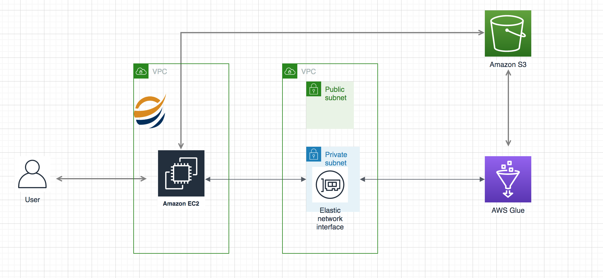

Below are the steps for AWS Glue Network Connection to submit the job from Sparkflows application to AWS Glue cluster.

Pre-requisite
--------

You need to have an AWS account with administrative access.

Create VPC
------

You first create a VPC with a private and a public subnet. You need a VPC because the AWS Glue Job needs an Amazon Elastic network interfaces (ENI) to call the REST API over internet.

1. Login to the AWS Console. Select an AWS Region of your choice where AWS Glue is available as a service. You will see the exercise instructions using the Paris region. Go to the VPC Management Console. Click on the Elastic IPs menu item in the left and then click on the Allocate Elastic IP address button.

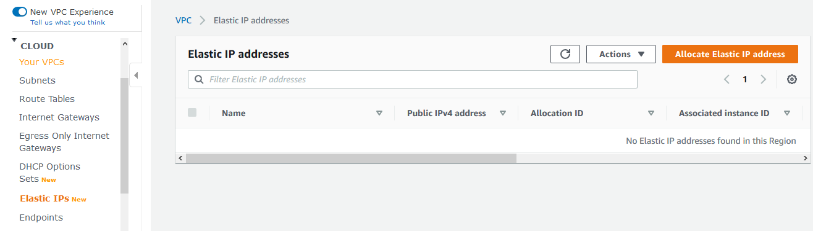

2. On the next screen, click on the Allocate button. An Elastic IP address is created which you will use for the NAT Gateway when creating the VPC.

3. Enter Connection name as dojoconnection. Select Network as the Connection type and click on the Next button.

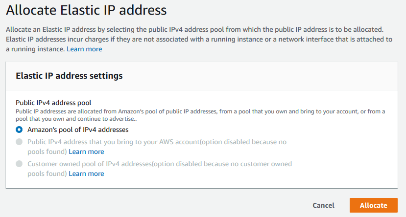

3. On the VPC Management Console and click on the Launch VPC Wizard button.

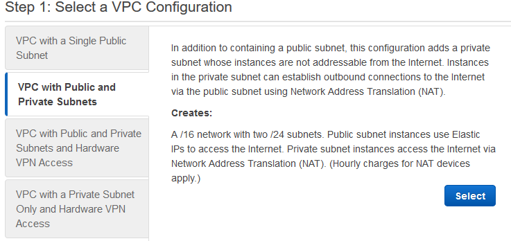

4. On the next screen, select VPC with Public and Private Subnets choice and click on the Select button.

.. figure:: ..//_assets/aws/glue/vpc_configuration.png
   :alt: aws
   :width: 60%

5. On the next screen, enter GlueVPC as the VPC Name and select the Elastic IP address (created in the previous steps) for the Elastic IP Allocation ID field. Keep rest of the values as default and click on the Create VPC button.

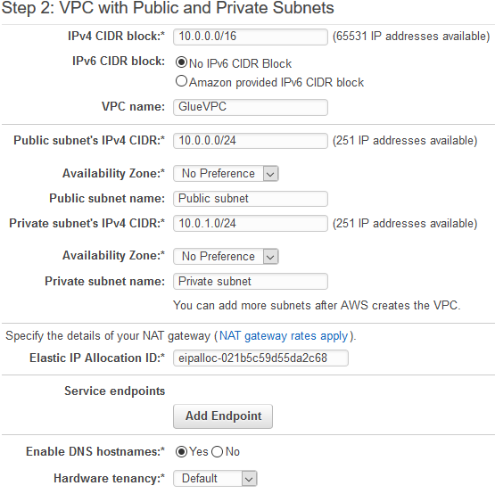

6. The VPC will be created in couple of minutes. Please wait for it to finish. You will use VPC private subnet and the default security group later to create ENI to call the REST API using AWS Glue Connection.

Create IAM Role
------------

You now create an Amazon IAM Role which the AWS Glue Job will use for the authorization to perform the task.

1. Go to the IAM Management Console. Click on the Roles menu item in the left and then click on the Create role button.

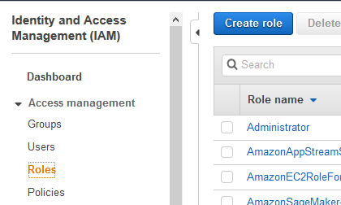

2. Select Glue as the AWS Service on the next screen and click the Next: Permissions button.

3. On the next screen, select AdministratorAccess as the policy and click on the Next: Tags button. In actual production use, you will not use administrative access permission.

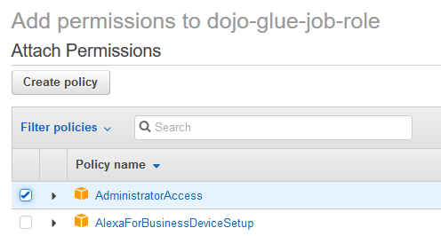

4. On the next screen, click on the Next: Review button.

5. On the next screen, enter the Role name and click on the Create role button.

6. The role is created in no time.

Create S3 Bucket
--------------

You will create an Amazon S3 bucket which serves many purposes. It will be used to store Python script for the AWS Glue job. It will also be used by AWS Glue job to copy data returned by the REST API call.

1. Go to the S3 Management Console and create a S3 bucket. Please make sure you select the region of the bucket the same as the VPC created in the previous steps. If this bucket name is not available, kindly use another bucket name and make note of the name as you will need it for the configuration and scripting purposes.

Create Glue Connection
-----------------

Creating AWS Glue Connection is a very important step in completing this exercise. The connection is used to create an ENI in the private subnet of the VPC. AWS Glue job uses ENI to make call to the internet based REST API. The connection type used is Network.

1. Go to the AWS Glue Console, select Connections in left menu and click on the Add connection button.

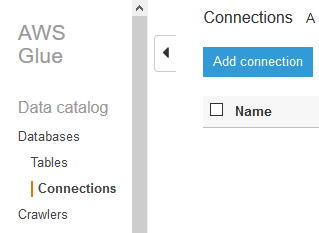

2. Enter Connection name as dojoconnection. Select Network as the Connection type and click on the Next button.

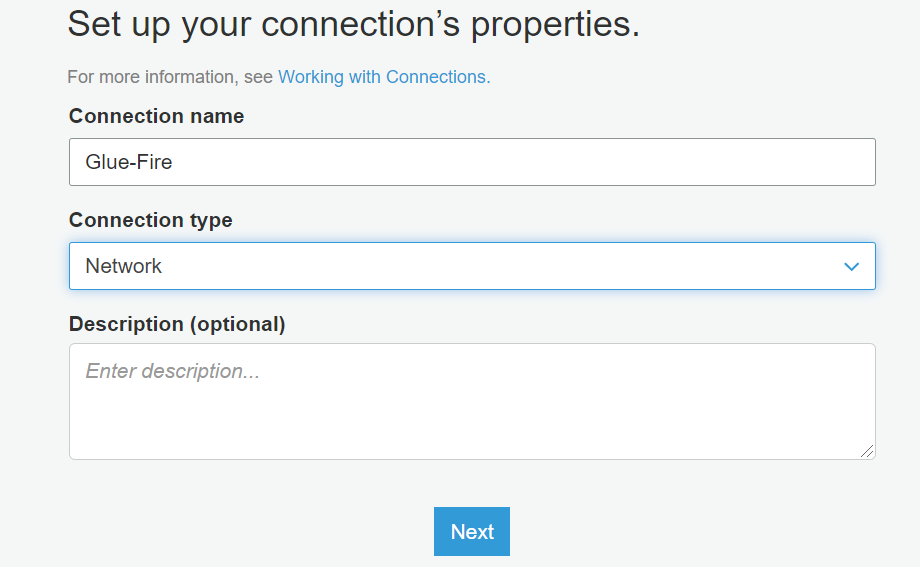

3. On the next screen, you select GlueVPC as the VPC. Select Private Subnet for the Subnet. Select the default Security Group. Finally click on the Next button.

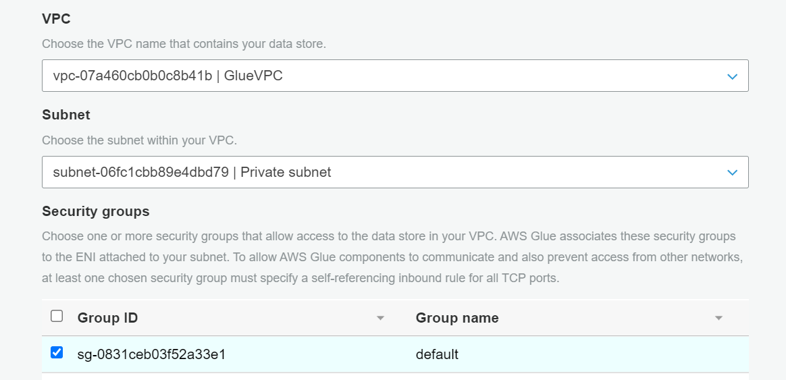

4. On the next screen, click on the Finish button. It will create the network type connection. Select the connection and click on the Test connection button to test the connection.

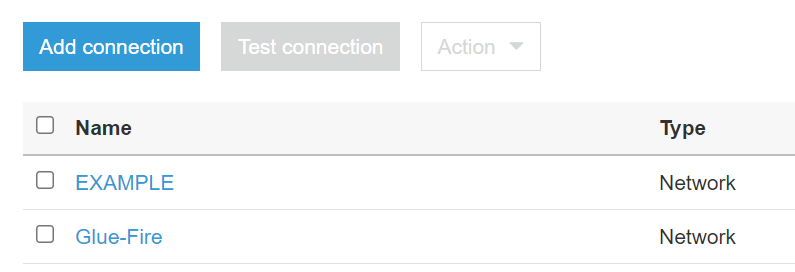

5. On the popup screen, select the role specified and specific s3 bucket, then use that one. Click on the Test connection button.

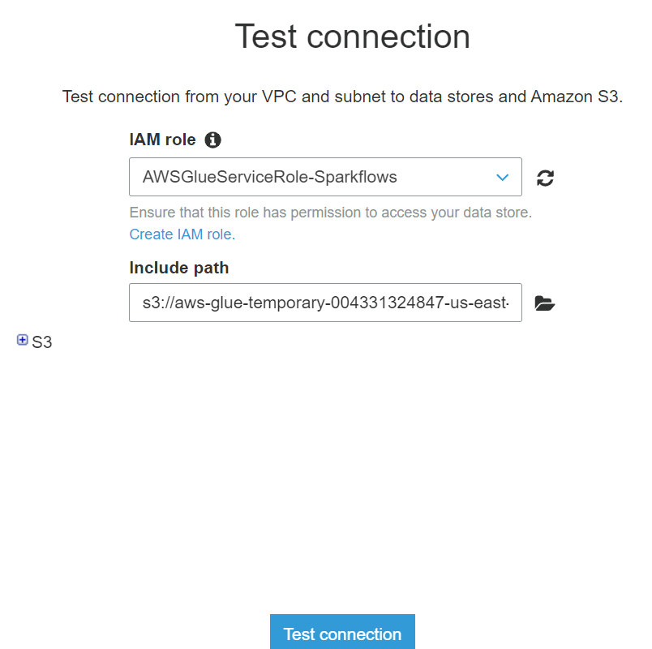

6. The connection test will take some time. Wait till the test status is shown as successful.

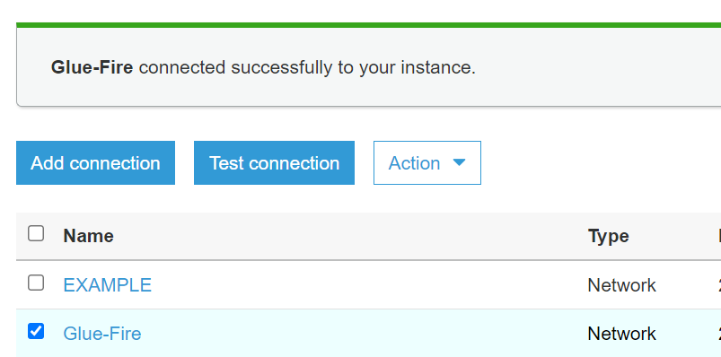

vpc peering
----------

Now since Sparkflows is running on other vpc, so you can use vpc peering connection to communicate Glue vpc to Sparkflows vpc.

1. Create Peering connection

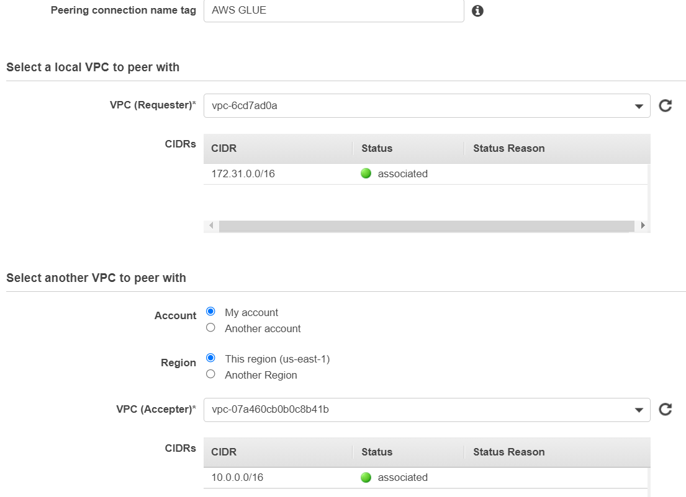
   

2. on successful creation, you will able to see peering connection with Status active.

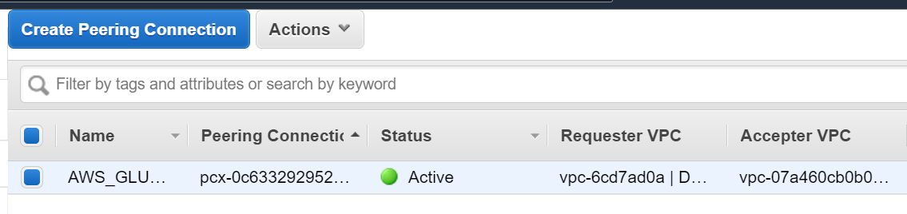

Fire Configuartions & Job Submission on AWS Glue
----------------

Now you have connection between vm on which Sparkflows is running and AWS Glue, so now we can configure Sparkflows for Glue and create workflow and submit the job on AWS Glue.

1. Login to Sparkflows application and go inside Configurations

Once you login to Sparkflows application Click on ADMINISTRATION tab on top, it will take you to configuration page, on clicking, it will take to configuration page.

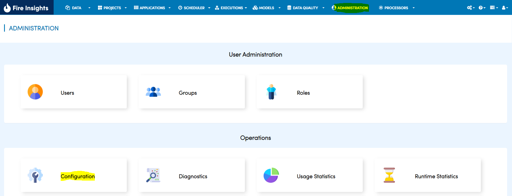

2. Update below parameter as per our configurations

Now update below parameter as per AWS configurations

.. list-table:: 
   :widths: 10 20 30
   :header-rows: 1

   * - Title
     - Description
     - Value
   * - Enable/Disable workflow execution on AWS Glue
     - Enable/Disable workflow execution on AWS Glue
     - true
   * - Script Location
     - Glue script location
     - s3://aws-glue-scripts/scripts/FireGlueApp.scala
   * - IAM Role
     - AWS IAM Role
     - AWSGlueServiceRole-Sparkflows
   * - Glue Main Class  
     - Glue Main class to execute
     - FireGlueApp
   * - Default Arguments
     - Pass any parameters as default arguments
     - --TempDir s3://aws-glue-temporary
   * - Glue Version
     - Glue Version. If empty it takes default glue version.
     - 2.0
   * - Glue Language
     - Glue Language. Input should scala or python
     - scala
   * - Extra Jars
     - Extra Jar file path pass in default arguments
     - s3://aws-glue-scripts/fire-spark_2.4-core-3.1.1-jar-with-dependencies.jar
   * - S3 Path
     - S3 bucket location where workflow json file gets uploaded for execution
     - s3://aws-glue-scripts/workflow-json
   * - Glue Connections
     - Glue connection names. Input the glue connection names as comma separated value like Glue-conn, Glue-conn1
     - Glue-Fire

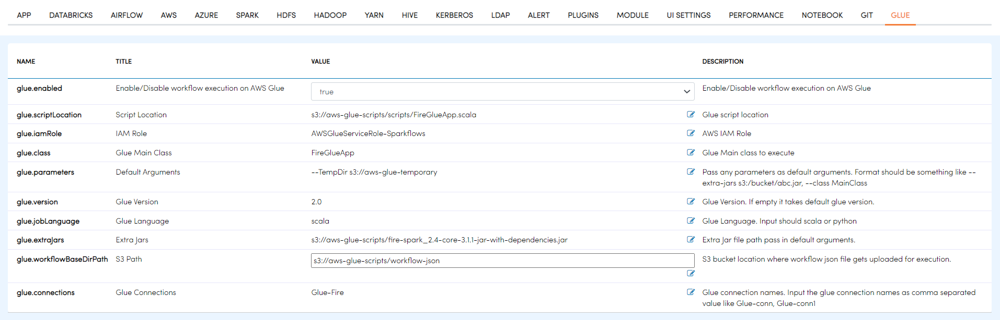

3. Create Workflow in Fire

Now you can create an example workflow in Fire, which reads from S3 bucket and save the workflow.

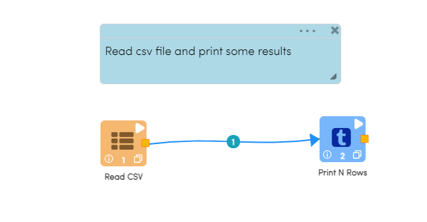

4. Submit the Job

After saving example workflow, now you can execute the job which will be submitted on AWS Glue Cluster and you will see response in Sparkflows.

.. figure:: ..//_assets/aws/glue/job_submit.PNG
   :alt: aws
   :width: 80%

5. Verify the Job on AWS Glue Cluster

Now you may verify the Job run on Sparkflows from AWS Glue Job from AWS Portal too.

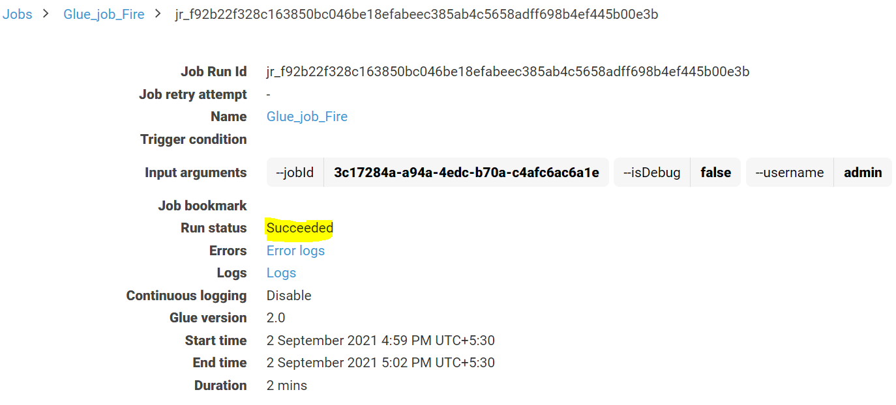
