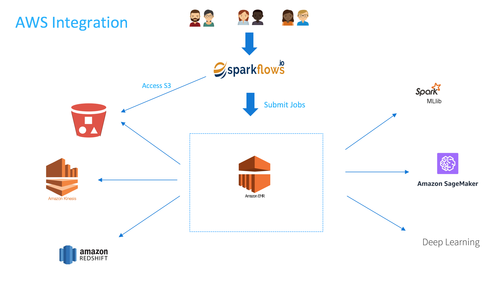

Introduction
============

Fire Insights is the flagship product from Sparkflows. It seamlessly integrates with AWS. With Fire Insights you can perform self-serve data processing, analytics, and machine learning on AWS.

Fire Insights integrates with EMR, S3, Redshift, SageMaker, HIVE, and Kinesis.

Fire Insights comes with several components including:

- **Workflow Editor** : To create workflows for data processing, analytics, and machine learning.
- **400+ Processors** : These include reading data from various stores, data processing, machine learning, and visualizations.
- **Execution Engine**: To execute the workflow on EMR.
- **Scheduler**       : To schedule running of the workflows at specified time intervals.

Fire Insights can be deployed on AWS in three forms:

- **On a Standalone VM** : One needs to provision an EC2 VM and install Sparkflows following the install steps as listed out - https://docs.sparkflows.io/en/latest/installation/installation/index.html
- **ECS Fargate** : Details of the Fargate deployment can be found here - https://docs.sparkflows.io/en/latest/aws/admin-guide/ecs-fargate-sparkflows-deployment/index.html
- **Existing Amazon EMR cluster** : We will go into the details of this install in the next section - https://docs.sparkflows.io/en/latest/aws/admin-guide/deploy.html
- **Using CloudFormation templates to set up a new Amazon EMR Cluster** : If you prefer to use the CloudFormation templates provided by the Sparkflows, an EMR cluster can be created with/without MySQL running in RDS, depending on which template you choose

Pre-requisites and Requirements
--------------------------------

- **On a Standalone VM** : If Fire Insights is to be installed on a Standalone EC2 machine, then one can choose a VM that suits your workloads from one of the M4 VM's options avilable - https://aws.amazon.com/ec2/instance-types/ We recommend M4 Instance types as they have been thoroughly tested. But, other VM's can also be used to install Sparkflows.

- **Amazon EMR cluster** :  If Fire Insights needs to be installed on EMR, then an EMR cluster would be ndded to run the workflows. You also need SSH access to one of the machines of the EMR cluster for installing the Fire Insights. 
  
  * Getting started with EMR - https://aws.amazon.com/emr/getting-started/
  * Opening SSH access to the EMR master node - https://docs.aws.amazon.com/emr/latest/ManagementGuide/emr-connect-master-node-ssh.html

Architecture for install on EMR
------------

Fire Insights runs either on the edge node or one of the master nodes of the EMR cluster and submits the jobs onto the cluster. By default, it runs on port 8080. However, this port needs to be changed to another available port as port 8080 (port 8085 can be used) in already in use.

When the jobs are fired onto the EMR cluster, it can read/write data from S3/HDFS/Redshift/Kinesis. It can also trigger Machine Learning jobs to SageMaker.

