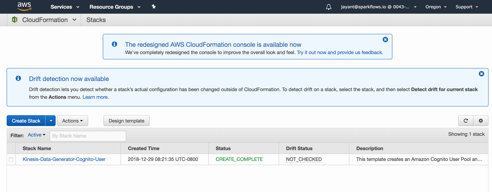
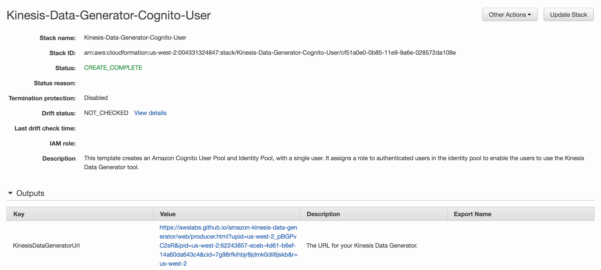

Fire Integration with Kinesis
==============================

This document described Fire integration with Kinesis. Fire uses Apache Spark Structured Streaming Connector from Qubole.

https://github.com/qubole/kinesis-sql

Install AWS CLI
----------

Install AWS CLI::

  https://docs.aws.amazon.com/cli/latest/userguide/cli-chap-install.html
  
Create an access key and secret key
----------------------------------

Create an access key and secret key for the user (https://docs.aws.amazon.com/IAM/latest/UserGuide/id_credentials_access-keys.html#Using_CreateAccessKey).

*Note* It's important to regularly rotate your access and secret keys. See this documentation for more information (https://docs.aws.amazon.com/IAM/latest/UserGuide/id_credentials_access-keys.html#rotating_access_keys_console)

Configure AWS CLI
-----------

Configure AWS CLI::

  https://docs.aws.amazon.com/cli/latest/userguide/cli-chap-configure.html
  aws configure region: us-east-1 aws_access_key_id = accesskeyid aws_secret_access_key = awssecretaccesskey

Create AWS Kinesis Stream
-----------

Create AWS Kinesis Stream::

  aws kinesis create-stream --stream-name sparkflows_kinesis_test --shard-count 1

Send message to AWS Kinesis from AWS CLI
------------

Sending message to Kinesis::

  aws kinesis put-record --stream-name sparkflows_kinesis_test --data file://data.json --partition-key uuidgen

Update EMR_EC2_Default_Role
------------

Update **EMR_EC2_DefaultRole** with **AmazonKinesisFullAccess** Policy so that our EMR Cluster would have full access to Kinesis.

Or Create an IAM policy for accessing Amazon Kinesis
---------------------------------------------------

Create an IAM policy that defines what this user has access to in your AWS account.  It's important to only grant this user minimal access within your account. See this documentation for how to create IAM policies (https://docs.aws.amazon.com/IAM/latest/UserGuide/access_policies_create.html).

Create EMR Cluster with the above Role
-----------

When we create the EMR Cluster with the above Role, it would have full access to Amazon Kinesis.

Pushing data to Kinesis
-----------

AWS provides a Kinesis Data Generator. It can be configured for pushing random data in specified format to Kinesis.

https://awslabs.github.io/amazon-kinesis-data-generator/web/help.html

   
   

   
   
Kinesis Workflow in Fire
----------

Workflows can be easily built in Fire which read data from Kinesis, process them and save the results where needed.

