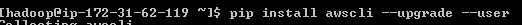
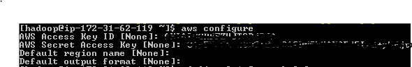
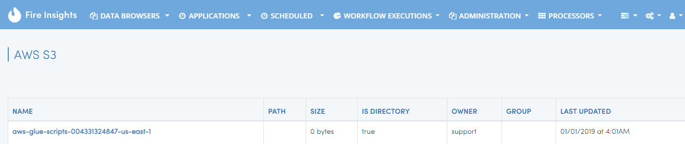

S3 Browser
==========

Fire Insights allows browsing the files in S3.

Configue AWS access key and password
-----------------------------------

Run ``aws configure`` to configure your credentials on the machine on which Fire Insights is running.

Install aws cli
================

- http://docs.aws.amazon.com/cli/latest/userguide/installing.html
- pip install awscli --upgrade --user
 

   
Configure AWS
==============

- aws configure
  - It would ask for 
    - AWS Access Key
    - AWS Secret Access Key
    - Default Region Name : Just enter
    - Default Output Format : Just enter
    

   
Access S3 IN Fire-UI
=====================

Go to Fire-UI page and Dropdown databrowser there we have S3 Browser as a option

.. figure:: ../_assets/tutorials/awscli/AWS3.PNG
   :alt: awscli
   :align: center
   
- Click on AWS s3 then we will get File available in it.

