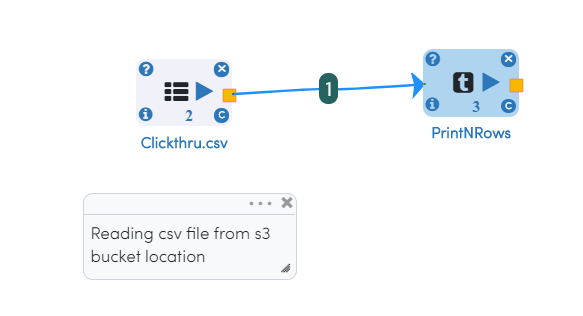

Reading/Writing from S3
========================

Fire is fully integrated with AWS S3. The Dataset Processors of Fire, can directly read data from S3 if the policies allow them to.

Dataset Processors
------------------

Dataset Processors include:

* Read CSV
* Read Parquet
* Read JSON
* Read XML

The path specified for reading from S3 would be s3://...

Reading from S3
------------

Below is an example Workflow. It reads a CSV file from S3, parses it and prints out the first 10 records.

In the dialog box of the Read CSV processor the path is specified as ``s3a://sparkflow-sample-data/data/Clickthru.csv``

   
.. figure:: ../_assets/aws/s3-csv-configuration.PNG
   :alt: S3 CSV Dialog
   :align: center
   
.. figure:: ../_assets/aws/s3-csv-output.PNG
   :alt: S3 CSV Output
   :align: center   

Writing to S3
-----------------

Below is an example Workflow. It reads a CSV file and save it to S3 path specified.

In the dailog box of the save CSV processor the path is specified as ``s3a://sparkflow-sample-data/write/``

.. figure:: ../_assets/aws/csvsave-workflow.PNG
   :alt: S3 Workflow
   :align: center
   
.. figure:: ../_assets/aws/configuration-csvs3.PNG
   :alt: S3 Workflow
   :align: center

Execution Result

.. figure:: ../_assets/aws/saveexecution.PNG
   :alt: S3 Workflow
   :align: center

Once the above workflow successfully completed, the save data can be viewed using ``DATABROWSERS/AWS S3`` Location with specified path

.. figure:: ../_assets/aws/browses3.PNG
   :alt: S3 Workflow
   :align: center
