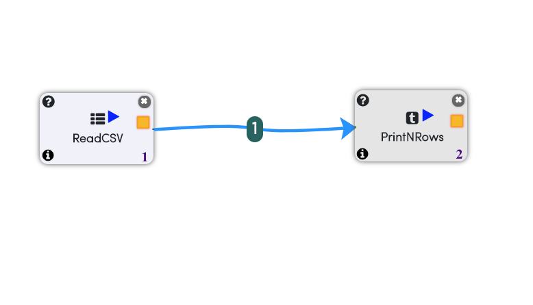
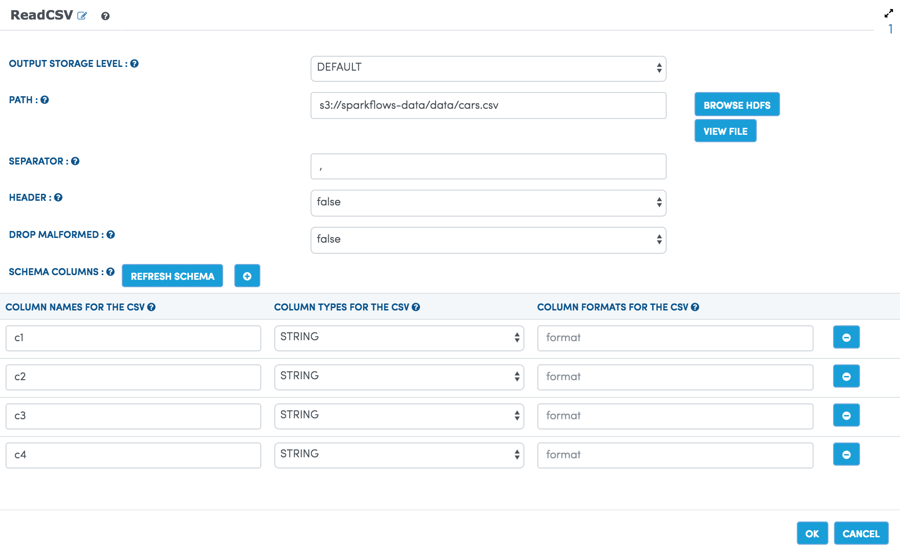
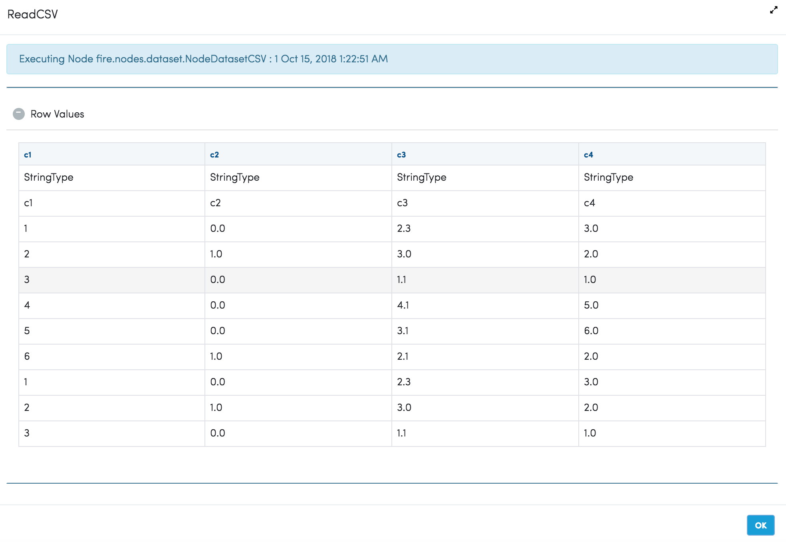

Reading/Writing from S3
========================

Fire is fully integrated with AWS S3. The Dataset Processors of Fire, can directly read data from S3 if the policies allow them to.

There are also S3 specific Processors which take in the AWS Access Key and AWS Access Passwords.

Dataset Processors
------------------

Dataset Processors include:

* Read CSV
* Read Parquet
* Read JSON
* Read XML

The path specified for reading from S3 would be s3://...

Below is an example Workflow. It reads a CSV file from S3, parses it and prints out the first 10 records.

In the dialog box of the Read CSV processor the path is specified as ``s3://sparkflows-data/data/cars.csv``

   

   

S3 Specific Processors
-------------

Fire has S3 specific processors for read from S3. These allow the user to specific the AWS Access Key and AWS Access Password.

* Read Avro S3
* Read CSV S3
* Read Parquet S3
* Write Avro S3
* Write CSV S3
* Write Parquet S3

