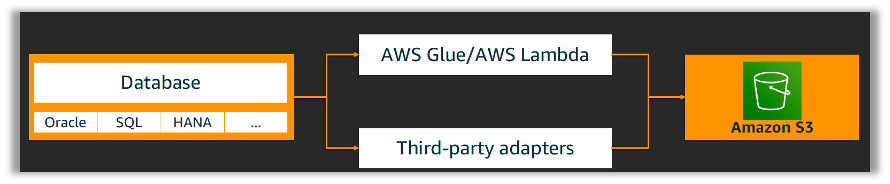

Migrating data from SAP into S3
==========================

Store SAP data into S3

Overview
--------

S3 Storage is the default storage layer in AWS.

   
Reference: https://blogs.sap.com/2021/03/03/the-aws-connector-for-sap/

Details
-------

Data extraction patterns for SAP applications

- Database-level extraction
  - Database-level extraction, as the name suggests, taps in to SAP data at database level. 
  - Use Python Support for SAP HANA client libraries or Java Database Connectivity (JDBC) drivers in AWS Glue and AWS Lambda.

- Application-level extraction
  - Application-level extractors like SAP Data Services extract data from SAP applications using integration frameworks in ABAP stack and store it in S3 through default connectors.

