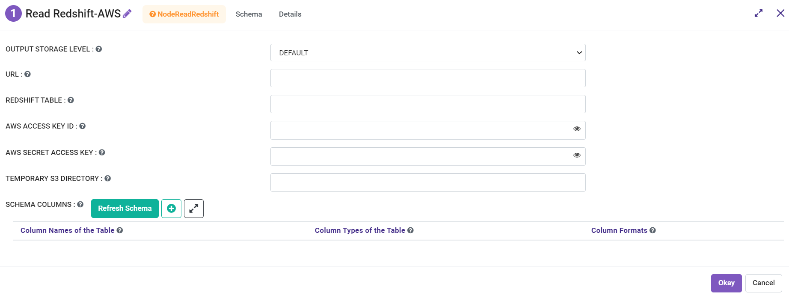
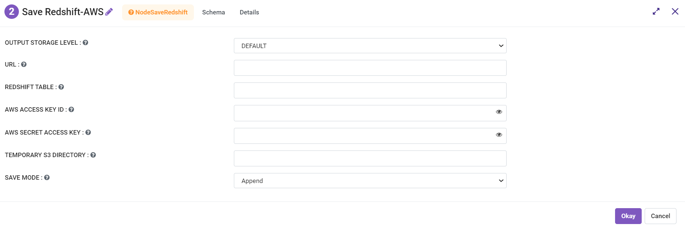

Integration with Redshift
========================

Fire is fully integrated with Redshift. Fire has a number of processors specifically for Redshift.

Redshift Processors
-------------

Fire has processors to read from and write to Redshift. These include:

* Read Redshift AWS

You need to have the below parameters in order to use the above processor.

.. list-table::
      :widths: 10 5 10
      :header-rows: 1

      * - Name
        - Title
        - Description
      * - url
        - URL
        - The JDBC URL to connect to.
      * - dbtable
        - Redshift Table
        - The Redshift table that should be read. Note that anything that is valid in a FROM clause of a SQL query can be used. For example, instead of a full table you could also use a subquery in parentheses.
      * - awsAccessKeyId
        - AWS Access Key ID
        - AWS Access Key ID.
      * - awsSecretAccessKey
        - AWS Secret Access Key
        - AWS Secret Access Key.
      * - tempS3Dir
        - Temporary S3 Directory
        - Temporary S3 Directory.

* Save Redshift-AWS

You need to have the below parameters in order to use the above processor.

.. list-table::
      :widths: 10 5 10
      :header-rows: 1

      * - Name
        - Title
        - Description
      * - url
        - URL
        - The JDBC URL to connect to.
      * - dbtable
        - Redshift Table
        - The Redshift table that should be write. Note that anything that is valid in a FROM clause of a SQL query can be used. For example, instead of a full table you could also use a subquery in parentheses.
      * - awsAccessKeyId
        - AWS Access Key ID
        - AWS Access Key ID.
      * - awsSecretAccessKey
        - AWS Secret Access Key
        - AWS Secret Access Key.
      * - tempS3Dir
        - Temporary S3 Directory
        - Temporary S3 Directory.
      * - saveMode
        - Save Mode
        - Whether to Append, Overwrite or Error if the path Exists.

