Reading/Writing from S3
========================

Fire is fully integrated with AWS S3. The Dataset Processors of Fire, can directly read data from S3 if the policies allow them to.
This document goes over the following topics:

1. *Dataset Processors*
2. *Reading from S3*
3. *Writing from S3*

Dataset Processors
------------------

Dataset Processors include:

* Read CSV
* Read Parquet
* Read JSON
* Read XML

The path specified for reading from S3 would be s3://...

Reading from S3
------------

Below is an example Workflow. It reads a CSV file from S3, parses it and prints out the first 10 records.

In the dialog box of the Read CSV processor the path is specified as ``s3a://sparkflow-sample-data/data/Clickthru.csv``

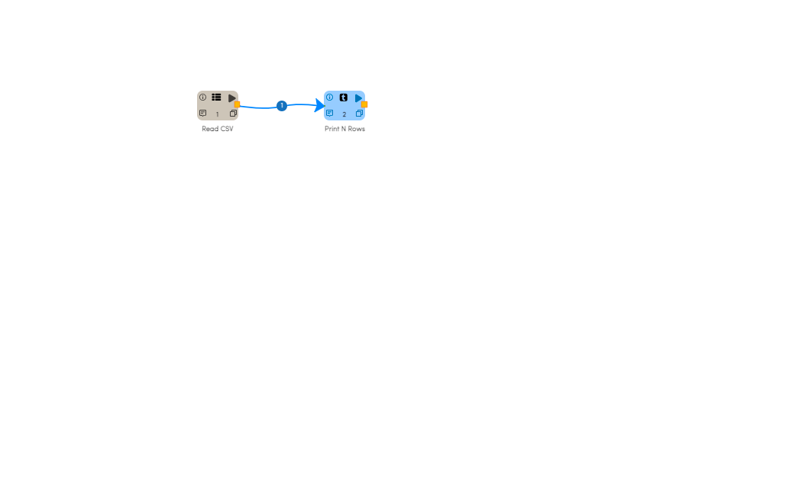
   
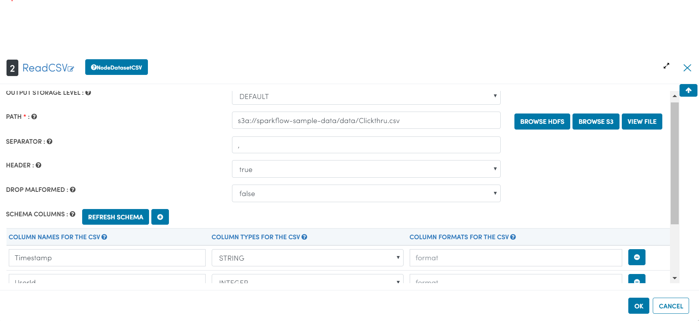
   
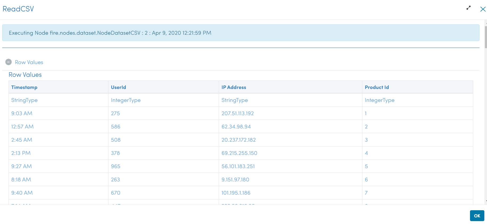

Writing to S3
-----------------

Below is an example Workflow. It reads a CSV file and save it to S3 path specified.

In the dailog box of the save CSV processor the path is specified as ``s3a://sparkflow-sample-data/write/``

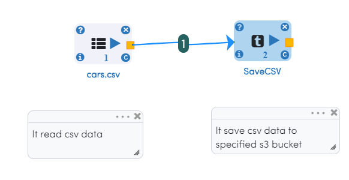
   
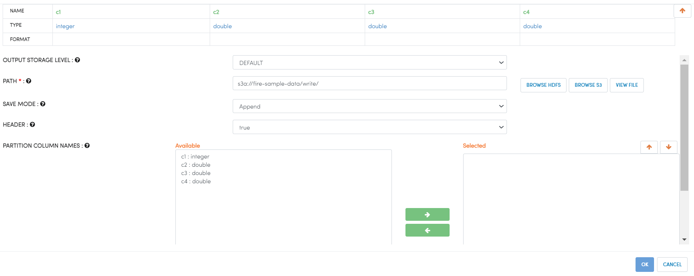

Execution Result

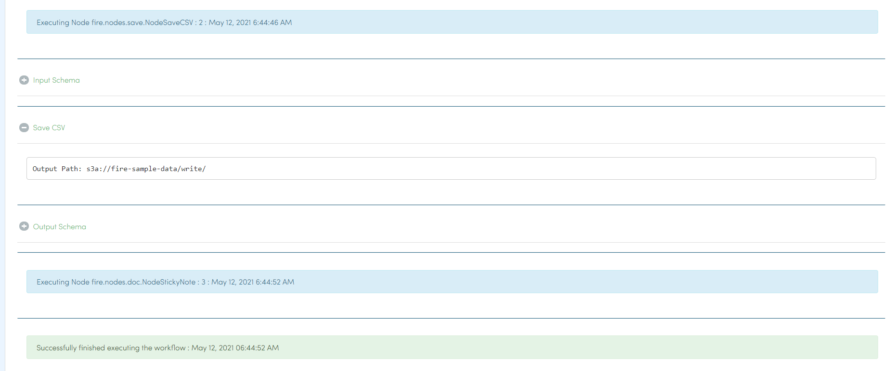

Once the above workflow successfully completed, the save data can be viewed using ``DATABROWSERS/AWS S3`` Location with specified path

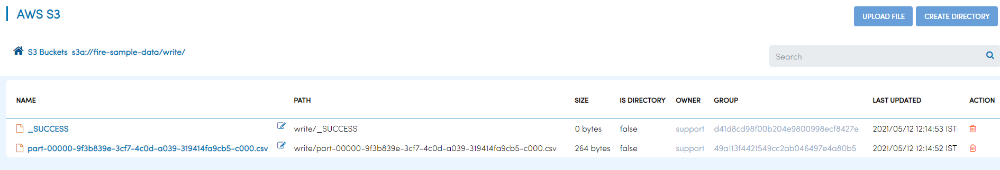

Saving ML Model to S3
========================

Saving Spark ML Model
---------------------

Below is an example workflow in sparkflows, where data is read from S3 and the final Spark ML model is saved to S3 location.

Workflow:

Configure ReadCSV

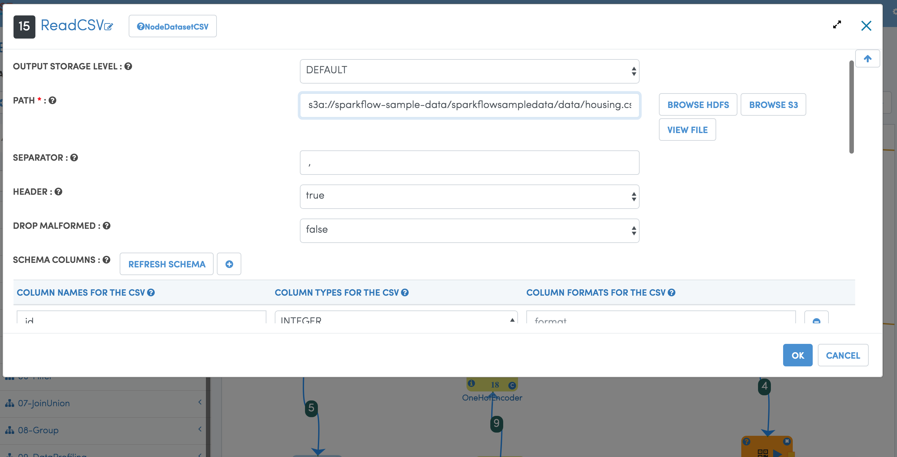
 

Configure SaveMlModel

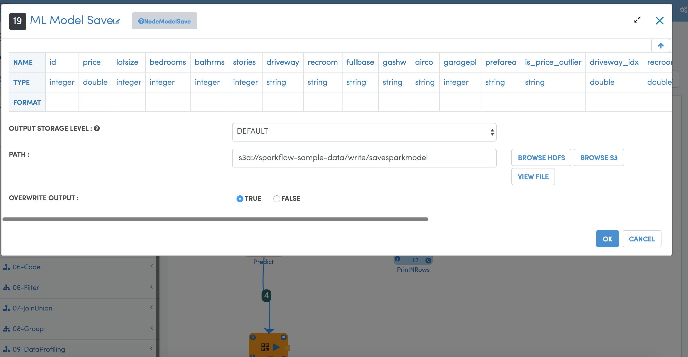

Execution Result:

.. figure:: ../../_assets/aws/sparkml-workflow-execution-result.PNG
   :alt: Spark ML Workflow
   :align: center
   
   
   

Saving H20 ML Model
---------------------

Below is an example workflow in sparkflows, where final H20 ML model is saved to S3 location.

Workflow:

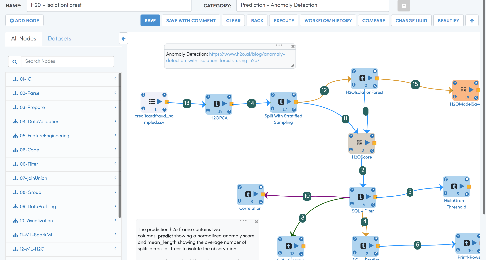

Configure Save H20 ML Model

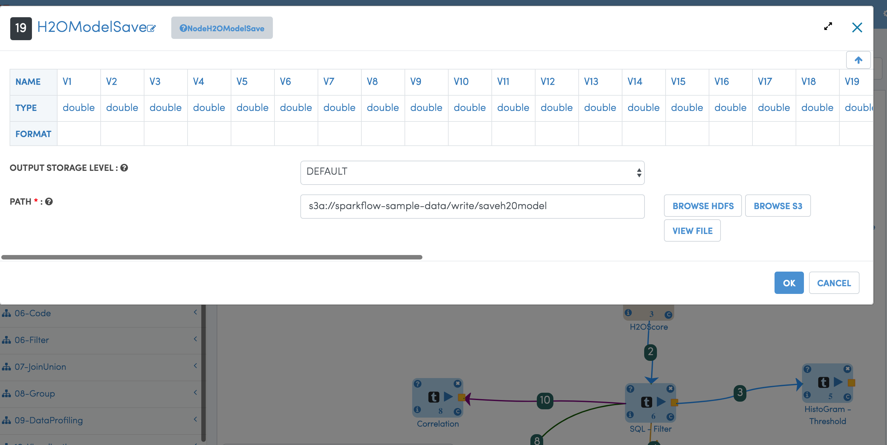

Execution Result:

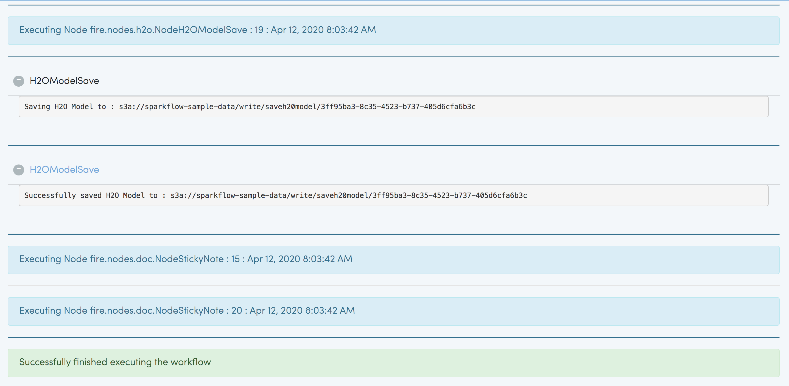
   
