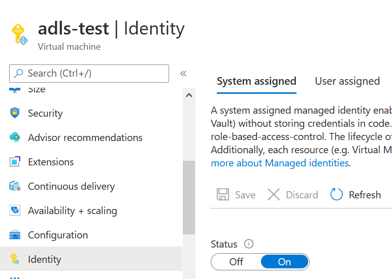
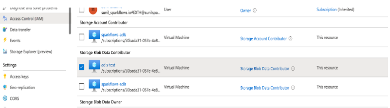
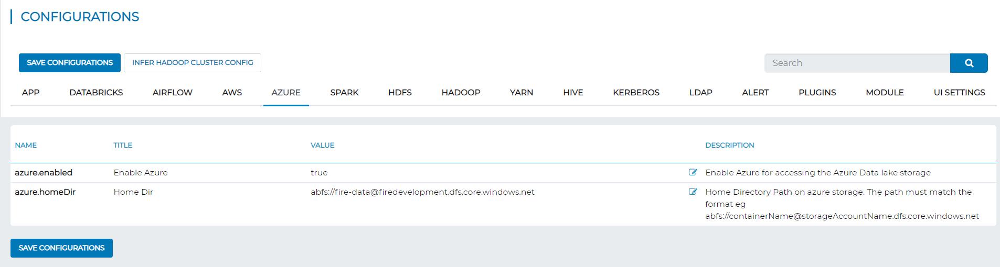
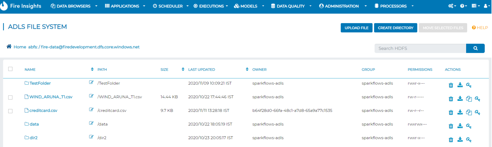

ADLS Integration - Managed Identity
================

Sparkflows has been integrated with Azure Data Lake Storage. Once configured, you can use the filesystem for accessing data from it.

Below are the steps for configuring Sparkflows with ADLS using managed identity.

Managed identity allow the users to access the Azure resources without hardcoding any credentials in the code.

Enable System Identity
-----------------------------------

System identity needs to be enabled on the VM where Sparkflows is installed.

In storage account, add the role to provide the access
------------------------------------------------------

In storage account, add the role to provide the access to Azure VM with needed access. 

   
Configure ADLS in Sparkflows
----------------------

Add the following parameters in Administration/Configuration in Sparkflows.

 - ``azure.enabled to true``
 - ``azure.homeDir as abfs://containerName@storageAccountName.dfs.core.windows.net`` 

ADLS page in Sparkflows
-------------------

Save the above configuration, refresh the page & click on the Data menu to see the ADLS page.

.. figure:: ../_assets/configuration/adls.PNG
   :alt: adls
   :width: 40%
   
Go to Data/ADLS page
------------------------

Click on ADLS to see ADLS FILESYSTEM in `DATA`.

Once the above configurations are done, you can start using files on ADLS while creating datasets and workflows.

