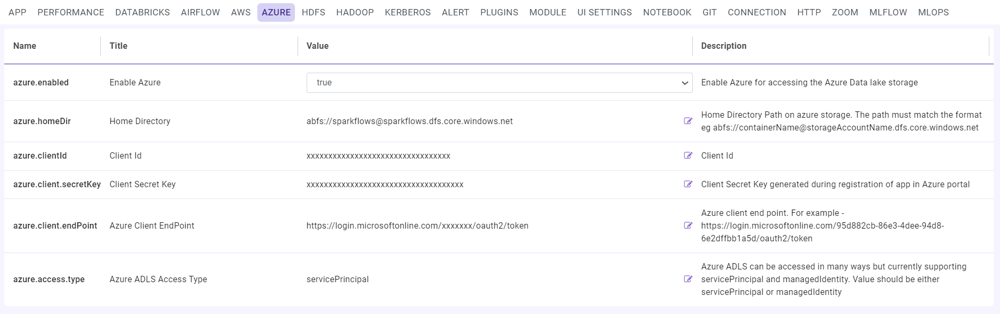
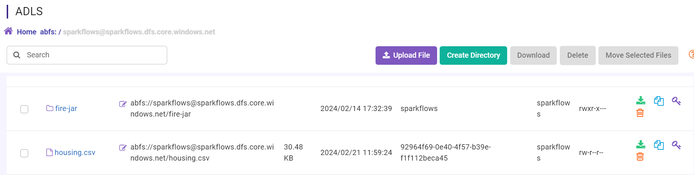

Azure Data Lake Storage
========

This document describes the steps for Configuring ADLS in Sparkflows running on a virtual machine.

Inorder to Configure ADLS in Sparkflows, User need to have below pre-requisites in Azure.

Azure pre-requisites
++++

The Azure pre-requisites needed to Configure ADLS in Fire Insights:

.. list-table:: 
   :widths: 10 20 30
   :header-rows: 1

   * - Title
     - Recommended
     - Value
   * - Home Directory	
     - Home Directory Path on azure storage
     - The path must match the format eg abfs://containerName@storageAccountName.dfs.core.windows.net
   * - Client Id	
     - Client Id
     - Client Id for ADLS Configuration
   * - Client Secret Key
     - Client Secret Key generated during registration of app in Azure portal.
     - Client Secret Key
   * - Azure Client EndPoint	
     - Azure Client EndPoint	
     - EndPoint
   * - Azure ADLS Access Type		
     - Azure ADLS can be accessed in many ways but currently supporting servicePrincipal and managedIdentity.	
     - Value should be either servicePrincipal or managedIdentity

Configuring ADLS in Sparkflows
+++++++++++++++

Once the above pre-requisites from Azure is available, you can Configure ADLS in Sparkflows using below steps:

Step 1 : Open Sparkflows in Web Browser
----------------

#. Open a web browser.
#. Enter the URL: http://sparkflows_IP:8080 and replace **sparkflows_IP** with your instance's **actual IP/DNS**.

Step 2 : Configure ADLS
--------------

#. Login to Sparkflows.
#. Access Sparkflows **Administration** Tab.

   .. figure:: ../../_assets/aws/livy/administration.png
      :alt: livy
      :width: 60%

#. Select **Configurations** Tab.
#. Select **AZURE** Tab.
#. Enter parameter details setup in Azure.
#. Save the **Configurations**.

.. list-table:: 
   :widths: 10 20 30
   :header-rows: 1

   * - Title
     - Recommended
     - Value
   * - Enable Azure		
     - Enable Azure for accessing the Azure Data lake storage
     - true
   * - Home Directory	
     - Home Directory Path on azure storage
     - The path must match the format eg abfs://containerName@storageAccountName.dfs.core.windows.net
   * - Client Id	
     - Client Id
     - Client Id for ADLS Configuration
   * - Client Secret Key
     - Client Secret Key generated during registration of app in Azure portal.
     - Client Secret Key
   * - Azure Client EndPoint	
     - Azure Client EndPoint	
     - EndPoint
   * - Azure ADLS Access Type		
     - Azure ADLS can be accessed in many ways but currently supporting servicePrincipal and managedIdentity.	
     - Value should be either servicePrincipal or managedIdentity

Step 3 : Browse ADLS
--------------

Once the above **Configurations** saved, you Can Browse ADLS as below:

#. Click on **DATA** Tab.
#. Select **ADLS**.
#. You can Browse ADLS file and folder.

