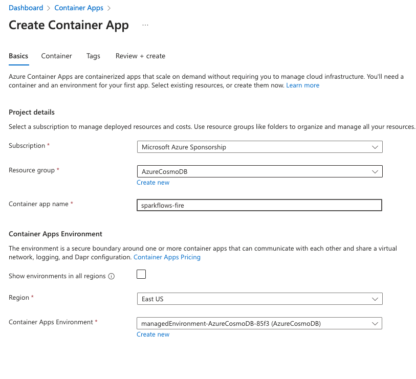
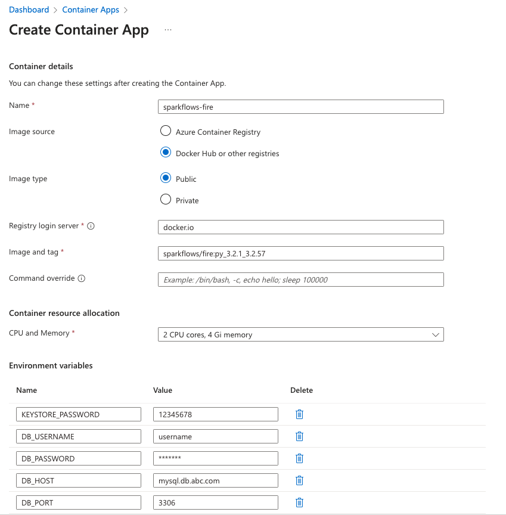
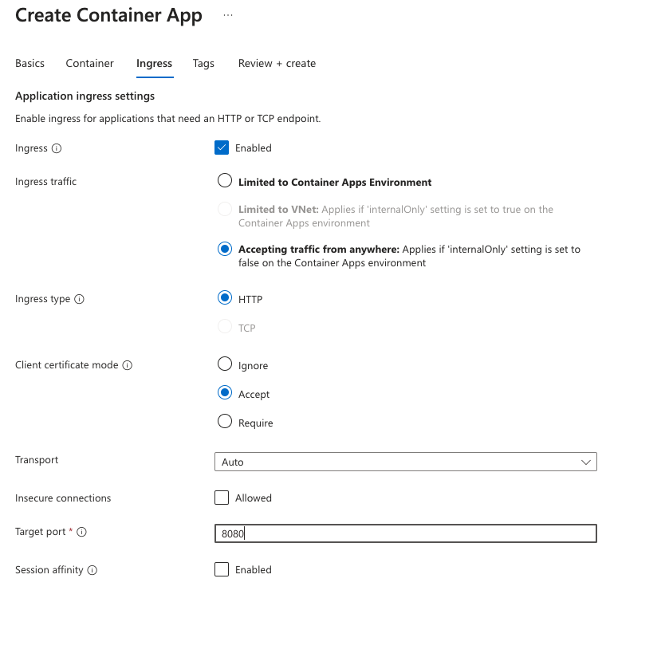
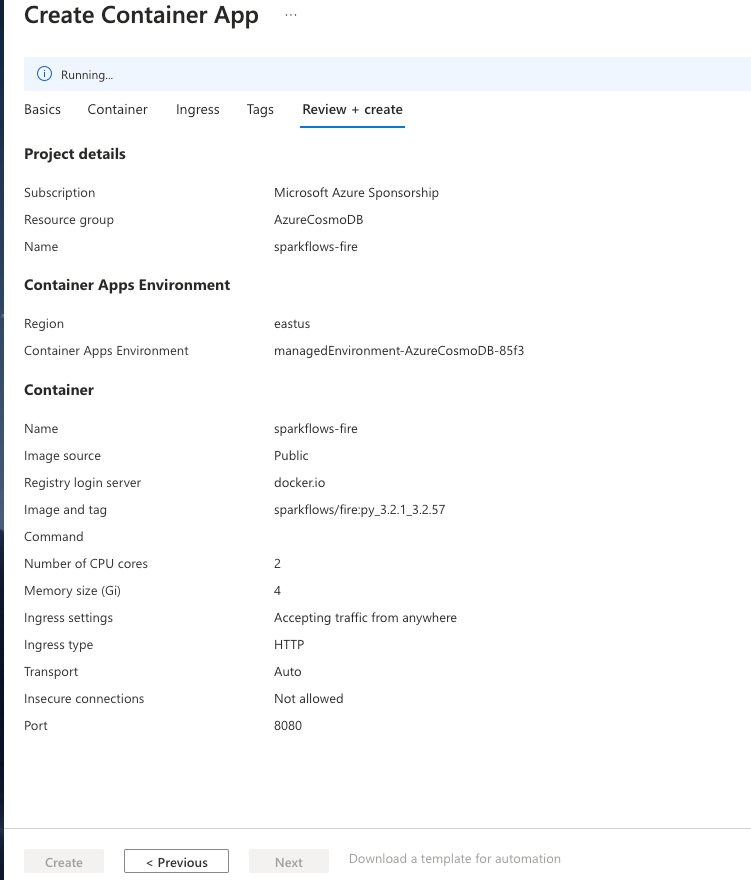
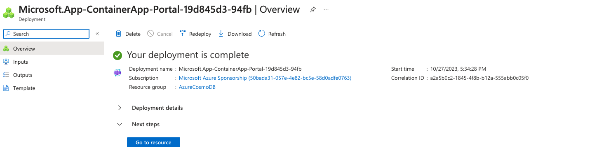

Azure Container Apps
=====================

This document describes the steps for installing Fire Insights on Azure Container Apps.

Once Fire is installed, it can be connected to various Apache Spark and Kubernetes clusters to leverage their scalability to execute the jobs.

Fire Insights stores metadata in a relational store.

MySQL needs to be set up before installing Fire Insights.

Step 1: Create a container app
-----------------
Navigate to the Container Apps in Azure Dashboard and click on Create. It will require you to fill in the basic information about the container, as shown below.

Step 2: Configure container configuration
------------------------------------------
Next step is to provide the image details and the container environment variables that allow the container to connect to a remote MySQL instance.

Make sure you provide at 2vCPU and 4GB RAM to the container. 

Step 3: Configure ingress
-------------------------------
The Ingress configuration, allows you to connect to the deployed container above. Configure as shown below

In this case, we have used **8080** as the target port, because by default the container runs on 8080 for http and 9443 for https with self-signed certificate.

Wait for the validation of the above configuration to be validated and then finally, click on create.

Once you click on create, it will deploy your container and after that you can track the progress on the below screen.

