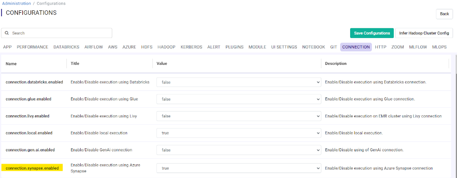
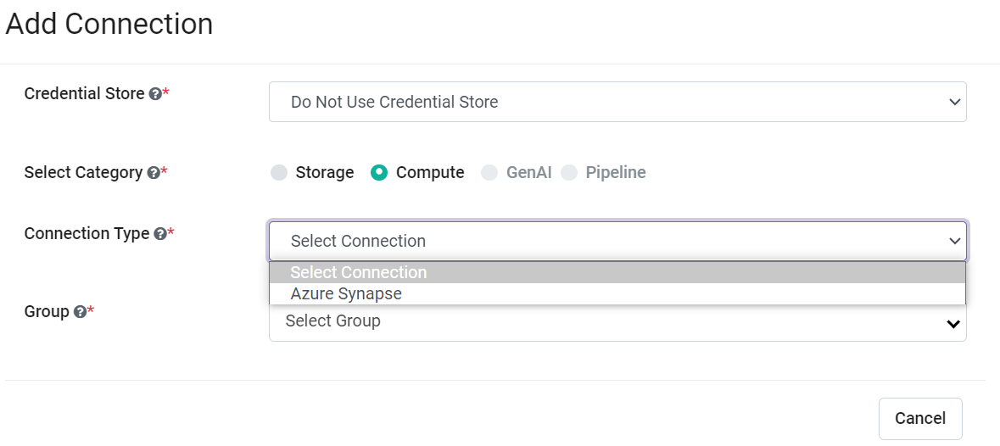
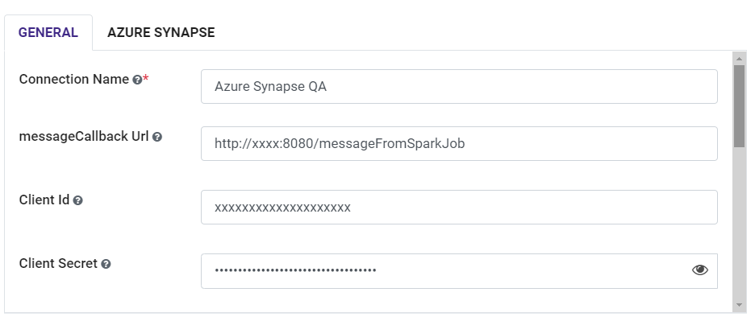
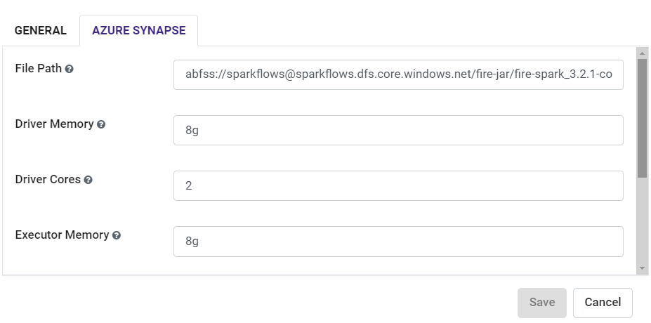

Azure Synapse Connection
=======

Sparkflows enable you to create Azure Synapse as a Compute Connection and submit the Job onto it.

Inorder to Create Azure Synapse Compute Connection in Sparkflows, User need to have below **pre-requisites** in Azure while configuring.

Azure pre-requisites
++++

The Azure pre-requisites needed to Create Azure Synapse Compute Connection in Sparkflows:

.. list-table:: 
   :widths: 10 20 30
   :header-rows: 1

   * - Title
     - Recommended
     - Value
   * - Client Id	
     - Client Id
     - Client Id
   * - Client Secret Key
     - Client Secret Key generated during registration of app in Azure portal.
     - Client Secret Key
   * - Azure Synapse URL	
     - Azure Synapse URL	
     - Synapse URL
   * - Pool Name	
     - Synapse Pool Name	
     - Synapse Pool Name
   * - Tenant Id	
     - Azure Tenant Id	
     - Azure Tenant Id

For more information on setting up Azure Synapse, `click here. <https://learn.microsoft.com/en-us/azure/synapse-analytics/quickstart-create-workspace>`_

Azure Synapse Connection
++++++++++++++

Sparkflows enables you to create **Azure Synapse Connection** and use it to submit **jobs/workflows**. Connections can be at various levels:

  * Global  : Everyone has access to these connections.
  * Group   : Users belonging to the group have access to these connections.
  * Project : The owner of the project and the groups with which the project has been shared with have access to the project level connections.

This page show how to create an **Azure Synapse Connection** in Sparkflows.

Enable Azure Synapse in Sparkflows
+++++++++++++++++

Login to ``Sparkflows`` application -> ``Administration`` -> ``Configurations`` -> ``Connection`` -> and enable Azure Synapse connection by setting the below parameter:

::

    connection.synapse.enabled : true

Navigate to Add Connections
++++++++++++++

Once you save the above Configuration, navigate to ``Administration`` -> ``Global Connections`` -> ``Add Connections`` as shown below:

.. figure:: ../../../_assets/aws/livy/administration.png
   :alt: livy
   :width: 60%

Add connection for group
+++++++

Navigate to ``Administration`` -> ``Global Connections`` -> ``Add Connections`` -> ``Add Connection For Group`` which pop up a new windows -> Select ``Compute Connection`` and other parameters as shown below:

.. figure:: ../../../_assets/azure/synapse_addconnection.png
   :alt: synapse
   :width: 60%

Add additional parameters as per your environment
+++++

Once you have selected  the connection type & groups, add the additional connection parameters needed. For more details refer the following tables and images:

For GENERAL tab
++++

.. list-table:: 
   :widths: 10 20 30
   :header-rows: 1

   * - Title
     - Description
     - Value
   * - Connection name
     - Connection Name
     - Name of Connection
   * - Postback Url
     - Postback Url
     - Postback Url through which Azure Synapse sent result back to Sparkflows.
   * - Client Id	
     - Client Id
     - Client Id for ADLS Configuration
   * - Client Secret Key
     - Client Secret Key generated during registration of app in Azure portal.
     - Client Secret Key
   * - Title 
     - Title of Selected Connection
     - Title of Selected Connection  
   * - EndPoint URL	
     - Azure Synapse URL	
     - Synapse URL
   * - Description 
     - Connection Description 
     - Connection Description
   * - Driver Class
     - Driver Class for selected Connection type 
     - It Comes with default value  
   * - Pool Name	
     - Synapse Pool Name	
     - Synapse Pool Name
   * - Tenant Id	
     - Azure Tenant Id	
     - Azure Tenant Id

   
For AZURE SYNAPSE tab
++++

.. list-table:: 
   :widths: 10 20 30
   :header-rows: 1

   * - Title
     - Description
     - Value
   * - File Path 
     - File Path 
     - Fire core jar file path
   * - Driver Memory 
     - Driver Memory 
     - Driver Memory need to be used
   * - Driver Cores  
     - Driver Cores  
     - Driver Cores need to be used 
   * - Executor Memory  
     - Executor Memory  
     - Executor Memory need to be used
   * - Executor Cores  
     - Executor Cores  
     - Executor Cores need to be used
   * - Executor Count  
     - Executor Count  
     - Executor Count need to be used
 

Save Connection
++++++++++++++

Once you have updated the above parameters ``Save`` the connection.

