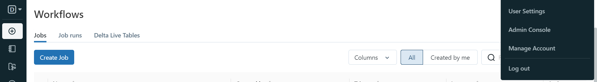
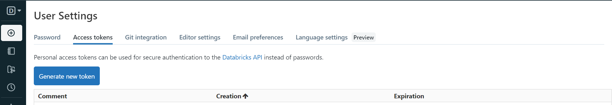
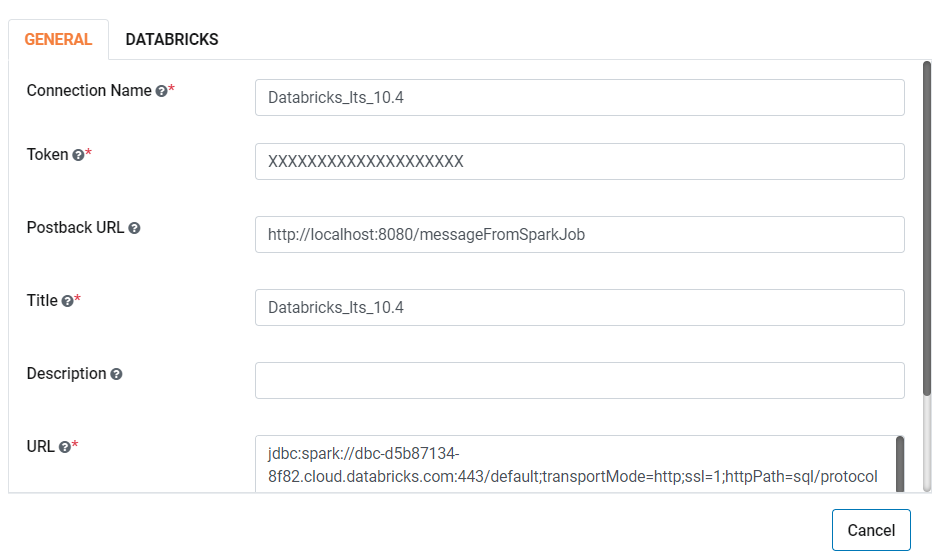
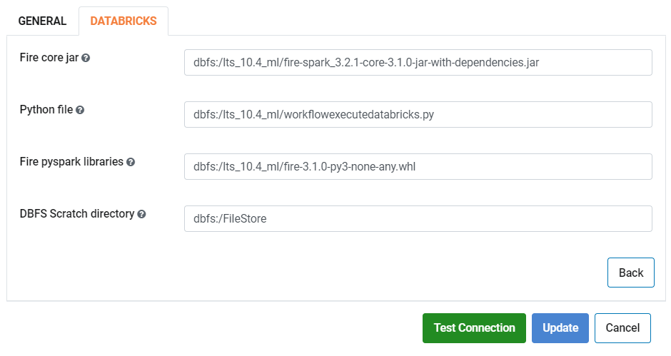
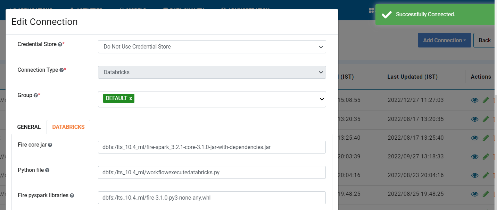

Azure Databricks Integration Steps
======================

Fire Insights integrates with Databricks. It submits jobs to the Databricks clusters using the REST API of Databricks and have the results displayed back in Fire Insights.

Fire also fetches the list of databases and tables from Databricks, making it easier for the user to build their workflows and execute those workflows. In addition, Fire displays the list of Databricks clusters running for the user.

For detailed information on running Databricks on Azure, please visit the link given here : https://docs.microsoft.com/en-us/azure/azure-databricks/quickstart-create-databricks-workspace-portal

Below are the steps for integrating Fire Insights with your Databricks Clusters:

Install Fire Insights
-----------

Install Fire Insights on any machine. The machine has to be reachable from the Databricks cluster.

Upload Fire Core Jar to Databricks
----------------------------------

Upload Fire Insights Jar to Databricks. Fire Insights jobs running on Databricks make use of this jar file.

Upload ``fire-x.y.z/fire-core-lib/fire-spark_3.2.1-core-3.1.0-jar-with-dependencies.jar`` to Databricks. Upload it under Workspace as a Library on to Databricks.

1. Login to ``Databricks Cluster``.
++++++++++++++++++++++++++++++++

2. Click on ``Workspace`` located on the left side pane.
++++++++++++++++++++++++++++++++

   .. figure:: ../_assets/configuration/azure_workspace.PNG
      :alt: Databricks
      :width: 40%
   
3. Create a new Library.
++++++++++++++++++++++++++++++++
 
   .. figure:: ../_assets/configuration/library_create.PNG
      :alt: Databricks
      :width: 40%
   
4. Upload ``fire-spark_3.2.1-core-3.1.0-jar-with-dependencies.jar`` from your machine by clicking on ``Drop JAR here`` or you may upload in ``DBFS``.
++++++++++++++++++++++++++++++++

   .. figure:: ../_assets/configuration/uploadlibrary.PNG
      :alt: Databricks
      :width: 40%
   
5. Once ``fire-spark_3.2.1-core-3.1.0-jar-with-dependencies.jar`` is uploaded, click on ``Create``.
++++++++++++++++++++++++++++++++

 .. figure:: ../_assets/configuration/createlibrary.PNG
    :alt: Databricks
    :width: 40%
 
6. Upload ``fire-3.1.0-py3-none-any.whl``. 
++++++++++++++++++++++++++++++++

You can upload the ``fire-3.1.0-py3-none-any.whl`` inside databricks library from either ``fire-x.y.z/dist`` or directly download it from the link given below:

https://docs.sparkflows.io/en/latest/databricks/admin-guide/databricks-library.html
  
7. Upload ``workflowexecutedatabricks.py`` file to DBFS.
++++++++++++++++++++++++++++++++

For Python Job submission to Databricks Cluster:

Upload ``fire-x.y.z/dist/workflowexecutedatabricks.py`` file to DBFS, copy the absolute path which needs to be added in databricks connection in ``DATABRICKS`` tab for ``Python file``. 

.. note:: It is mandatory to update the above path or else the Pyspark job will show the error message.

Install Databricks JDBC Driver
-----------------------------------

Fire needs the Databricks JDBC Driver to be installed. Install it in the ``fire-user-lib`` and ``fire-server-lib`` folder of the Fire installation.

You can download the Databricks JDBC Driver from the Databricks website using the links given below: 

* https://docs.databricks.com/bi/jdbc-odbc-bi.html
* https://databricks.com/spark/odbc-driver-download

The driver is available as a zip file e.g. ``SimbaSparkJDBC-2.6.3.1003.zip``.

* Unzip the downloaded file. It will create a directory like ``SimbaSparkJDBC-2.6.3.1003``.
* Copy the JDBC jar file named ``SparkJDBC41.jar`` into ``fire-x.y.z/fire-user-lib`` and ``fire-x.y.z/fire-server-lib``.

Create your REST API token in Databricks
--------------

Create your token in Databricks. It would be used in making REST API calls to Databricks from Fire Insights.

1. Login to your Databricks Account.
++++++++++++++++++++++++++++++++

2. Click on ``Account`` icon located in the top right corner.
++++++++++++++++++++++++++++++++

   
3. Click on ``User Settings``.
++++++++++++++++++++++++++++++++

4. Click on ``Generate New Token``.
++++++++++++++++++++++++++++++++

5. Add ``Comment`` & ``Lifetime(days)`` for token expiry & click on ``Generate``.
++++++++++++++++++++++++++++++++

.. figure:: ../_assets/configuration/token_update.PNG
   :alt: Databricks
   :width: 60%

6. Copy the token generated. Click on ``DONE``.
++++++++++++++++++++++++++++++++

.. figure:: ../_assets/configuration/token_generated.PNG
   :alt: Databricks
   :width: 40%

Create Databricks Connection in Fire Insights
-----------------------------------

1. Create a connection in Fire Insights to Databricks. 

* Enable Databricks in Fire Insights

Login to ``Fire Insights`` application -> ``Administration`` -> ``Configurations`` -> ``Connection`` -> and enable Databricks connection by setting the below parameter:

::

    connection.databricks.enabled : true

* Create a connection in Fire Insights to Databricks. 

It can be created by the Administrator under ``Administration/Global Connections``. These connections are available for everyone to use.

It can also be created by any user inside their Project. In this case, it is only available to the Project and its users.

For GENERAL tab
++++

.. list-table:: 
   :widths: 10 20 30
   :header-rows: 1

   * - Title
     - Description
     - Value
   * - Connection Name
     - Connection Name
     - Name of Connection
   * - Token
     - Token
     - Token created in above steps  
   * - Postback Url
     - Postback Url
     - Postback Url through which Databricks sent result back to Fire Insights
   * - Title 
     - Title of Selected Connection
     - Title of Selected Connection  
   * - Description 
     - Connection Description 
     - Connection Description
   * - Url
     - Url for selected Connection type
     - Add URL for Databricks Connection

Reference Link for further information : https://docs.sparkflows.io/en/latest/databricks/admin-guide/index.html

For DATABRICKS tab
++++

.. list-table:: 
   :widths: 10 20 30
   :header-rows: 1

   * - Title
     - Description
     - Value
   * - Fire core jar
     - Fire core jar
     - Fire core jar PATH uploaded in databricks library
   * - Python file
     - Python file
     - Python file PATH as uploaded in above step  
   * - Fire pyspark libraries
     - Fire pyspark libraries
     - Fire pyspark libraries PATH uploaded in databricks library
   * - DBFS Scratch directory 
     - DBFS Scratch directory
     - Scratch directory on Databricks DBFS where app has Read, Write and Delete Privilege
  

Test Connection
++++

Once the above Configuration are updated, Click on ``Test Connection`` and ``Save`` if its successfully connected.

Reference Link for further information : https://docs.sparkflows.io/en/latest/installation/connection/compute-connection/databricks.html

Now, we are ready to start using the Databricks Connection in Fire Insights to:

* Browse DBFS.
* View your Databricks Clusters.
* Browse your Databricks Databases & Tables.
* Create Workflows which Read from and Write to Databricks.
