CDC - Case Study
======================
Sparkflows supports the incremental loading of changes in relational tables through workflows and the summary page.

This document outlines the **Change Data Capture (CDC) - Case Studies** using the **AutoIncrement** and **DeltaMerge** Nodes in Sparkflows.

Case Study-Initial Load
----------------------------------------------

1. Table Creation
----------------------------------------------

* a. Create a **EMPLOYEE_MASTER** Oracle table as below:

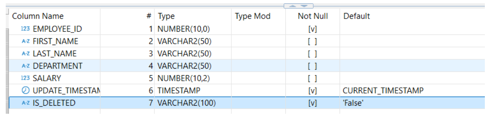

* b. Add following rows to the table:

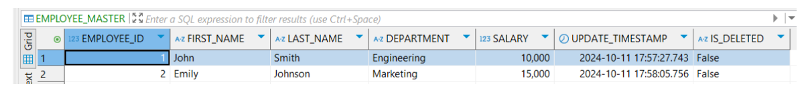

2. Workflow creation and execution
----------------------------------------------

* a. Create a workflow as below:

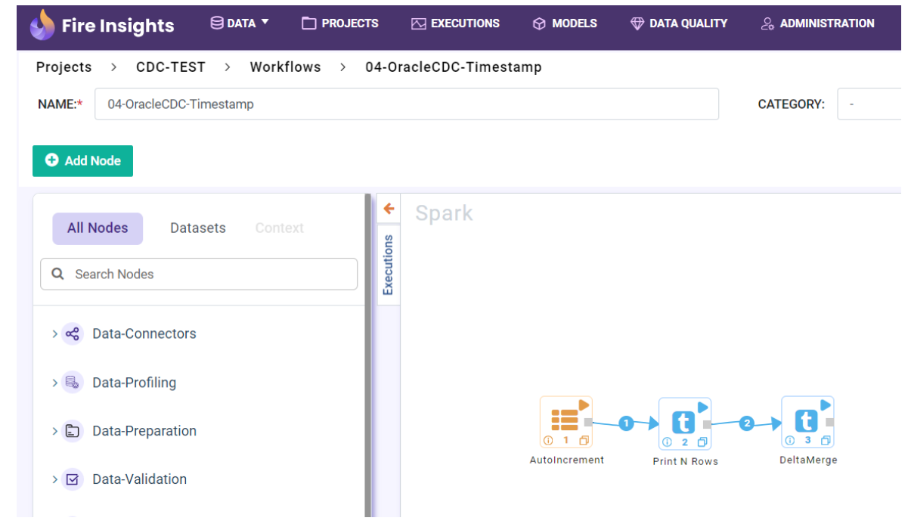

* b. Configure Autoincrement node as below:

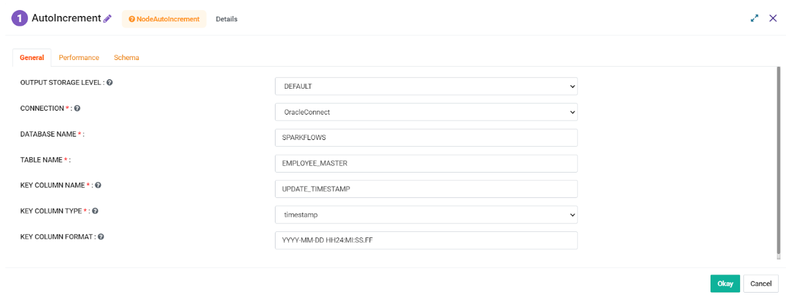

* c. Configure DeltaMerge node as below:

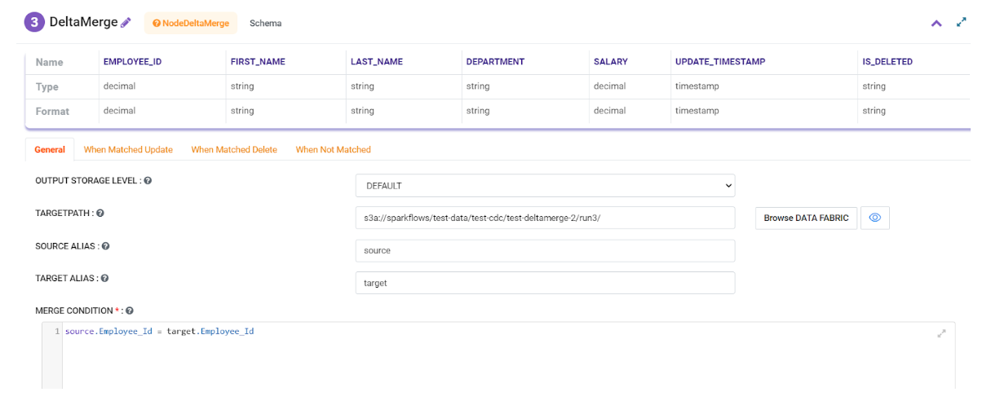

3. With this configuration execute the workflow and output would be as followings:
----------------------------------------------

* a. Print Node

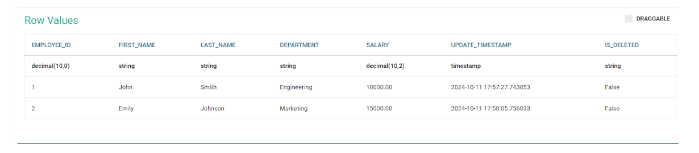

* b. CDC Tab displaying the End Value

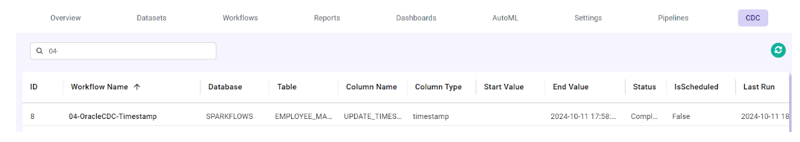
   
* c. Entire data from the dataset would get merged to the Targetpath as a part of Initial Load. Data from the TargetPath is as below

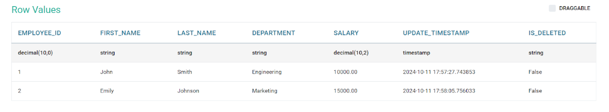

Case Study-New Row Merge
----------------------------------------------

1. New Row Addition
----------------------------------------------

* a. Add a new rows to EMPLOYEE_MASTER Oracle table as below:

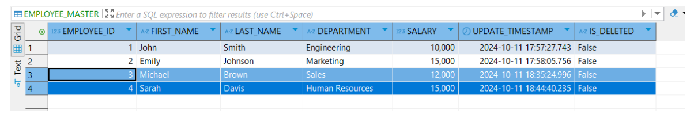

2. Workflow execution
----------------------------------------------

* a. Execute the CDC workflow that was created earlier

3. With this configuration execute the workflow and output would be as followings:
----------------------------------------------

* a. Print Node

Two newly added rows would be printed by the Print Node

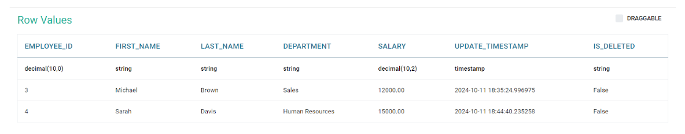

* b. CDC Tab displaying the Start Value as per the last fetch Update_Timestamp value and End Value as per the latest Max Updae_Timestamp

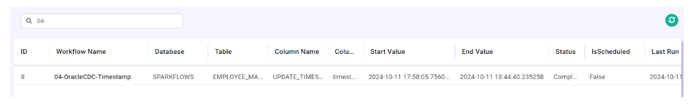
   
* c. New rows added to the Table got merged to the Targetpath. Data from the TargetPath is as below

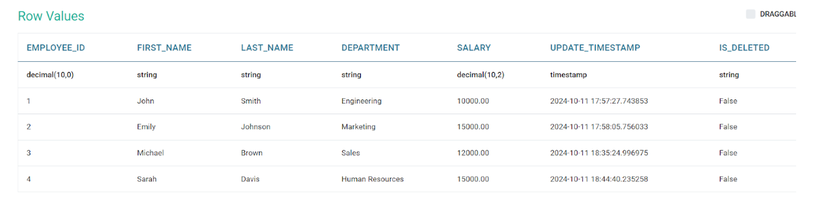

Case Study-Update Data Merge
----------------------------------------------

1. Update Data
----------------------------------------------

* a. Update Data in EMPLOYEE_MASTER Oracle table as below:

Salary and Update_Timestamp has been updated for Employee_ID = 4

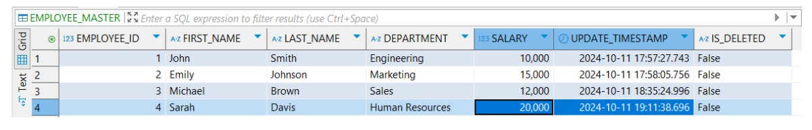

2. Workflow execution
----------------------------------------------

* a. Execute the CDC workflow that was created earlier

3. With this configuration execute the workflow and output would be as followings:
----------------------------------------------

* a. Print Node

Updated row would be printed by the Print node based on the update in the Update_Timestamp column (which is the CDC column in Autoincrement node)

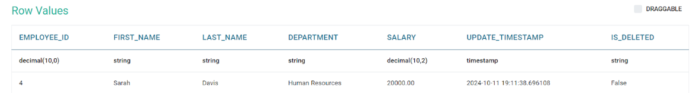

* b. CDC Tab displaying the Start Value as per the last fetch Update_Timestamp value and End Value as per the latest Max Updae_Timestamp

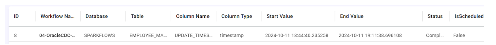
   
* c. Data updates (Salary and Update_Timestamp values for the Employee_ID = 4) reflect the merged data at the Targetpath. Data from the TargetPath is as below

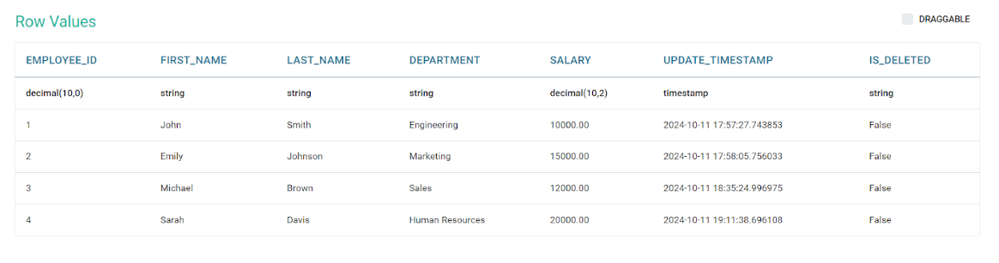

Case Study-Delete Data Merge
----------------------------------------------

1. Update Delete Flag Data
----------------------------------------------

* a. Update Data in EMPLOYEE_MASTER Oracle table as below:

Is_Deleted and Update_Timestamp has been updated for Employee_ID = 3. Is_Deleted flag has been set to ‘True’ marking it as deleted.

.. figure:: ../_assets/cdc/cdc-cs3-delete.png
   :alt: cdc
   :width: 60%

2. Workflow execution
----------------------------------------------

* a. Configure DeltaMerge node as below:

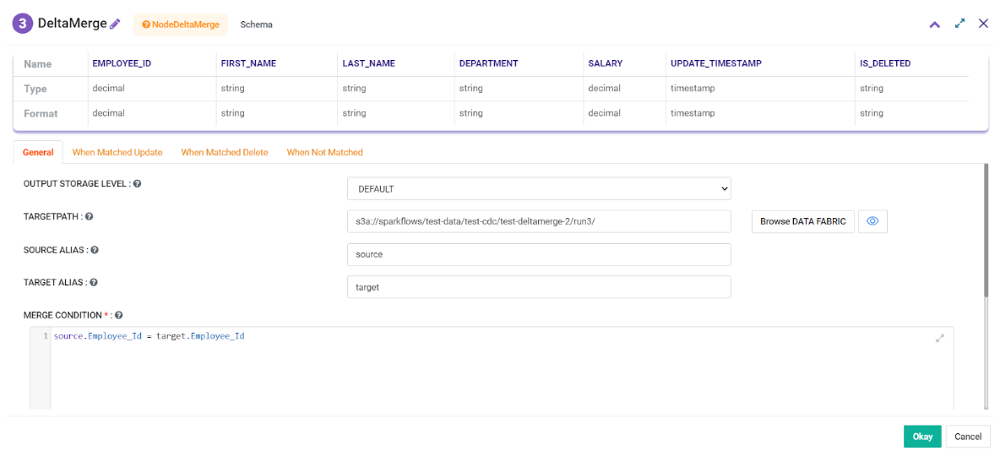
   
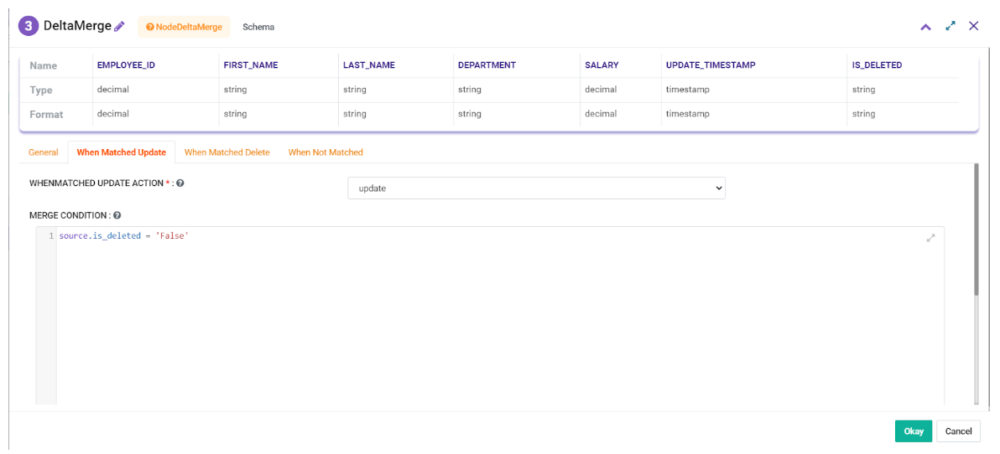
   
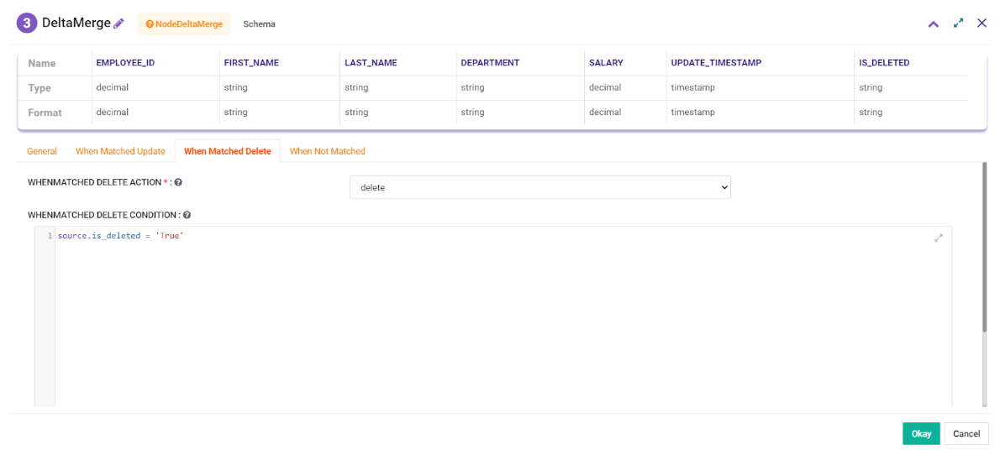

* b. Execute the CDC workflow that was created earlier

3. With this configuration execute the workflow and output would be as followings:
----------------------------------------------

* a. Print Node

Updated row would be printed by the Print node based on the update in the Update_Timestamp column (which is the CDC column in Autoincrement node). Deleted row would be printed.

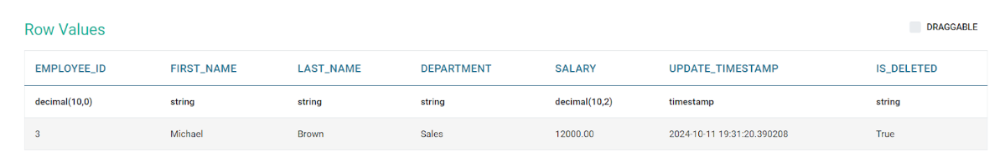

* b. CDC Tab displaying the Start Value as per the last fetch Update_Timestamp value and End Value as per the latest Max Updae_Timestamp

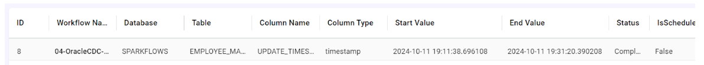
   
* c. Row that was marked as deleted (Employee_ID = 3) has been removed from the Targetpath after merge. Data from the TargetPath is as below

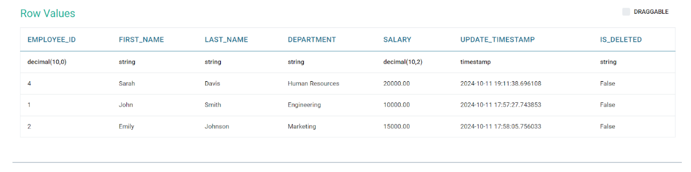
