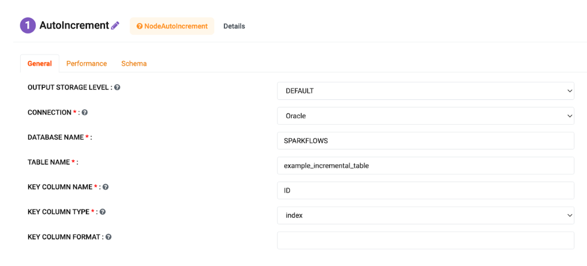
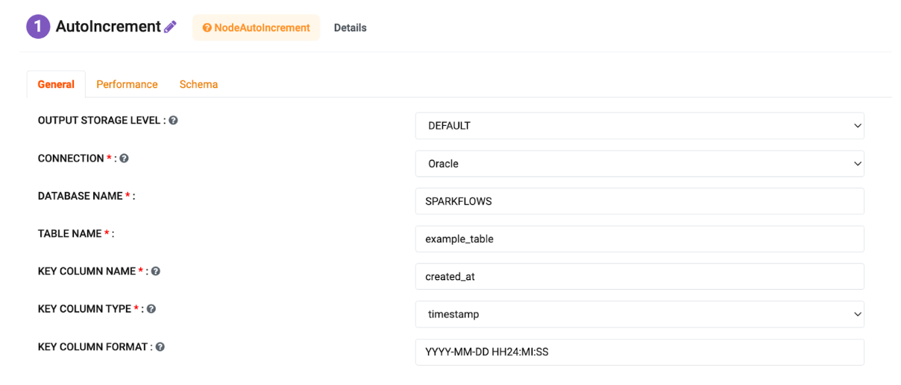
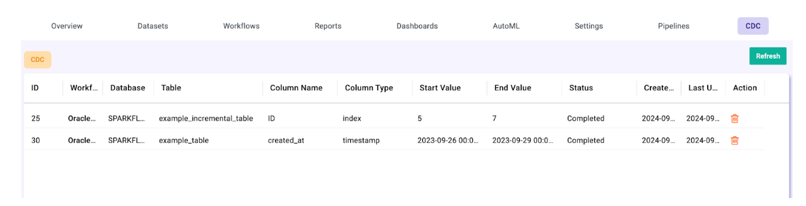

CDC - Change Data Capture
======================
Sparkflows supports the incremental loading of changes in relational tables through workflows and the summary page.

This document outlines the overview of **Change Data Capture (CDC)** using the **AutoIncrement** and **DeltaMerge** Nodes in Sparkflows.

**Change Data Capture (CDC)** with Incremental Load using **AutoIncrement** node and Merge with **DeltaMerge** node on Delta Lake Location involves continuously capturing the changes (inserts, updates, deletes) in the source database and applying these changes to the target Delta in an efficient and scalable manner.

Here's a detailed explanation of the process:

What is Change Data Capture (CDC)?
----------------------------------------------

**CDC** is a technique used to track and capture the changes (like inserts, updates, and deletes) happening in a database table and apply these changes to another table or system. The purpose of **CDC** is to keep the target system synchronized with the source without fully reloading the data every time.

1. Incremental Load with JDBC Source: AutoIncrement Node
----------------------------------------------

When loading data incrementally from a database, the goal is to retrieve only the new or changed records since the last load, instead of reloading all the data. This minimizes the load on the source system and increases efficiency.

**Source Database: MySQL, Oracle, Postgres or any other RDBMS.**

**Steps to perform Incremental Load using AutoIncrement Node:**

* **Identify a Change Indicator:** This could be a timestamp (e.g., last_modified column) or a monotonically increasing key (e.g., id).

* **Initial Load:** During the first load, all records from the source table are loaded into the target Delta Lake Location.

* **Subsequent Loads:** After the initial load, the job only queries records that have been inserted or updated since the last load by filtering using the last_modified column or the highest id value previously loaded.

Details of metadata of the last run are stored in the CDC page of sparkflows for each workflow.

**Configuration:**

* **a. Type: index**

* **b. Type: timestamp/date**

2. Merge Incremental Data with Delta Lake: 
----------------------------------------------

Once the new or changed records are loaded into a DataFrame via AutoIncremental, you need to merge this incremental data into an existing Delta Lake Location. Delta Lake provides an efficient mechanism to perform upserts (update or insert) using the MERGE command.

**Steps for the Merge Process:**

* **Delta Lake Schema:** Ensure that the schema of the Delta Lake target location matches the schema of the incremental data.

* **Merge Condition:** Identify a merge condition to match records between the source and target tables. This condition will be used to determine if a record should be inserted (new record) or updated (existing record).

**Explanation:**

* **a. When Matched (Delete Condition):**

If **source.is_deleted = true**, the matching record in the Delta Location is deleted using **.delete()**. This condition allows selective deletion of records.

* **b. When Matched (Update Condition):**

If **source.is_deleted = false**, the matching record in the Delta Location is updated. The **.updateExpr()** method is used to update specific columns based on the source data. You can define multiple conditions and update clauses for more complex logic.

* **c. When Not Matched (Insert):**

When the record is not matched (i.e., a new record in the source), the record is inserted into the Delta Location using .insertExpr().

.. note:: **source.is_deleted** refers to the column in source indicating that a row has been marked as deleted.

.. figure:: ../_assets/cdc/cdc-autoinc-deltamerge.png
   :alt: cdc
   :width: 60%

3. Tracking Last Loaded Timestamp or ID
----------------------------------------------

To efficiently capture incremental changes, you need to keep track of the last load point (either a timestamp or an ID). This is typically done in a CDC page with AutoIncrementNode.

**Updating the Last Loaded Timestamp:** After each successful load and merge operation, store the new maximum value of the last_modified column (or id) in the CDC page with AutoIncrementNode.

**Project >> CDC**

* Each job reads from this metadata table to determine the last processed record for a given table used in workflow with AutoIncrementNode.

* After each successful load and merge, the workflow updates this metadata table with the new id or timestamp.

In **Adminstartion >> Configuration** enable the CDC module.

4. Summary:
----------------------------------------------

Ingesting data from **MySQL** and **Oracle**, the following steps can be implemented:

* **a. Initial Load:** Perform a full data load for each table and store it in Delta Lake.(AutoIncrement and Save Delta Node).

* **b. Incremental Load:** Subsequent loads only fetch new or updated data using incremental logic.(AutoIncrement Node)

* **c. Merge with Delta:** Data is merged into Delta Lake Location, ensuring data consistency and historical tracking.(DeltaMerge Node)

* **CDC Tracking:** Metadata is updated after each job, and the next incremental load picks up where the last one left off.(AutoIncremental Node and CDC page)

* **Scheduled Execution:** Jobs are scheduled to run daily or at a defined interval, ensuring up-to-date data.
