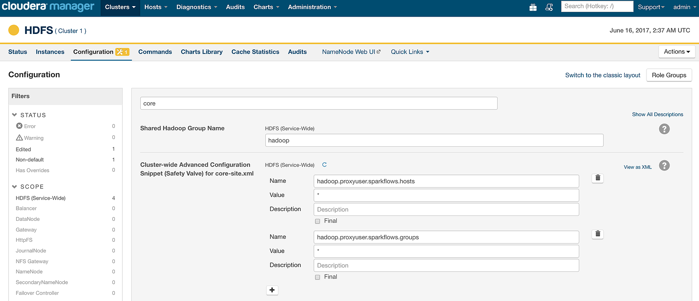
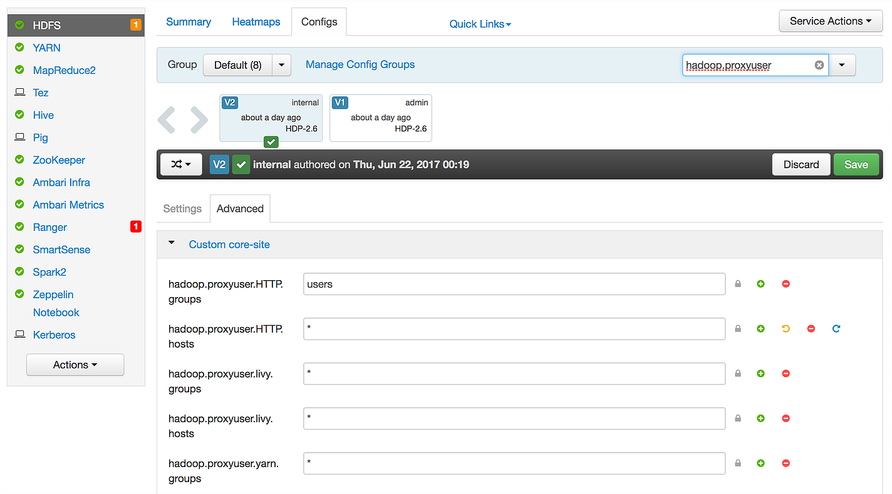
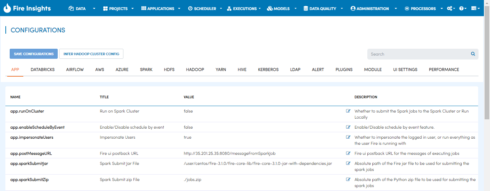

Connect to Apache Spark Cluster
==================================

Overview
--------

Fire can be configured to submit the spark jobs to run on an Apache Spark Cluster.

* **Install Fire on an edge node of your Apache Spark Cluster.**
    
    * The edge node has the hadoop, Hive or Spark configuration files set up.
    * Make sure that you are already able to run your spark jobs from this node using spark-submit.
* **Update the below configurations under the menu, Administration/Configuration.**

.. Note:: In order for Fire to connect to the Apache Spark Cluster, it needs to be installed as a user which can impersonate other users. More details can be found below in this page. For the rest of the documentation on this page, we assume that it has been installed as the user **sparkflows**.

Fire User Setup
---------------

The user with which Fire is running has to be a proxy user in HDFS. As in this way it can impersonate the logged in user.

Follow the steps given below for setting the Fire user to be a proxy user on HDFS.

Update core-site.xml of Hadoop to allow Fire user to impersonate:
^^^^^^

For detailed information, read `Cloudera Documentataion. <https://www.cloudera.com/documentation/enterprise/5-8-x/topics/admin_hdfs_proxy_users.html>`_

* In your core-site.xml file for hadoop, allow Sparkflows user to impersonate other users. Without impersonation enabled for this user, your sparkflows application users trying to run jobs against a hadoop cluster would not be able to do so.

* Also, allow the appropriate groups that the sparkflows users will be able to impersonate belong to.

* In the example given below, user **sparkflows** is allowed to impersonate users from hosts **host1** and **host2**. The users being impersonated belong to the groups **Hive, HFS, hadoop, Spark**. Your permissions are likely going to be different and more restrictive.

Below is an example::

  <property>
     <name>hadoop.proxyuser.sparkflows.hosts</name>
     <value>host1,host2</value>
  </property>

  <property>
     <name>hadoop.proxyuser.sparkflows.groups</name>
     <value>hive,hfs,hadoop,spark</value>
   </property>

Cloudera Manager
^^^^^^^^^^^^^^^^

If you are using Cloudera Manager, you can set the above settings for impersonation in **HDFS/Configuration**.

Ambari
^^^^^^

If you are using Ambari, you can set the above settings for impersonation in **HDFS/Configuration under Custom core-site**.

Infer Hadoop Cluster Config
--------------------

**Infer Hadoop Cluster Config button** under **Administration/Configuration** automatically infers some of the configurations of the cluster from the hadoop config files on the edge node to help with the process. Use it to get the initial set of configurations.

Fire Configurations to connect to an Apache Spark Cluster
-------------------------------------------------------------

Below are the configuration details to connect Fire to an Apache Spark Cluster.

.. list-table:: 
   :widths: 14 20 30
   :header-rows: 1

   * - Parameter
     - Value
     - Description
   * - app.runOnCluster
     - true
     - Indicate to run on the spark cluster. By default it is set to false.
   * - app.postMessageURL
     - http://localhost:8080/messageFromSparkJob
     - Indicate the URL on fire server which receives messages from the spark jobs running on the cluster. Set localhost to the machine name on which Fire is running. Replace 8080 with the port number on which Fire is running.
   * - app.sparkSubmitJar
     - /user/centos/fire-2.1.0/fire-lib/fire-core-2.1.0-jar-with-dependencies.jar
     - fire-lib directory of the Sparkflows install contains the fire core jar used in submitting the workflows to the Spark cluster. Set it correctly to be the absolute path of the fire core JAR. 
   * - hdfs.namenodeURI
     - hdfs://localhost:8020
     - Update the HDFS namenode URI. Set localhost to the machine on which the namenode is running.
   * - hdfs.namenodeURI
     - file://
     - Set it to file:// when the files are on the local filesystem. This can be the case when HDFS is not there.  
   * - hdfs.namenodeURI
     - maprfs:///
     - Set it to maprfs:/// for mapr.  
   * - hive.JDBC_DB_URL 
     - jdbc:hive2://localhost:10000 
     - Update the Hive JDBC DB URL if you would be accessing Hive from Sparkflows. This is the URL of the HiveServer 2 server.
   * - spark.sql-context 
     - HIVEContext
     - Set it to either HIVEContext or SQLContext based on whether you want to use HIVEContext or SQLContext in your job. Use HIVEContext if you would be accessing the HIVE tables. 
   * - spark.master  
     - yarn 
     - Set it to yarn for connecting to a spark cluster running YARN.  
   * - spark.master  
     - spark://spark_master_hostname:port
     - Set it to the spark master URL when connecting to a spark cluster running in standalone mode. Port is normally 7077.
   * - spark.spark-submit 
     - spark-submit
     - Spark Submit command for submitting the Spark jobs to the cluster. It can be spark2-submit for Spark2 CDH clusters. Make sure to provide the full path or spark-submit should be in the path.  

Create New Users in Fire
--------------------

Fire allows creating multiple users. Create the users in Fire under **Administration/Users** section which would build and run the workflows.

These users have to exist on HDFS. So, ensure that these users' home directory(s) are created on HDFS.

Also, create the home directory for the users on HDFS. The sample code below creates the home directory for the user **xyz** onto HDFS. It also changes the permission of the directory::

* su - hdfs
* hadoop fs -mkdir /user/xyz
* hadoop fs -chown xyz:hadoop /user/xyz

Set up PySpark
-------------------

If running with PySpark, the following might need to be added to point PYSPARK to the right version of python on the cluster machines. Below is an example where python is at **/home/ec2-user/venv/bin/python**.

It is also important that all the users are able to execute the Python executable.

spark-env.sh::

    export PYSPARK_PYTHON=/home/ec2-user/venv/bin/python
    export PYSPARK_DRIVER_PYTHON=/home/ec2-user/venv/bin/python

spark-defaults.conf::

    spark.yarn.appMasterEnv.PYSPARK_PYTHON=/home/ec2-user/venv/bin/python
    spark.yarn.appMasterEnv.PYSPARK_DRIVER_PYTHON=/home/ec2-user/venv/bin/python

