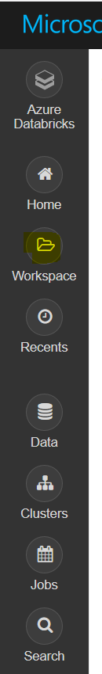
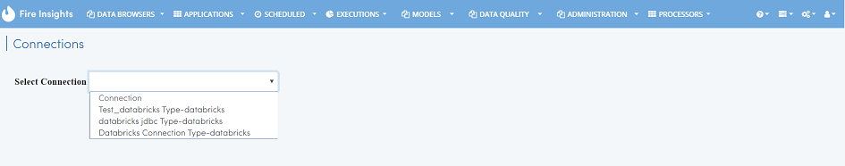
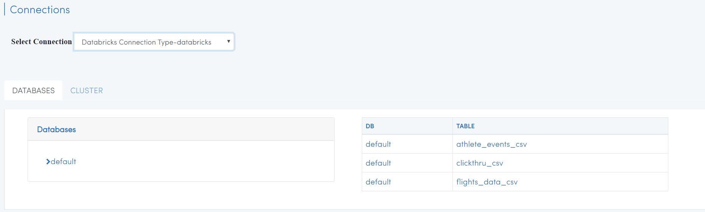
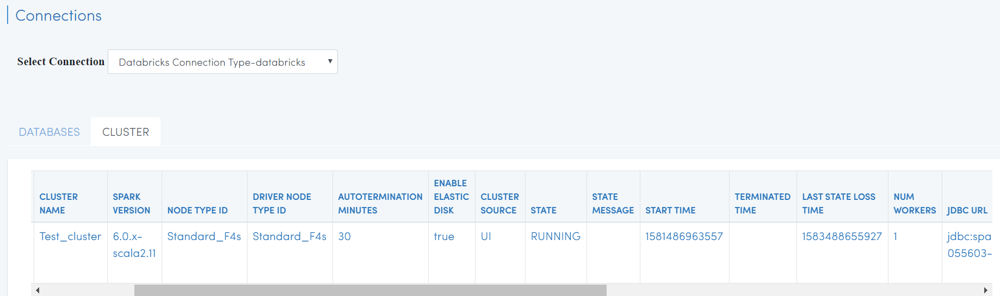

Databricks Integration
======================

Fire Insights integrates with Databricks. It submits jobs to the Databricks clusters using the REST API of Databricks and have the results displayed back in Fire Insights.

Fire also fetches the list of Databases and Tables from Databricks, making it easier for the user to build their workflows and execute them. In addition fire displays the list of Databricks clusters running for the user.

Databricks can be running on Azure or on AWS.

* Running Databricks on Azure : https://docs.microsoft.com/en-us/azure/azure-databricks/quickstart-create-databricks-workspace-portal
* Running Databricks on AWS : https://databricks.com/aws

Deployment
-----------

Install Fire Insights on any machine. The machine has to be reachable from the web via a public IP or DNS entry. Then connect Fire Insights to your Databricks Cluster

Upload Fire Core Jar to Databricks
----------------------------------

Fire Insights jar has to be uploaded to Databricks. Fire Insights jobs running on Databricks make use of this jar file.

Upload ``fire-x.y.z/fire-core-lib/fire-spark_2_3-core-3.1.0-jar-with-dependencies.jar`` to Databricks. Upload it under Workspace as a Library on to Databricks.

* Login to ``Databricks Cluster``.
* Click on ``workspace`` in the left side pane.

   
 * Dropdown ``workspace``, Click on ``Create & Library`` .
 
 .. figure:: ../_assets/configurationcreate_library.PNG
   :alt: Databricks
   :align: center
   :width: 60%

Configure the Uploaded Library in Fire Insights
------------------------------------

Configure the path of the uploaded fire core jar library in Databricks in Fire Insights.

This has to be done under Administration/Configuration.

.. figure:: ../_assets/configuration/databricks-configurations.PNG
   :alt: Databricks
   :align: center
   :width: 60%
   
Configure app.postMessageURL
----------------------------

Configure ``app.postMessageURL`` to be the public IP of the machine. It has to be accessible from the Databricks Cluster.

.. figure:: ../_assets/configuration/Fireui_postbackurl.PNG
   :alt: Databricks
   :align: center
   :width: 60%

Install Databricks JDBC Driver
-----------------------------------

Fire needs the Databricks JDBC Driver to be installed. Install it in the ``fire-user-lib`` folder of the Fire installation.

You can download the Databricks JDBC Driver from the Databricks site : 

* https://docs.databricks.com/bi/jdbc-odbc-bi.html
* https://databricks.com/spark/odbc-driver-download

The driver is available as a zip file. eg: ``SimbaSparkJDBC-2.6.3.1003.zip``

* Unzip the downloaded file. It will create a directory like ``SimbaSparkJDBC-2.6.3.1003``
* Copy the jdbc jar file named ``SparkJDBC4.jar`` into ``fire-x.y.z/fire-user-lib`` and ``fire-x.y.z/fire-server-lib``

Create your REST API token in Databricks
--------------

Create your token in Databricks. It would be used in making REST API calls to Databricks from Fire Insights.

* Login to Azure account with Databricks cluster running.
* Click on ``Account`` icon in right corner top.

.. figure:: ../_assets/configuration/usersetting.PNG
   :alt: Databricks
   :align: center
   :width: 60%
* Click on ``User Settings``.

.. figure:: ../_assets/configuration/userset.PNG
   :alt: Databricks
   :align: center
   :width: 60%

* Click on ``Generate New Token``.

.. figure:: ../_assets/configuration/generatetoken.PNG
   :alt: Databricks
   :align: center
   :width: 60%

* Add ``comment`` & ``Lifetime(days)`` for token expiry & Click on ``Generate``.

.. figure:: ../_assets/configuration/token_update.PNG
   :alt: Databricks
   :align: center
   :width: 60%

* Copy the token generated and Click on ``DONE``.

.. figure:: ../_assets/configuration/token_generated.PNG
   :alt: Databricks
   :align: center
   :width: 60%

Create Databricks Connection
----------

Create a connection in Fire Insights under your Application for connecting to Databricks.

* Specify your Databricks Token.
* Specify the Databricks JDBC URL of your cluster in Databricks.

.. figure:: ../_assets/configuration/databricks_connection.PNG
   :alt: Databricks
   :align: center
   :width: 60%

Read Databricks table in Workflow
------------------------------------------

In the workflow use the processor 'ReadDatabricksTable'. It will allow you to read tables from Databricks.

Then use the other processors in Fire for processing the data read from the Databricks Table.

Workflow
++++++++

.. figure:: ../_assets/configuration/workflow-databricks.PNG
   :alt: Databricks
   :align: center
   :width: 60%

Processor Configurations for ReadDatabricksTable
++++++++

.. figure:: ../_assets/configuration/databricks_editor.PNG
   :alt: Databricks
   :align: center
   :width: 60%

Refresh schema for processor ReadDatabricksTable
++++++++
 
.. figure:: ../_assets/configuration/databricks_refreshschema.PNG
   :alt: Databricks
   :align: center
   :width: 60% 

Processor executions for ReadDatabricksTable
++++++++

.. figure:: ../_assets/configuration/databrcks_interactiveexecutions.PNG
   :alt: Databricks
   :align: center
   :width: 60%

Databricks Workflow execution
++++++++

Below is the output of executing the above workflow which reads data from a Databricks table.

.. figure:: ../_assets/configuration/databricks_workflowexecutions.PNG
   :alt: Databricks
   :align: center
   :width: 60%
   
   
Write to Databricks Table in a Workflow
---------------------------------------

Browse Databricks Databases and Tables
--------------------------------------

Fire Insights allows you to Browse your Databricks Schema.

Go to ``DATABROWSERS/Connections``. It will display the various Databricks Connections in your Applications.

Select the relevant ``connection`` to use it for browing the Databricks Schema.

   
Select ``CLUSTER`` tab to see detail informations of databrick cluster 

