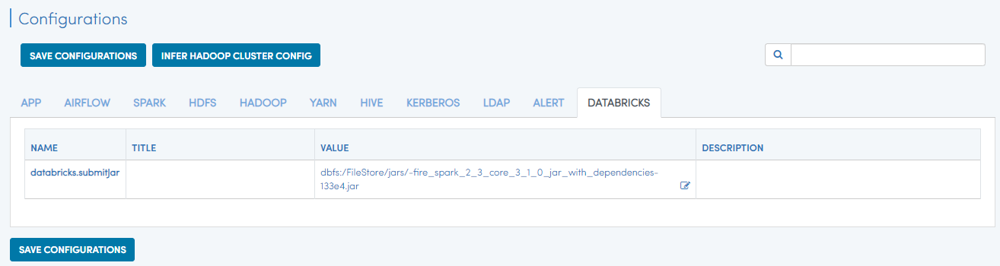
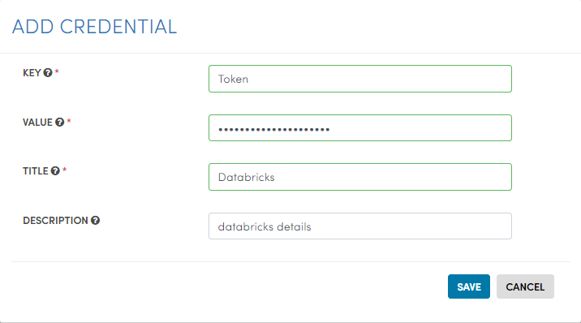
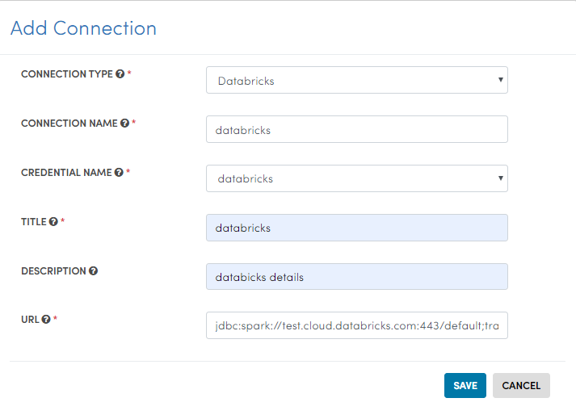
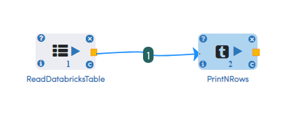
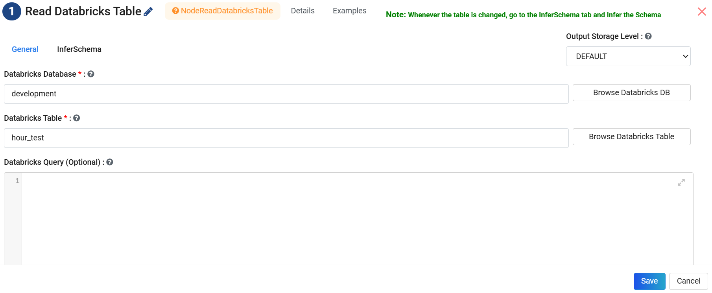
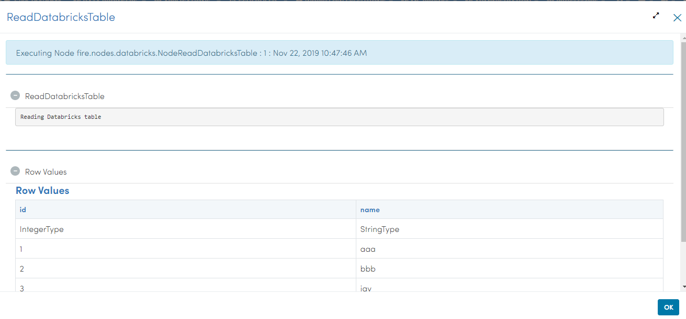
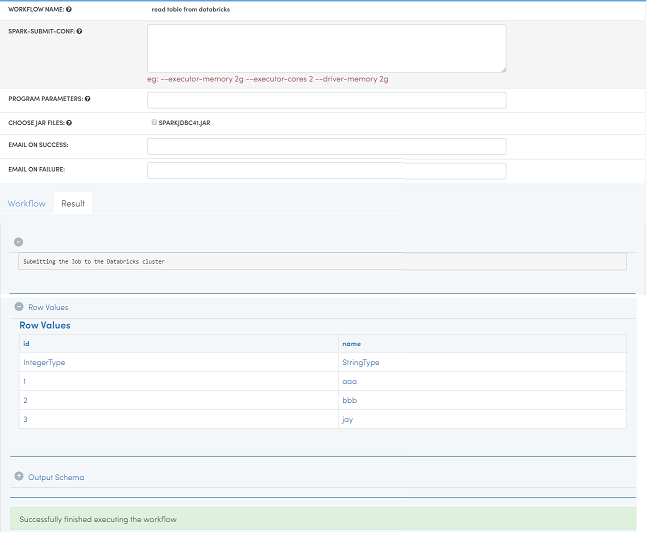

Databricks Integration
======================

Fire Insights integrates with Databricks. It can submit jobs to the Databricks clusters.

Deployment
-----------

Install Fire Insights on any machine. The machine has to be reachable from the web. Then connect it to your Databricks Cluster

Upload Fire Core Jar to Databricks
----------------------------------

Upload fire-x.y.z/fire-core-lib/fire-spark_2_3-core-3.1.0-jar-with-dependencies.jar to Databricks. Upload it under Workflows as a Library on to Databricks.

.. figure:: ../_assets/configuration/fire-jar.PNG
   :alt: Databricks
   :align: center
   :width: 60%

Specify the Uploaded Library in Fire
------------------------------------

Specify the uploaded fire core jar library in Databricks in Fire Insights.

This has to be done under Administration/Configuration.

Credential
----------

Create a credential (Key/Value) for your Databricks account. This would be used in creating the Connection below.

Connection
----------

Create a connection in your Application for connecting to Databricks.

* Specify the Databricks JDBC URL of your cluser in Databricks.

Read Databricks tables in Workflows
------------------------------------------

In the workflow use the processor 'Read from Databricks'. It will allow you to read tables from Databricks.

Then use the other processors in Fire for processing things.

Workflow:

Processor Configurations for ReadDatabricksTable:

Processor executions for ReadDatabricksTable:

Workflow execution :

   
   

Databricks JDBC Driver Installation
-----------------------------------

Fire needs the Databricks JDBC Driver to be installed. Install it in the fire-user-lib folder of the Fire installation.

You can download the Databricks JDBC Driver from the Databricks site : 

* https://docs.databricks.com/bi/jdbc-odbc-bi.html
* https://databricks.com/spark/odbc-driver-download

