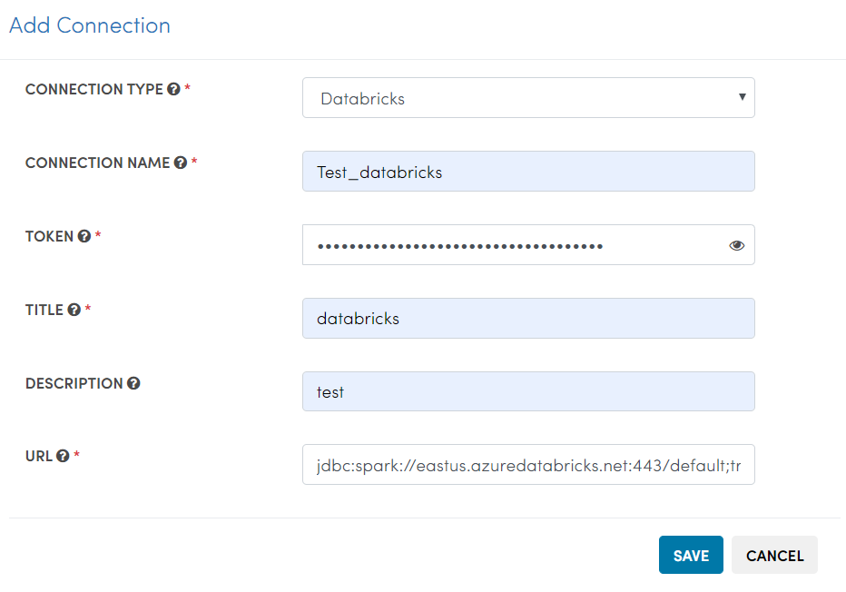

Databricks Integration
======================

Fire Insights integrates with Databricks. It can submit jobs to the Databricks clusters and have the results displayed back in Fire Insights.

Deployment
-----------

Install Fire Insights on any machine. The machine has to be reachable from the web via a public IP or DNS entry. Then connect Fire Insights to your Databricks Cluster

Upload Fire Core Jar to Databricks
----------------------------------

Fire Insights jar has to be uploaded to Databricks. Fire Insights jobs running on Databricks make use of this jar file.

Upload fire-x.y.z/fire-core-lib/fire-spark_2_3-core-3.1.0-jar-with-dependencies.jar to Databricks. Upload it under Workflows as a Library on to Databricks.

.. figure:: ../_assets/configuration/fire-jar.PNG
   :alt: Databricks
   :align: center
   :width: 60%

Configure the Uploaded Library in Fire Insights
------------------------------------

Configure the path of the uploaded fire core jar library in Databricks in Fire Insights.

This has to be done under Administration/Configuration.

.. figure:: ../_assets/configuration/databricks-configurations.PNG
   :alt: Databricks
   :align: center
   :width: 60%
   
Configure app.postMessageURL
----------------------------

Configure ``app.postMessageURL`` to be the public IP of the machine. It has to be accessible from the Databricks Cluster.

Install Databricks JDBC Driver
-----------------------------------

Fire needs the Databricks JDBC Driver to be installed. Install it in the ``fire-user-lib`` folder of the Fire installation.

You can download the Databricks JDBC Driver from the Databricks site : 

* https://docs.databricks.com/bi/jdbc-odbc-bi.html
* https://databricks.com/spark/odbc-driver-download

The driver is available as a zip file. eg: ``SimbaSparkJDBC-2.6.3.1003.zip``

* Unzip the downloaded file. It will create a directory like ``SimbaSparkJDBC-2.6.3.1003``
* Copy the jdbc jar file named ``SparkJDBC4.jar`` into ``fire-x.y.z/fire-user-lib``

Create Databricks Connection
----------

Create a connection in Fire Insights under your Application for connecting to Databricks.

* Specify your Databricks Token.
* Specify the Databricks JDBC URL of your cluster in Databricks.

Read Databricks table in Workflow
------------------------------------------

In the workflow use the processor 'ReadDatabricksTable'. It will allow you to read tables from Databricks.

Then use the other processors in Fire for processing the data read from the Databricks Table.

Workflow
++++++++

.. figure:: ../_assets/configuration/workflow-databricks.PNG
   :alt: Databricks
   :align: center
   :width: 60%

Processor Configurations for ReadDatabricksTable
++++++++

.. figure:: ../_assets/configuration/databricks-editor.PNG
   :alt: Databricks
   :align: center
   :width: 60%

Processor executions for ReadDatabricksTable
++++++++

.. figure:: ../_assets/configuration/databricks-execute.PNG
   :alt: Databricks
   :align: center
   :width: 60%

Databricks Workflow execution
++++++++

Below is the output of executing the above workflow which reads data from a Databricks table.

.. figure:: ../_assets/configuration/workflow-databricks-execute.PNG
   :alt: Databricks
   :align: center
   :width: 60%
   
   
