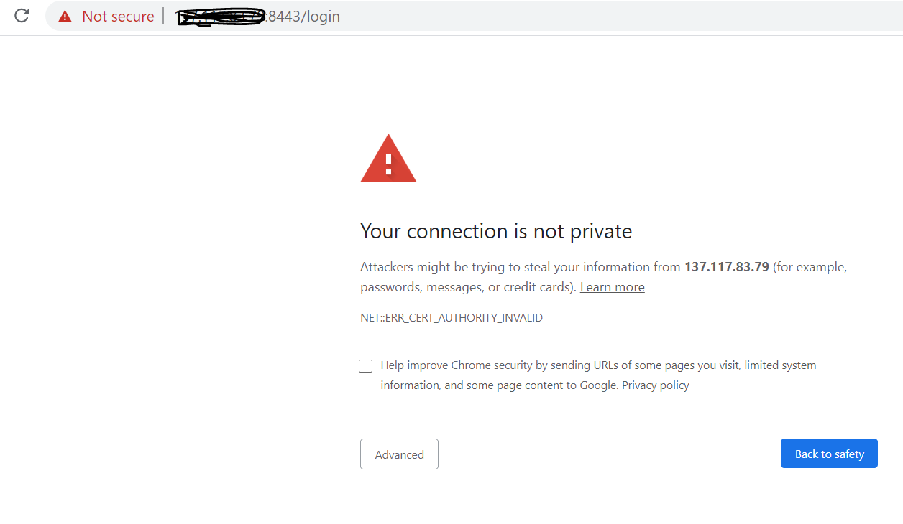
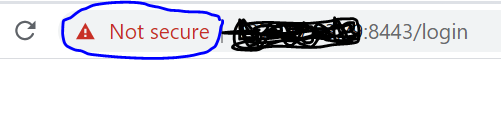

HTTPS : Self-Signed Certificates
================================

Fire Insights comes with a self-signed certificate. It is contained in conf/keystore.jks.

When using the self-signed certificate, the Browser will complain as it has not been issued by a Certificate Authority.

This warning message can be supressed by importing the self-signed certificate into the Browser  inside  ``Trusted Root Certification Authorities``.

Below are the steps for it.

- Login to `URL` which is running on `HTTPS` port.
   - https://privateip:8443/login

   
- Click on `Not secure` place.
 

