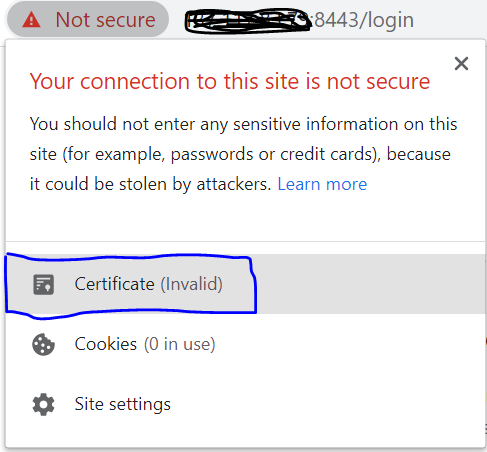
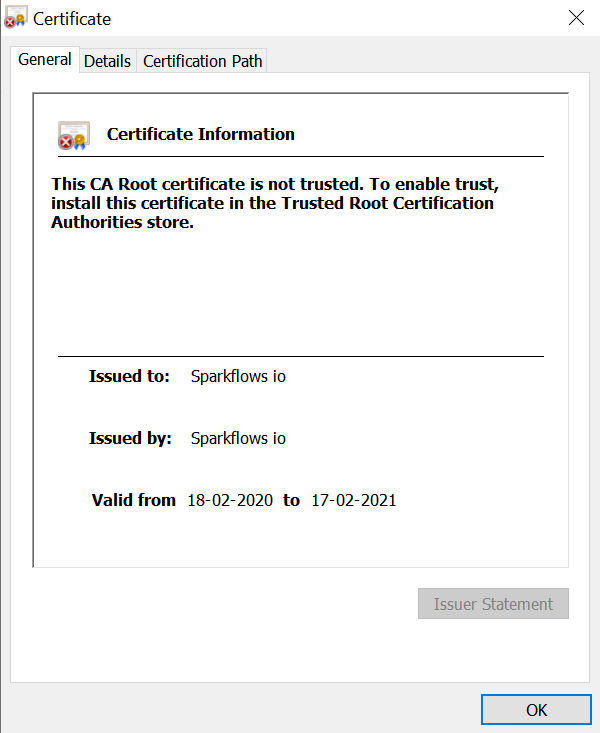
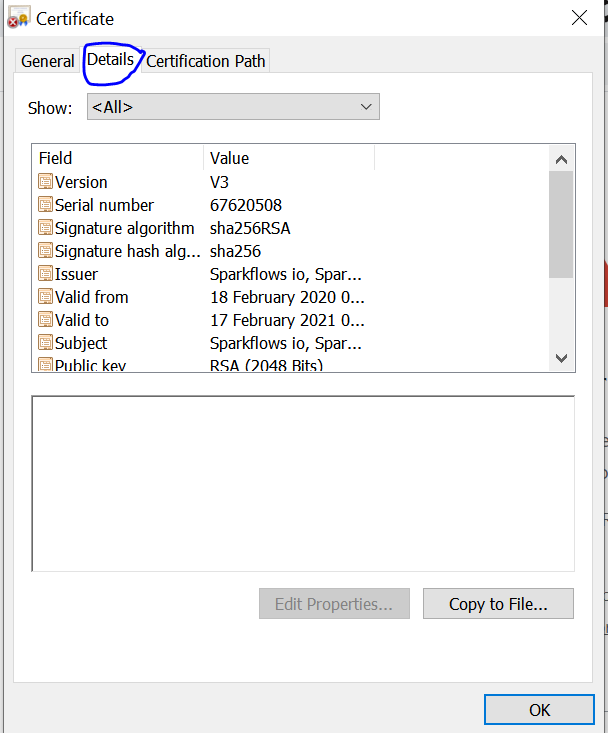
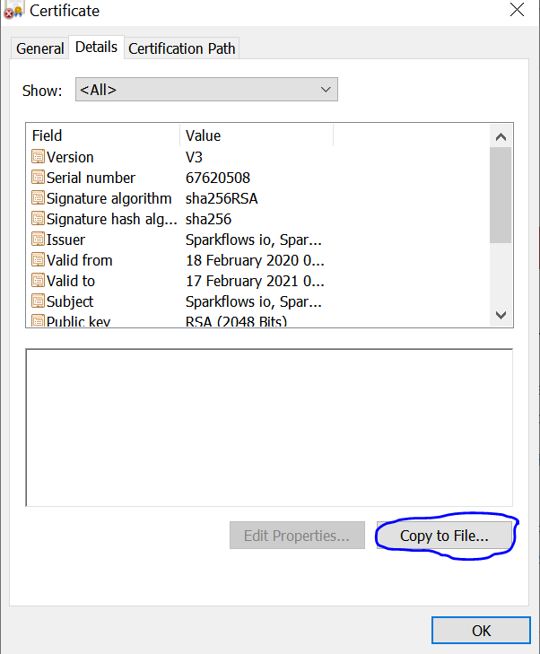
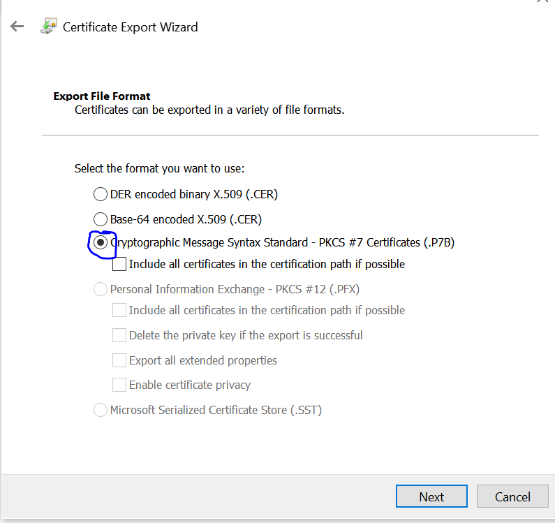
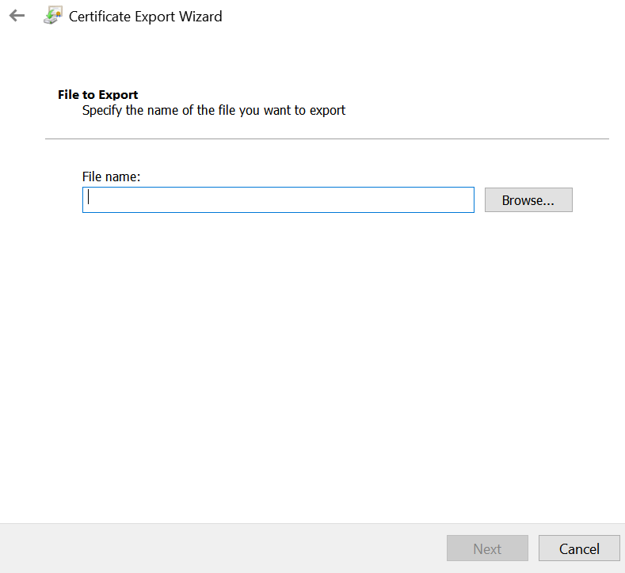
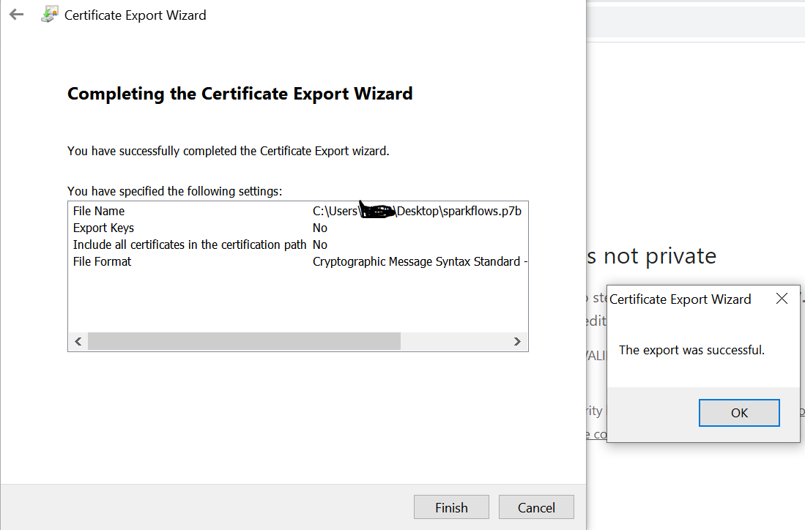
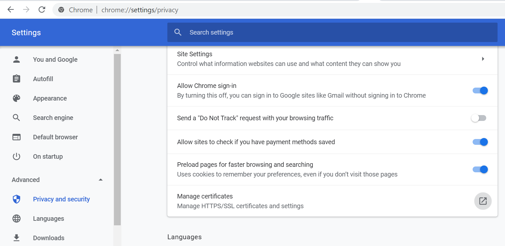
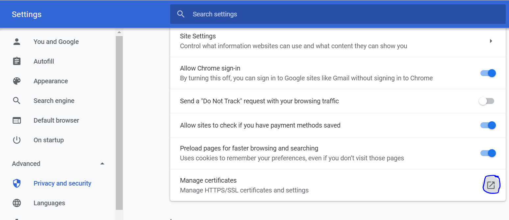
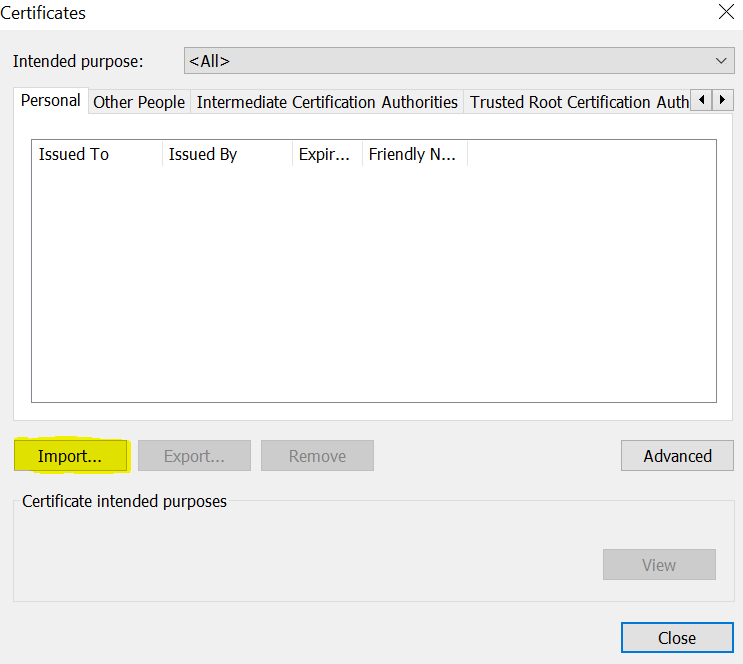

HTTPS : Self-Signed Certificates
================================

Fire Insights comes with a self-signed certificate. It is contained in conf/keystore.jks.

When using the self-signed certificate, the Browser will complain as it has not been issued by a Certificate Authority.

This warning message can be supressed by importing the self-signed certificate into the Browser  inside  ``Trusted Root Certification Authorities``.

Below are the steps for it.

- Login to `URL` which is running on `HTTPS` port.
   - https://privateip:8443/login

.. figure:: ../_assets/configuration/Url_https.PNG
   :alt: certificate
   :align: center
   :width: 60%
   
- Click on ``Not secure`` option.
 
.. figure:: ../_assets/configuration/Notsecure.PNG
   :alt: certificate
   :align: center
   :width: 60%
   
- Click on ``Certificate``.

   
   

- View ``Certificate``.

- Click on ``Details`` option.

- Click on ``copy to  file`` option.

- Select below option and press ``Next``.

   
- Select the ``Name & file location`` of certificate.

- After Upadating details ``Success msg`` will apear.

- Once the above steps Completed Successfully, Need to add certificate to Browser
   - Using Google chrome
   
- Go to below location after opening ``Googlechrome``.
   - Settings -> Advanced -> Privacy and Security-> Manage Certificates 
   

- Click on ``Manage Certicate`` icon.

- Click on ``import``.

