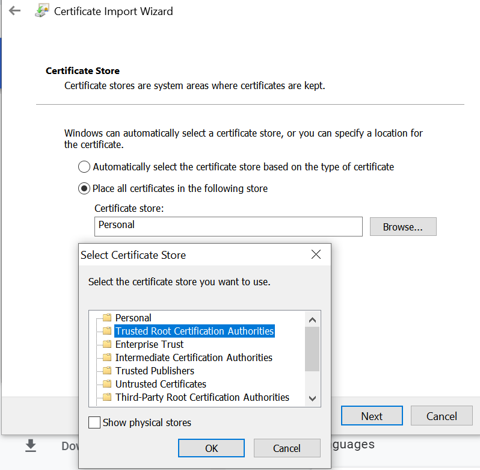
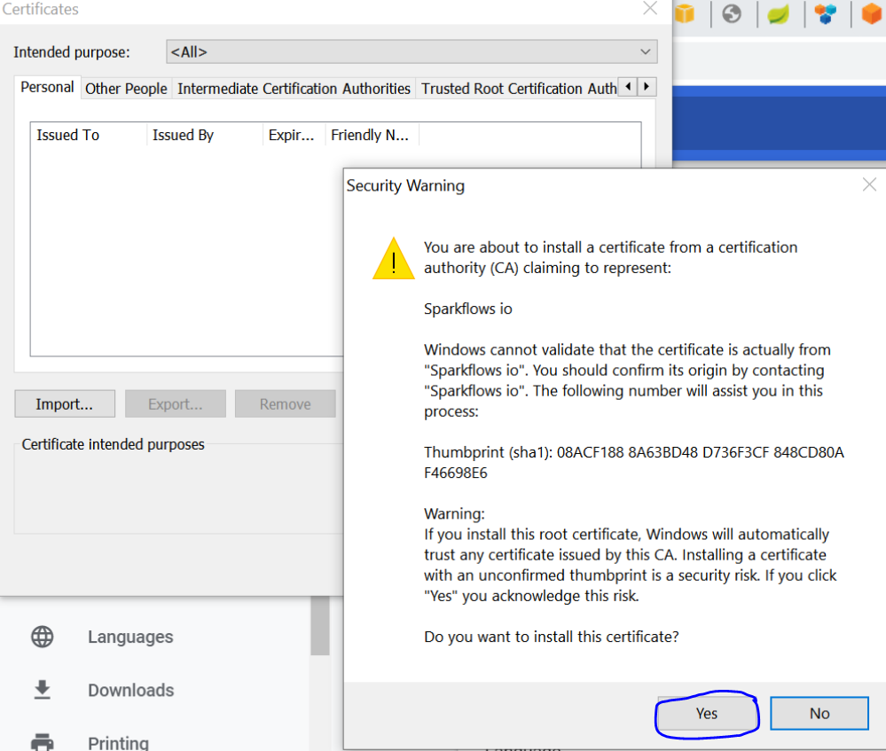
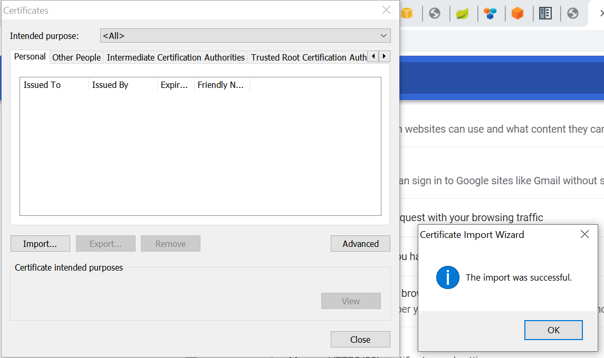
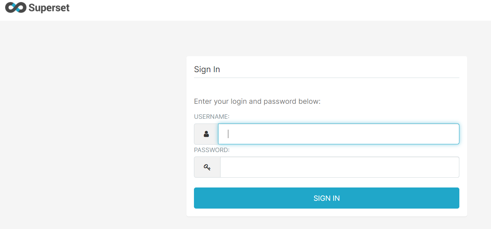

HTTPS : Importing Self-Signed Certificates
================================

Fire Insights comes with a self-signed certificate. It is contained in conf/keystore.jks.

When using the self-signed certificate, the Browser will complain as it has not been issued by a Certificate Authority.

This warning message can be supressed by importing the self-signed certificate into the Browser  inside  ``Trusted Root Certification Authorities``.

Below are the steps for importing self-signed certificate into your Browser.

Export the certificate to your machine
--------------------------------------------

- Got to ``URL`` for the ``HTTPS`` port.
   - https://privateip:8443/login

.. figure:: ../_assets/configuration/Url_https.PNG
   :alt: certificate
   :align: center
   :width: 60%
   
- Click on ``Not secure`` option.
 
.. figure:: ../_assets/configuration/Notsecure.PNG
   :alt: certificate
   :align: center
   :width: 60%
   
- Click on ``Certificate``.

.. figure:: ../_assets/configuration/certificate.PNG
   :alt: certificate
   :align: center
   :width: 60%
   
   

- View ``Certificate``.

.. figure:: ../_assets/configuration/viewcertificate.PNG
   :alt: certificate
   :align: center
   :width: 60%

- Click on ``Details`` option to see detail information of certificate.

.. figure:: ../_assets/configuration/certificatedetails.PNG
   :alt: certificate
   :align: center
   :width: 60%

- Click on ``copy to  file`` option to copy certificate to ``local machine``.

.. figure:: ../_assets/configuration/copyfile.PNG
   :alt: certificate
   :align: center
   :width: 60%

- Select below option and press ``Next``.

.. figure:: ../_assets/configuration/exportfile.PNG
   :alt: certificate
   :align: center
   :width: 60%
   
- Select the ``Name & file location`` of certificate.

.. figure:: ../_assets/configuration/filelocation.PNG
   :alt: certificate
   :align: center
   :width: 60%

- After upadating the details ``Success msg`` will apear.

.. figure:: ../_assets/configuration/exportcertificate.PNG
   :alt: certificate
   :align: center
   :width: 60%

Next we need to add the exported certificate to the Browser.

   
Add Certificate to Browser
--------------------------
 
- Using Google chrome
   
- Go to below location after opening ``Google Chrome``.
   - Settings -> Advanced -> Privacy and Security-> Manage Certificates 
   

.. figure:: ../_assets/configuration/managecertificate.PNG
   :alt: certificate
   :align: center
   :width: 60%

- Click on ``Manage Certificate`` icon.

.. figure:: ../_assets/configuration/managebrowsecert.PNG
   :alt: certificate
   :align: center
   :width: 60%

- Click on ``import``.

.. figure:: ../_assets/configuration/import.PNG
   :alt: certificate
   :align: center
   :width: 60%

- Select ``certificate from local system``, use ``Trusted Root Certification Authorities`` option and press ``yes`` to save it.

   

- Once the above process is complete, close the ``browser`` and start again and try to login with above ``URL``, It should work without any warnings.

   

* Help Url: https://peacocksoftware.com/blog/make-chrome-auto-accept-your-self-signed-certificate 

