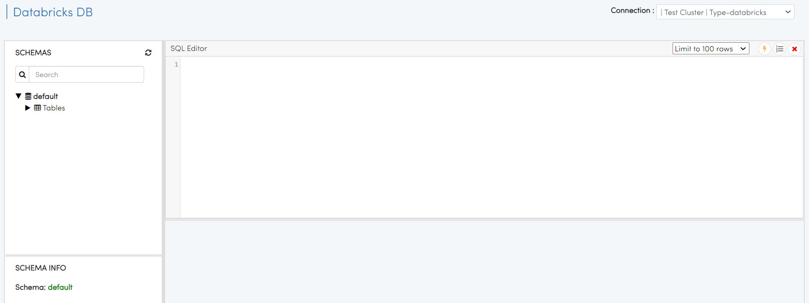
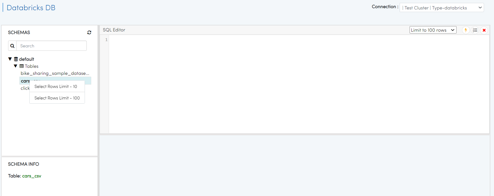
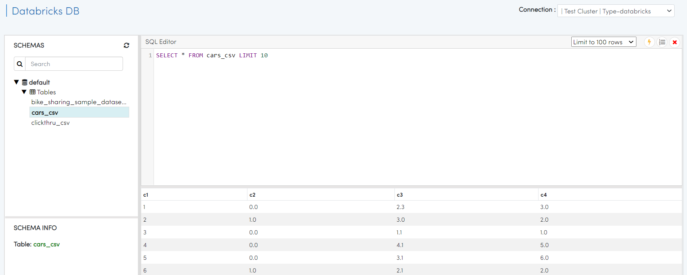

Browsing Databricks Tables
===========================

Fire Insights allows you to Browse your Databricks Databases & Tables.

Go to Data/Databricks DB
----------------------

It will display the Databricks DB page.

Select the Tables 
----------------------

Once you select a Table, right-click on it to get the query to view the first few records from the table.

   
Execute the SQL query to view records from the table selected.

