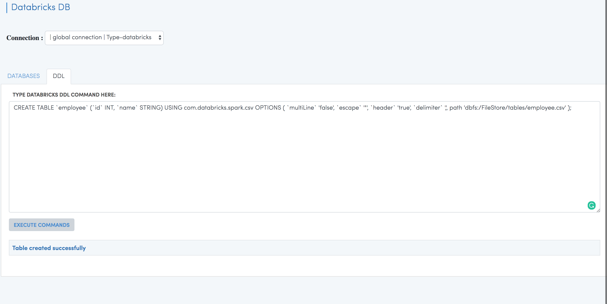
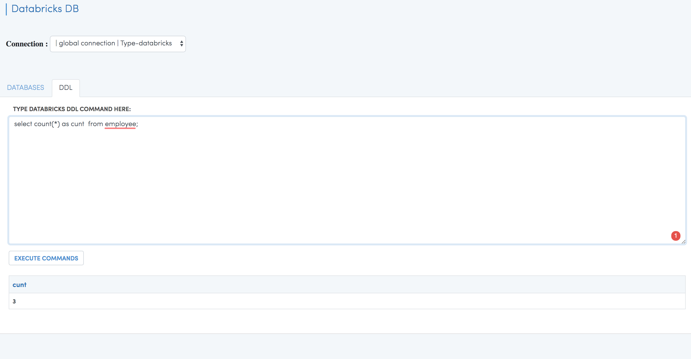
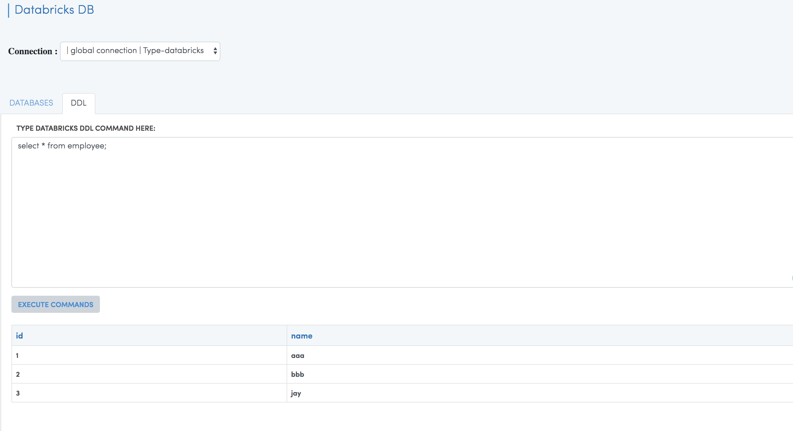
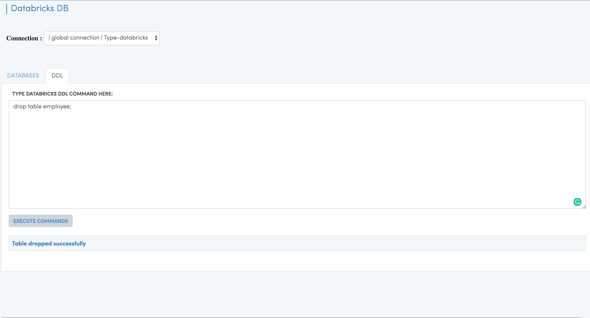

Run DDL Commands
===========================

Fire Insights allows you to run DDL commands on Databricks.

With this, one can:

  - Create New Databases
  - Create New Tables
  - View the schema of the tables
  - And many more

Go to DATABROWSERS/Databricks DB. Then click on DDL.

Databricks has a good page on Creating New Tables:

https://docs.databricks.com/spark/latest/spark-sql/language-manual/create-table.html

Below are example of running DDL
--------------------------------

Creating Database
+++++++++++++++++

* DDL Statement::

    CREATE DATABASE finance; 
    
Creating Table
++++++++++++++

* DDL Statement::

    CREATE TABLE `employee` (`id` INT, `name` STRING) USING com.databricks.spark.csv OPTIONS ( `multiLine` 'false', `escape` '"', `header` 'true', `delimiter` ',', path 'dbfs:/FileStore/tables/employee.csv' ); 

* DDL Statement::

    CREATE TABLE `housing` (`id` INT, `price` DOUBLE, `lotsize` INT, `bedrooms` INT, `bathrms` INT, `stories` INT, `driveway` STRING, `recroom` STRING, `fullbase` STRING, `gashw` STRING, `airco` STRING, `garagepl` STRING, `prefarea` STRING) USING com.databricks.spark.csv OPTIONS ( `multiLine` 'false', `escape` '"', `header` 'true', `delimiter` ',', path 'dbfs:/FileStore/sample-data/data/housing.csv' )

* DDL Statement::

    CREATE TABLE `bike_sharing_sample_dataset` (`datetime` STRING, `season` INT, `holiday` INT, `workingday` INT, `weather` INT, `temp` DOUBLE, `atemp` DOUBLE, `humidity` INT, `windspeed` DOUBLE, `casual` INT, `registered` INT, `count` INT) USING com.databricks.spark.csv OPTIONS ( `multiLine` 'false', `escape` '"', `header` 'true', `delimiter` ',', path 'dbfs:/FileStore/sample-data/bike_sharing_sample_dataset.csv' )

Location of the data could be changed to S3 location.

   

Running SQL
+++++++++++

* Select SQL Statement::

    select count(*) as count  from employee;

   

Sample Data:
++++++++++++

* Select SQL Statement::

    select * from employee;
    
By default, the first 100 rows of data are displayed.

   
 
 
Drop Table
++++++++++

* Drop Statement::

    drop table employee;

