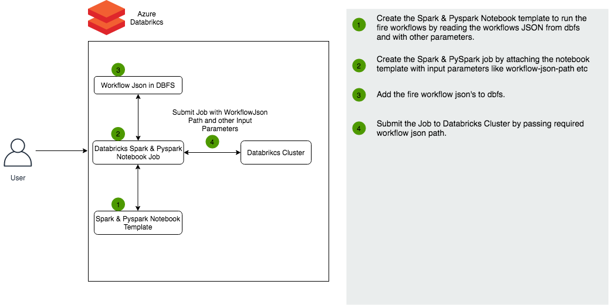

Execute Workflow without Fire Insights
==================

Workflows created in Fire Insights can be run on Databricks without the necessity of having Fire Insights installed.

Architecture Diagram
----------

Below are the high level steps for it:

#. Export the workflow from Fire Insights as JSON file.
#. Uplod the workflow JSON to DBFS.
#. Upload the Fire Insights libraries into the Databricks Cluster.
#. Create a Notebook and attach it to Databricks Cluster which has Fire Insights Library installed.
#. Execute the Notebook.
  
Steps for Running Scala Workflows
--------------

Step 1 : Export and Upload the workflow JSON to DBFS
++++++

As the first step, export the workflow as JSON files and upload to a DBFS folder.

Note that the workflow might be a Spark/Scala workflow or a PySpark workflow.

Step 2 : Upload Fire Core JAR
++++++++++++++++++++++

Upload the **fire-x.y.z/fire-core-lib/fire-spark_2_4-core-3.1.0-jar-with-dependencies.jar** file to Databricks as a Library under Workspace.

Step 3 : Create a Notebook in Databricks
++++++++++++

Suppose the workflow json is available at **dbfs:/workflows/test_csv_scala.json**.

In order to execute it, create a Notebook with the below code::

    # Create Input Parameters
    
    dbutils.widgets.text("job-id", "100")
    dbutils.widgets.text("postback-url", "")
    dbutils.widgets.text("workflowJsonPath", "dbfs:/workflows/test_csv_scala.json")
    dbutils.widgets.text("programParameters", "")
    
::

    # Get the values of Input Parameters
    
    val jobId = dbutils.widgets.get("job-id")
    val webserverURL = dbutils.widgets.get("postback-url")
    val workflowJsonPath = dbutils.widgets.get("workflowJsonPath")
    var programParameters = dbutils.widgets.get("programParameters")
    val debug = "false"
    val username = ""

::

    # Adding the scope, user, password and url of secrets to parameter, if any.
    
    programParameters = programParameters.trim + " --var databricks_scope=db_secrets_scope --var sf_user_key=sfUser --var sf_password_key=sfPassword --var sf_url_key=sfUrl"
    
    
::

    # Read the workflow json.
    
    import org.apache.commons.lang3.StringEscapeUtils
    val workflowjson = spark.read.textFile(workflowJsonPath).take(1)(0)

::

    # Execute the workflow.
    
    import fire.execute.WorkflowExecuteDatabricks
    WorkflowExecuteDatabricks.execute(webserverURL, jobId, workflowjson, debug, username, programParameters.trim)
    

Step 4 : Create the Spark Job in Databricks
++++++++++++++++

Create the Spark Job by attaching the notebook template with input parameters like workflow-JSON-path, etc.

Step 5 : Submit the Spark Job to Databricks Cluster
++++++++++++++++

Submit the Spark Job to Databricks cluster by passing the required workflow JSON path.

Steps for Running PySpark Workflows
-------------

Step 1 : Export and Upload the workflow JSON to DBFS
++++++

As the first step, export the workflow as JSON files and upload to a DBFS folder.

Note that the workflow might be a Spark/Scala workflow or a PySpark workflow.

Step 2 : Upload Fire Wheel File to DBFS
++++++++++++++

Upload the **fire-x.y.z/dist/fire-3.1.0-py3-none-any.whl** file to Databricks. 

You can either upload it under Workspace as a Library onto Databricks or place it in an S3 Bucket that is accessible from the Databricks Cluster.

Step 3 : Create Notebook
++++++++++++

Suppose the workflow json is available at **dbfs:/workflows/Join_Workflow.json**.

In order to execute it, create a Notebook with the below code::

    # Create Input Parameters
    
    dbutils.widgets.text("job-id", "100")
    dbutils.widgets.text("postback-url", "")
    dbutils.widgets.text("workflowJsonPath", "dbfs:/workflows/Join_Workflow.json")
    dbutils.widgets.text("programParameters", "")
    
::

    # Get the values of Input Parameters
    
    jobId = dbutils.widgets.get("job-id")
    webserverURL = dbutils.widgets.get("postback-url")
    workflowJsonPath = dbutils.widgets.get("workflowJsonPath")
    programParameters = dbutils.widgets.get("programParameters")
    
::

    # Print the Input Parameters
    
    print("jobId: "+jobId)
    print("webserverURL: "+webserverURL)
    print("workflowJsonPath: "+workflowJsonPath)
    print("programParameters: "+programParameters)

::

    # Import the WorkflowExecuteDatabricks and call the execute method by passing parmaters.
    
    from fire.databricks.workflow_execute import WorkflowExecuteDatabricks
    debug = False
    username = ""
    WorkflowExecuteDatabricks.execute(webserverURL = webserverURL, jobId = jobId, 
                                      workflowJsonPath = workflowJsonPath, debug = debug, username = username,
                                      program_parameters = programParameters)
    
 
Step 4 : Create the PySpark Job in Databricks
++++++++++++++++

Create the PySpark Job by attaching the notebook template with input parameters like workflow-JSON-path, etc.

Step 5 : Submit the Pyspark Job to Databricks Cluster
++++++++++++++++

Submit the Pyspark Job to Databricks cluster by passing the required workflow JSON path.
 
 
.. note::  Make sure to verify that the workflow JSON path in DBFS is accessible and above Notebook is attached to Databricks Cluster with required Fire Insights library.
