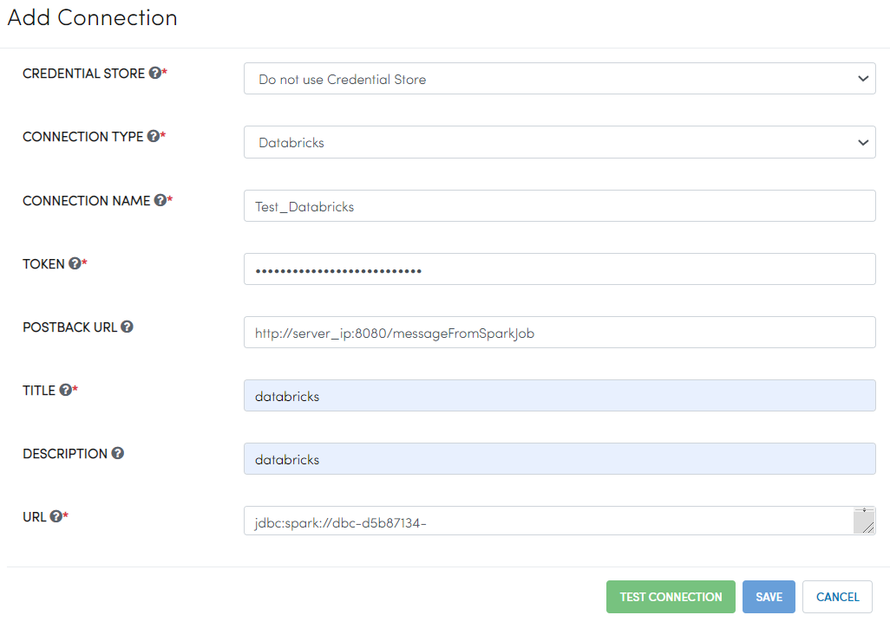

Databricks Integration Steps
======================

Fire Insights integrates with Databricks. It submits jobs to the Databricks clusters using the REST API of Databricks and have the results displayed back in Fire Insights.

Fire also fetches the list of Databases and Tables from Databricks, making it easier for the user to build their workflows and execute them. 

In addition fire displays the list of Databricks clusters running for the user.

Databricks can be running on Azure or on AWS.

* Running Databricks on Azure : `Azure-Databricks Documentation <https://docs.microsoft.com/en-us/azure/azure-databricks/quickstart-create-databricks-workspace-portal>`_
* Running Databricks on AWS : `AWS-Databricks Documentation <https://databricks.com/aws>`_

Below are the steps for Integrating Fire Insights with your Databricks clusters.

Step 1 : Install Fire Insights
^^^^^^^^^^^^^^^^

To begin, install Fire Insights on any machine. Ensure that this machine is accessible from your Databricks cluster.

Step 2 : Upload Fire Core JAR to Databricks
^^^^^^^^^^^^^^

Fire Insights relies on a specific JAR file to execute tasks within Databricks. 

This JAR file, named **fire-spark_3.2.1-core-3.1.0-jar-with-dependencies.jar**, must be uploaded under Workspace as a Library on to Databricks. 

You can do this by following these steps:

#. **Login** to your **Databricks Account** using your credentials.
#. Click on **Workspace** located on the left side pane.
   
   .. figure:: ../../_assets/configuration/azure_workspace.PNG
      :alt: Databricks
      :width: 40%
   
#. Create a new **Library**.

   .. figure:: ../../_assets/configuration/library_create.PNG
      :alt: Databricks
      :width: 40%

#. Upload JAR File **fire-spark_3.2.1-core-3.1.0-jar-with-dependencies.jar** either from your machine or
   
   use the download link from the previous step by selecting the **Drop JAR here** option.

   .. figure:: ../../_assets/configuration/upload-library.png
       :alt: Databricks
       :width: 40%
   
#. Once **fire-spark_3.2.1-core-3.1.0-jar-with-dependencies.jar** is uploaded, click on **Create**.

   .. figure:: ../../_assets/configuration/createlibrary.PNG
      :alt: Databricks
      :width: 40%
   
#. Check the box with **Install automatically on all clusters**, in order to avoid having to install it manually on every cluster.   

   .. figure:: ../../_assets/configuration/automatic_install.PNG
      :alt: Databricks
      :width: 40%

   .. note:: This option is not compatible with clusters using Runtime version 7.0 or higher.
   

Step 3 : Create REST API Token in Databricks
^^^^^^^^^^^^^^

To facilitate communication between Fire Insights and Databricks via REST API calls, a token must be generated in your Databricks account. 

Follow these steps to create your token:

#. **Login** to your **Databricks Account** using your credentials.
#. Click on **User Settings**.

   .. figure:: ../../_assets/configuration/user-setting.png
      :alt: Databricks
      :width: 60%

#. Click on **Generate New Token**.

   .. figure:: ../../_assets/configuration/generatetoken.PNG
      :alt: Databricks
      :width: 60%

#. Add **Comment & Lifetime(days)** for token expiry & click on **Generate**.

   .. figure:: ../../_assets/configuration/token_update.PNG
      :alt: Databricks
      :width: 60%

#. Copy the token generated and click on **DONE**.

   .. figure:: ../../_assets/configuration/token_generated.PNG
      :alt: Databricks
      :width: 60%

Step 6 : Create Databricks Connection in Fire Insights
^^^^^^^^^^^^^^

The connection can be created by the **Administrator** under **Administration/Global Connections**. These connections are available for everyone to use. It can also be created by any user with their Application. In this case, it is only available to the Application and its users.

Refer the below table for more details on parameter settings:

.. list-table:: 
   :widths: 25 25 50
   :header-rows: 1

   * - Title
     - Description
     - Value
   * - CREDENTIAL STORE  
     - Select the Credential Store from drop-down
     - Choose specific Credential Store from drop-down or select Do not use Credential Store
   * - CONNECTION TYPE 
     - Select the Connection type from drop-down
     - Choose Databricks as Connection Type
   * - CONNECTION NAME
     - Connection Name
     - Add a unique Connection Name
   * - TOKEN 
     - Token
     - Add token generated
   * - POSTBACK URL
     - Fire Insights Post Back URL
     - Add Fire Insights Post Back URL
   * - TITLE 
     - Title for selected Connection
     - Add a unique Title
   * - DESCRIPTION
     - Connection Description
     - Add some Connection Description
   * - URL
     - JDBC URL for databricks connection
     - Add JDBC URL for Databricks Connection
     

More details on creating these connections can be found here : `Create Databricks Connection <https://docs.sparkflows.io/en/latest/installation/connection/compute-connection/databricks.html>`_

.. note:: Please make sure to specify a POSTBACK URL. This is the address where results from Databricks jobs will be sent to Fire Insights. If you don't provide one, the system will automatically use the **app.postMessageURL** updated by default in configurations.

With these steps completed, you're now ready to harness the power of the Databricks Connection within Fire Insights. This integration allows you to seamlessly:

* Browse Databricks File System (DBFS).
* Access information about your Databricks Clusters.
* Explore your Databricks Databases and Tables.
* Create workflows that read from and write to Databricks, enhancing your data processing capabilities.

