Databricks Integration Steps
======================

Fire Insights integrates with Databricks. It submits jobs to the Databricks clusters using the REST API of Databricks and have the results displayed back in Fire Insights.

Fire also fetches the list of Databases and Tables from Databricks, making it easier for the user to build their workflows and execute them. In addition fire displays the list of Databricks clusters running for the user.

Databricks can be running on Azure or on AWS.

* Running Databricks on Azure : https://docs.microsoft.com/en-us/azure/azure-databricks/quickstart-create-databricks-workspace-portal
* Running Databricks on AWS : https://databricks.com/aws

Below are the steps for Integrating Fire Insights with your Databricks clusters.

Install Fire Insights
^^^^^^^^^^^^^^^^

Install Fire Insights on any machine. The machine has to be reachable from the Databricks cluster.

Upload Fire Core Jar to Databricks
^^^^^^^^^^^^^^

Fire Insights jar has to be uploaded to Databricks. Fire Insights jobs running on Databricks make use of this jar file.

Upload ``fire-x.y.z/fire-core-lib/fire-spark_3.2.1-core-3.1.0-jar-with-dependencies.jar`` to Databricks. Upload it under Workspace as a Library on to Databricks.

1. Login to your ``Databricks Account``.

2. Click on ``Workspace`` located on the left side pane.

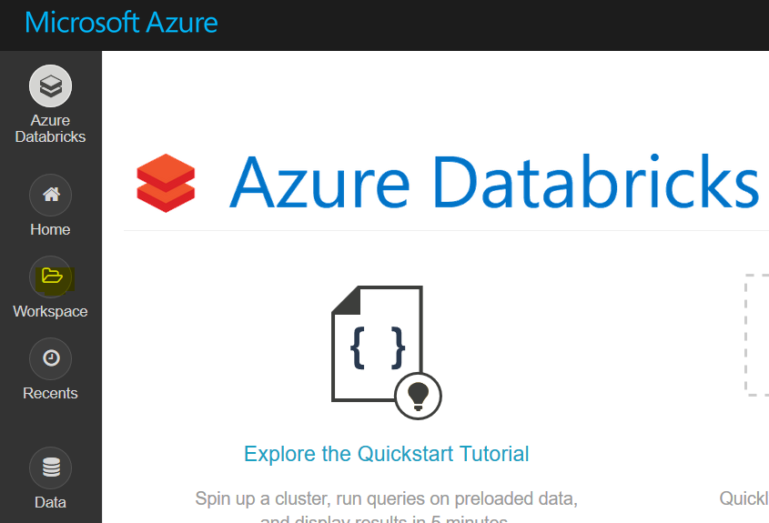
   
3. Create a new **Library**.

 
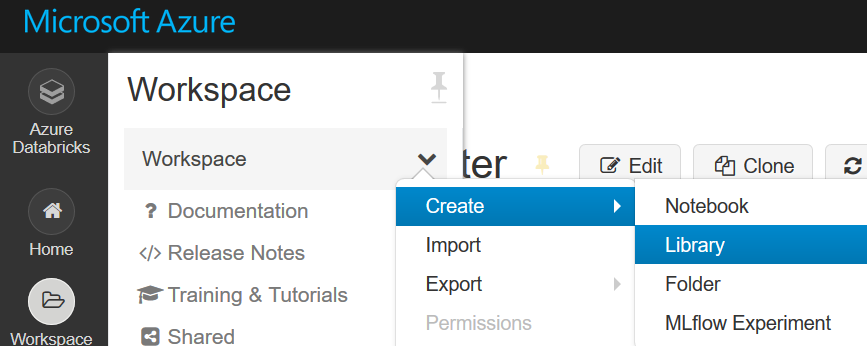

4. Upload ``fire-spark_3.2.1-core-3.1.0-jar-with-dependencies.jar`` from your machine or from Download link added in previous step by clicking on ``Drop JAR here``.

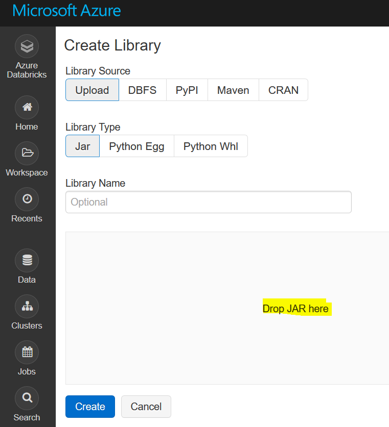
   
5. Once ``fire-spark_3.2.1-core-3.1.0-jar-with-dependencies.jar`` is uploaded, click on ``Create``.

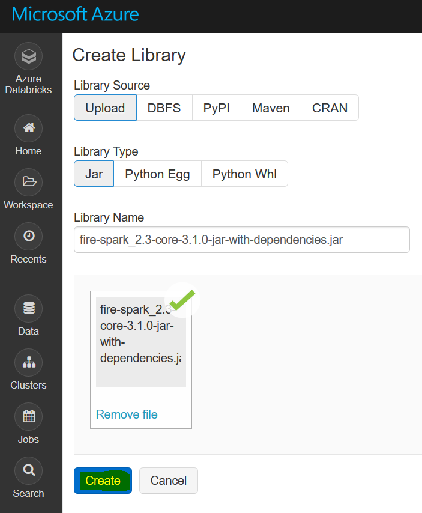
   
* Check the box with ``Install automatically on all clusters``, in order to avoid having to install it manually on every cluster.   

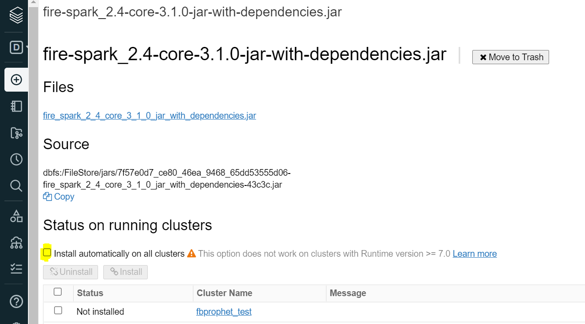

.. note::  This option does not work on clusters with Runtime version >= 7.0.
   
Configure the Uploaded Library in Fire Insights
^^^^^^^^^^^^^^^

Configure the path of the uploaded fire core jar library in Databricks in Fire Insights.

This has to be done under Administration/Configuration.

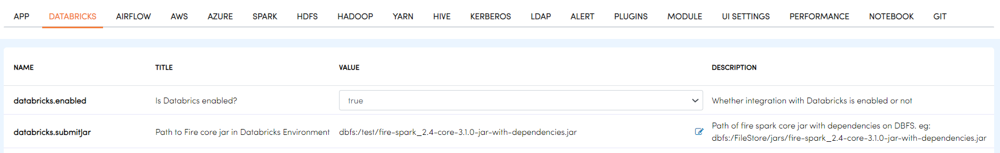
   
   
Configure app.postMessageURL in Fire Insights
^^^^^^^^^^^^^^^^^^^^

Configure ``app.postMessageURL`` to be the IP of the machine on which Fire Insights is installed. Jobs running on Databricks would post back results to the Fire Insights using this URL.

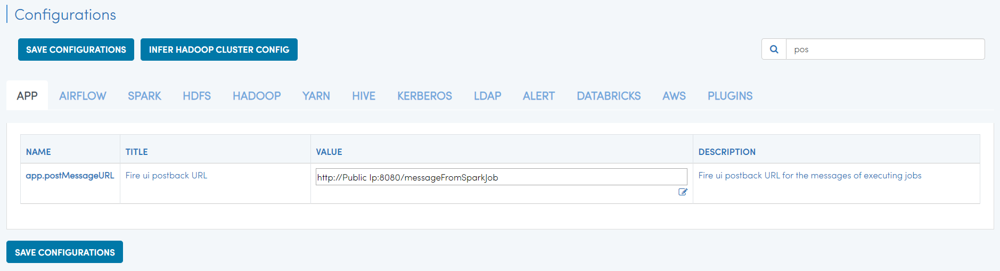

Create your REST API token in Databricks
^^^^^^^^^^^^^^

Create your token in Databricks. It would be used in making REST API calls to Databricks from Fire Insights.

1. Login to your Databricks Account.

2. Click on ``Account`` icon located on the top right corner.

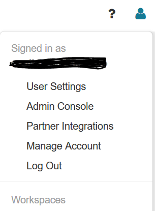
   
3. Click on ``User Settings``.

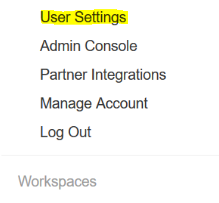

4. Click on ``Generate New Token``.

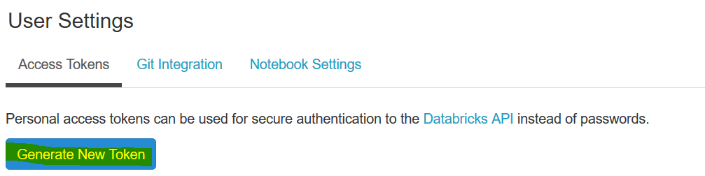

5. Add ``comment`` & ``Lifetime(days)`` for token expiry & click on ``Generate``.

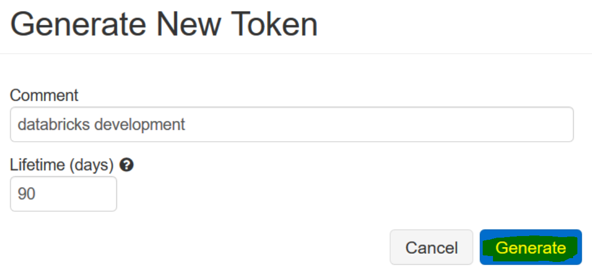

6. Copy the token generated. Click on ``DONE``.

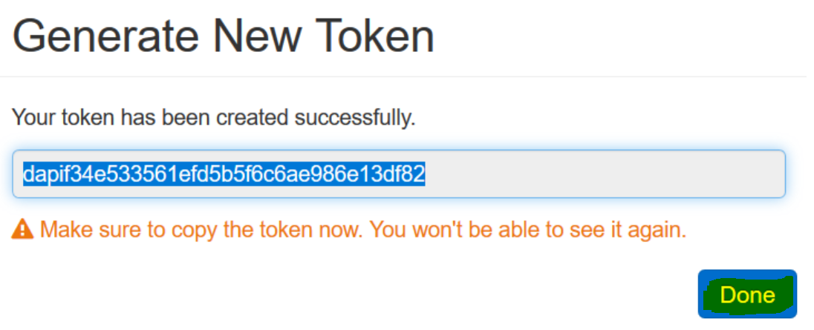

Create Databricks Connection in Fire Insights
^^^^^^^^^^^^^^

Create a connection in Fire Insights to Databricks. 

It can be created by the Administrator under Administration/Global Connections. These connections are available for everyone to use.

It can also be created by any user with their Application. In this case, it is only available to the Application and its users.

.. list-table:: 
   :widths: 10 20 20
   :header-rows: 1

   * - Title
     - Description
     - Value
   * - CREDENTIAL STORE  
     - Select the Credential Store from drop-down
     - Choose specific Credential Store from drop-down or select Do not use Credential Store
   * - CONNECTION TYPE 
     - Select the Connection type from drop-down
     - Choose Databricks as Connection Type
   * - CONNECTION NAME
     - Connection Name
     - Add a unique Connection Name
   * - TOKEN 
     - Token
     - Add token generated
   * - POSTBACK URL
     - Fire Insights Post Back URL
     - Add Fire Insights Post Back URL
   * - TITLE 
     - Title for selected Connection
     - Add a unique Title
   * - DESCRIPTION
     - Connection Description
     - Add some Connection Description
   * - URL
     - JDBC URL for databricks connection
     - Add JDBC URL for Databricks Connection
     

.. figure:: ../../_assets/configuration/connection_databricks.PNG
   :alt: Databricks Connection
   :width: 40%

.. note:: Make sure to add POSTBACK URL through which Jobs running on Databricks would post back results to Fire Insights using this URL or else it will take from ``app.postMessageURL``, added in configuration.

Now, we are ready to start using the Databricks Connection in Fire Insights to:

* Browse DBFS.
* View your Databricks Clusters.
* Browse your Databricks Databases & Tables.
* Create workflows which Read from and Write to Databricks.

