Databricks Python Integration Steps
======================

Fire Insights integrates with Databricks and can submit Python jobs. 

It submits jobs to the Databricks clusters using the REST API of Databricks and have the results displayed back in Fire Insights.

This document explains in detail the steps needed for Integrating Fire Insights with Databricks clusters for running Python jobs.

.. note::  The Machine on which Fire Insights is installed should have Python 3.7.0 or above.

Follow the steps given below :

Step 1 : Install Python
----------

* To install Python on Red Hat and CentOS, follow the steps given at the below link:
  
  `Python Installation Steps for Red Hat and CentOS <https://docs.sparkflows.io/en/latest/installation/installation/python-install-redhat-centos.html>`_

* To install Python on Ubuntu, follow the steps given at the below link:
  
  `Python Installation Steps for Ubuntu <https://docs.sparkflows.io/en/latest/installation/installation/python-install-ubuntu.html>`_

* To install Python on MacOS, follow the steps given at the below link: 
  
  `Python Installation Steps for MacOS <https://docs.sparkflows.io/en/latest/installation/installation/python-install-macos.html>`_

Step 2 : Install Fire Insights
-----------

Install Fire Insights on your machine. The machine has to be accessible from the Databricks cluster.

Step 3 : Upload Fire Wheel File to Databricks
----------------------------------
Fire Insights wheel file has to be uploaded to Databricks. Fire Insights jobs running on Databricks make use of this wheel file.

Upload the file, **fire-x.y.z/dist/fire-3.1.0-py3-none-any.whl**, either under Workspace as a Library on to Databricks under DBFS or in S3 Bucket which is accessible from the Databricks Cluster.

   .. figure:: ../../_assets/configuration/wheelfile.PNG
      :alt: Wheel File
      :width: 90%

To be able to upload, follow the below steps :

#. Login to **Databricks Cluster**.
#. Click on **Workspace** located in the left sidebar.

   .. figure:: ../../_assets/configuration/azure_workspace.PNG
      :alt: Databricks
      :width: 60%
   
#. Create a new **Library** by selecting :

   Library Source as **DBFS**
   
   Library Type as **Python Whl** 

   Next,  provide any **Library Name** field and
    
   Add File Path of **fire-3.1.0-py3-none-any.whl** located in DBFS.

   Finally, click on **Create**.

   .. figure:: ../../_assets/configuration/python-lib.PNG
      :alt: Databricks
      :width: 60%

#. Choose **Databricks cluster**.
   
   When you click the Create button, you will be prompted to **choose a specific Databricks Cluster** for installation. 
 
   Simply select the cluster on which you wish to install the application.

   .. figure:: ../../_assets/configuration/create.PNG
      :alt: Databricks
      :width: 60%
   
   .. figure:: ../../_assets/configuration/install.PNG
      :alt: Databricks
      :width: 60%
   
   On Successfull installation of wheel file on Databricks Cluster, it would be displayed under Libraries as shown below:

   .. figure:: ../../_assets/configuration/wheelpack.PNG
      :alt: Databricks
      :width: 70%

Another option is to upload ``fire-3.1.0-py3-none-any.whl`` file to S3 Bucket which is accessible from Databricks Cluster.

Once you upload ``fire-3.1.0-py3-none-any.whl`` file to S3 Bucket, login to Databricks Cluster & inside Libraries tab.

Install New Library & select ``DBFS/S3`` in Library Source, ``Python Whl`` in Library Type and copy/paste the location of python wheel file available in S3 in File Path & click on Install.

.. figure:: ../../_assets/configuration/s3wheel.PNG
   :alt: Databricks
   :width: 70%

Once it is installed successfully, you can see that the python wheel inside Library is up.

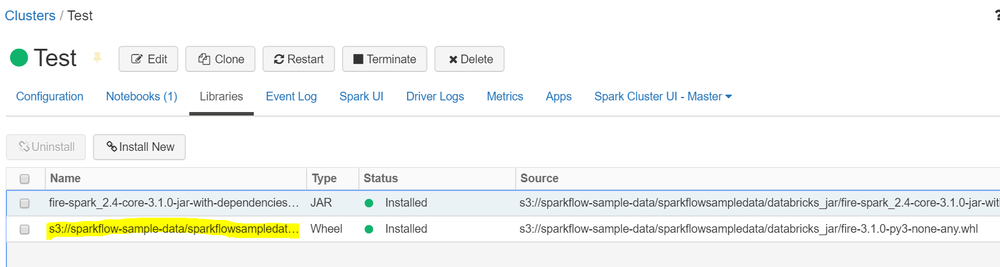

Install Python dependencies
-----------------------

You need to install the python dependencies required by Fire Insights on the machine by running the below command from ``fire-x.y.z/dist/fire/`` directory::

    pip install -r requirements.txt

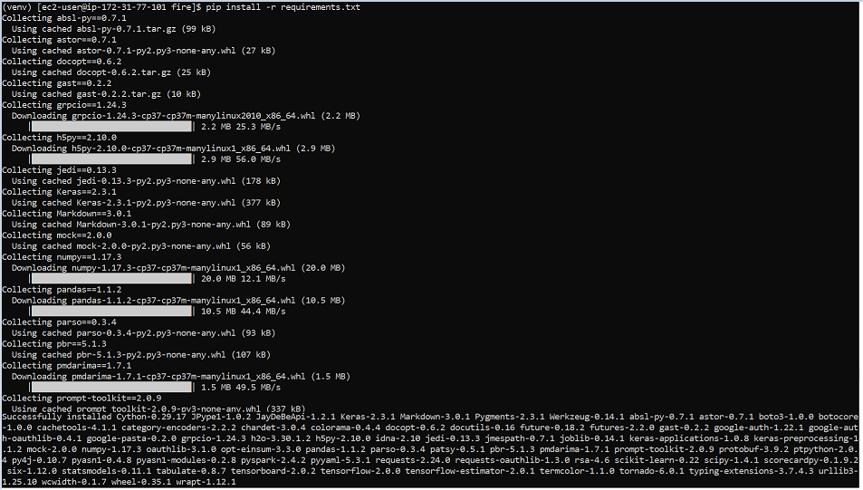

Note: Make sure that pip, etc. is already installed on that machine.

Install dependency for JDBC Driver
--------------------------

Copy the ``JDBC Driver`` jar to pyspark jar path. Once it is copied successfully, you can see the JDBC Driver jar inside pyspark jar path::

    cp -r SparkJDBC41.jar $PATH_VIRTUAL_ENV/venv/lib/python3.7/site-packages/pyspark/jars/

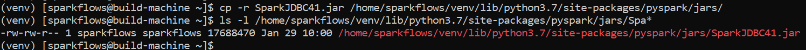
   
 

Install dependency for AWS
--------------------------

Copy the jars ``hadoop-aws`` and ``aws-java-sdk`` to pyspark jar path.

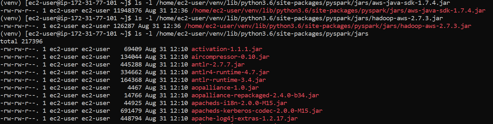

Install any specific package of Python if one needs to use in Custom Processors on Databricks Cluster as well as on Fire Insights Machine.

Use the command below to install it on the Fire Insights machine. ::

    pip install scorecardpy

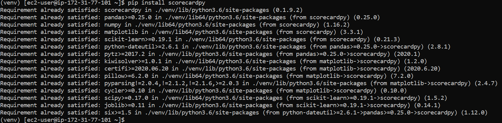

Install it on your Databricks cluster with the steps given below. ::

   * Open a Notebook and attach to Databricks Cluster.
   * %sh pip install scorecardpy

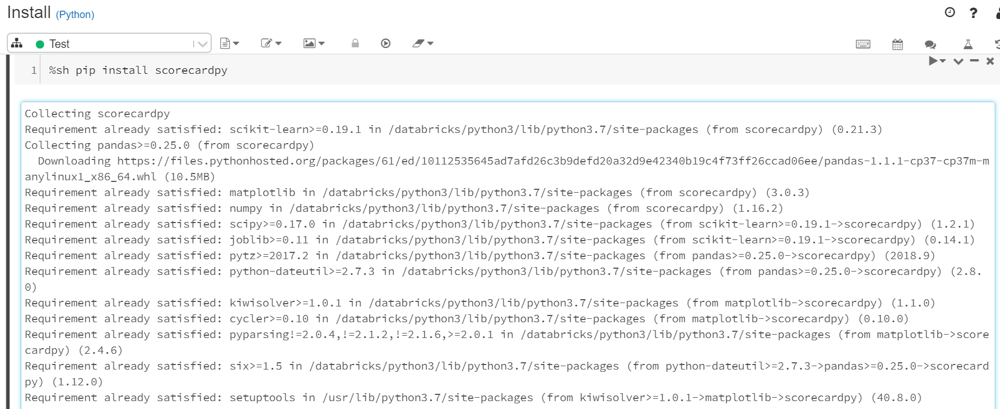

Install prophet package on databricks
-------------------------------------

Install the needed python package for prophet using Init script on databricks cluster.

::

    #!/bin/bash
    pip install pip==20.0.2
    pip uninstall -y pystan
    pip install pystan==2.19.1.1
    pip install numpy==1.17.3
    pip install prophet==1.1.1
    

Add above in a script file, upload in DBFS and go to Advanced Options, select Init Scripts and add DBFS path to it. 

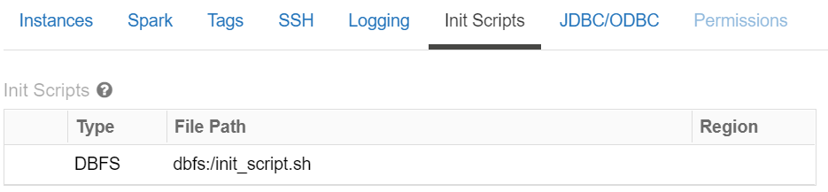

Upload Fire workflowexecutedatabricks.py file to DBFS
----------------------------------

For Python Job submission to Databricks Cluster:

Upload ``fire-x.y.z/dist/workflowexecutedatabricks.py``, file to DBFS or even  to S3 Bucket.

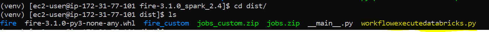

You can ``UPLOAD`` it, using DBFS browser too.

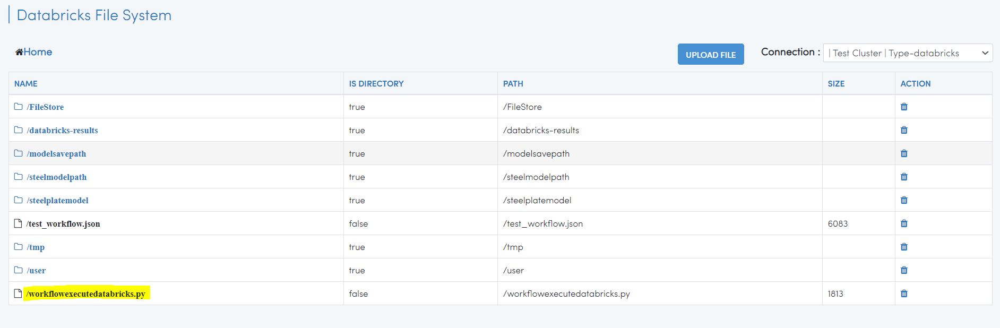

Configure the Uploaded Library in Fire Insights
------------------------------------

Configure the path of the uploaded fire python wheel package file & workflowexecutedatabricks.py under ``databricks.pythonFile`` & ``databricks.pythonPackages`` respectively in Fire Insights.

It can be two sources either ``DBFS`` or ``S3`` path.

If you have uploaded in ``DBFS`` path.

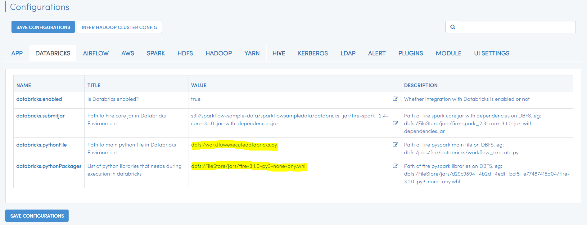

If you have uploaded in ``S3`` path.

.. figure:: ../../_assets/configuration/s3db_configure.PNG
   :alt: Databricks
   :width: 90%

Job Submission using Pyspark Engine
-----------------------------------

Now, you can submit pyspark jobs to Databricks Cluster from Fire Insights.

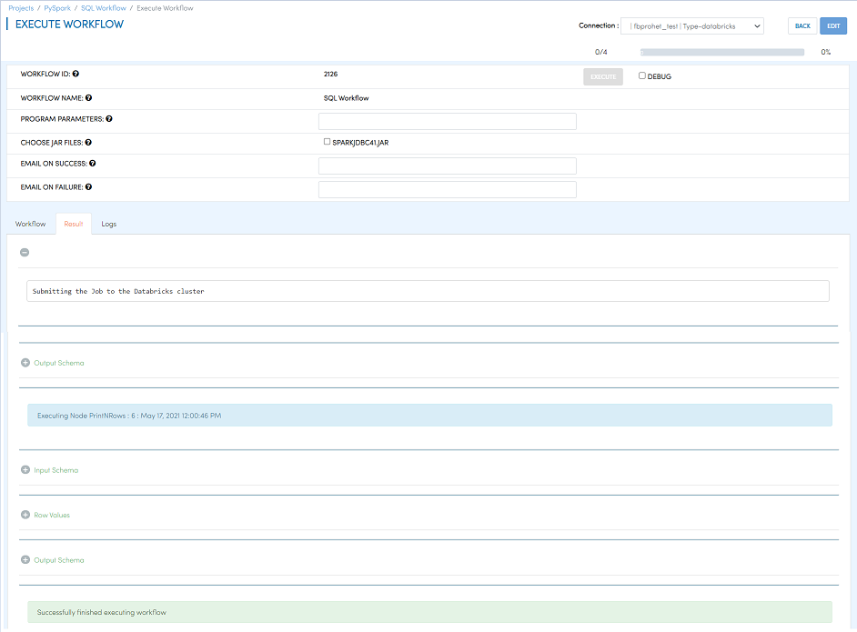

