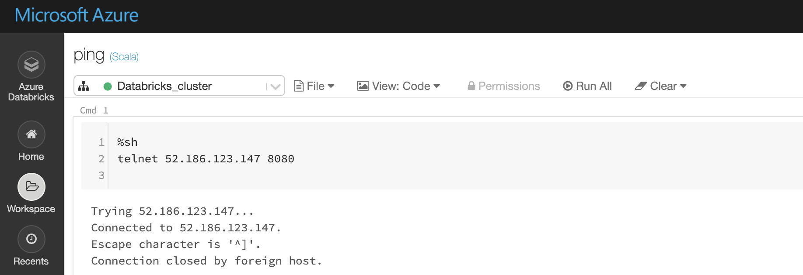

Troubleshooting Databricks Integration
===========================================

When the workflow is executed, nothing shows up in Fire
-----------------------------------------

One problem might be that the ``postback URL`` is not configured right in Sparkflows under Administration/Configuration.

The other problem can be that the machine running Sparkflows is not accessible from the Databricks Cluster. Test connectivity to the Sparkflows machine from Databricks.

Connectivity from Databricks to Fire postback URL can be done in Databricks via Notebooks using the telnet command.

   
   
When the workflow is executed, nothing shows up in Fire
-----------------------------------------

Another reason might be that you are using the Databricks ``High Concurrency`` cluster. Ensure that you are connecting Fire to Databricks ``Standard`` cluster or have enabled scala in the high concurrency cluster.

When accessing most of the Databricks pages in Fire, it gives Simba JDBC error
-----------------------------------------

The reason for it is that the Databricks Simba JDBC jar file is not deployed in Fire.

https://docs.sparkflows.io/en/latest/databricks/databricks-installation.html#install-databricks-jdbc-driver

In the workflow editor, it shows 'Cannot connect to Fire'
-------------------

Ensure that under ``Administration/Configuration``, app.runOnCluster is set to ``false``.

Checking the cluster logs in Databricks
-------------------

There are times when it is helpful to look at the Cluster logs in Databricks when running Fire with Databricks.

The following logs under ``Driver Logs`` are useful:

- log4j-active.log

Search for ``WorkflowExecuteDatabricks`` in the logs to view if the Sparkflows Job is running in Databricks.

java.lang.Exception: An error occurred while initializing the REPL. Please check whether there are conflicting Scala libraries or JARs attached to the cluster, such as Scala 2.11 libraries attached to Scala 2.10 cluster (or vice-versa).
	at com.databricks.backend.daemon.driver.DatabricksILoop$class.initSpark(DatabricksILoop.scala:98)
   
This error can happen when running spark 2.3 version of Fire with spark 2.4 cluster on Databricks.
Either upgrade Fire to spark 2.4 version, or create another Databricks cluster which supports spark 2.3.

Databricks Cluster Versions Support
------------------------------------

Databricks Runtime Version             Spark Version                Scala Version

7.3                                    3.0.1                        2.12

6.2                                    2.4.4                        2.11

6.3                                    2.4.4                        2.11

6.4                                    2.4.5                        2.11

6.5                                    2.4.5                        2.11

