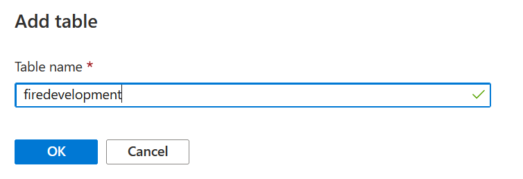
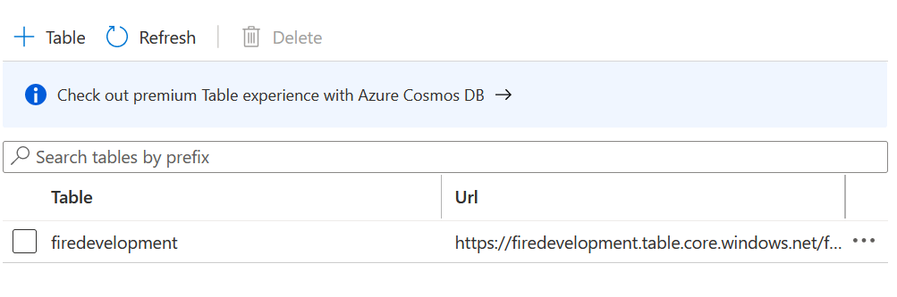

Azure Integration
=================

It explains how to create new table in ADLS.

Create Table in ADLS
--------------------

Below are steps involve in it:

1. Login to Azure account and go inside storage account

.. figure:: ../_assets/databricks/storage_account.PNG
   :alt: databricks
   :width: 40%

2. Select Tables in Table services and click Table

.. figure:: ../_assets/databricks/table.PNG
   :alt: databricks
   :width: 40%

3. Add Table name and press ok

   
4. On sucessful creation of Table you will see Table name in Table list

