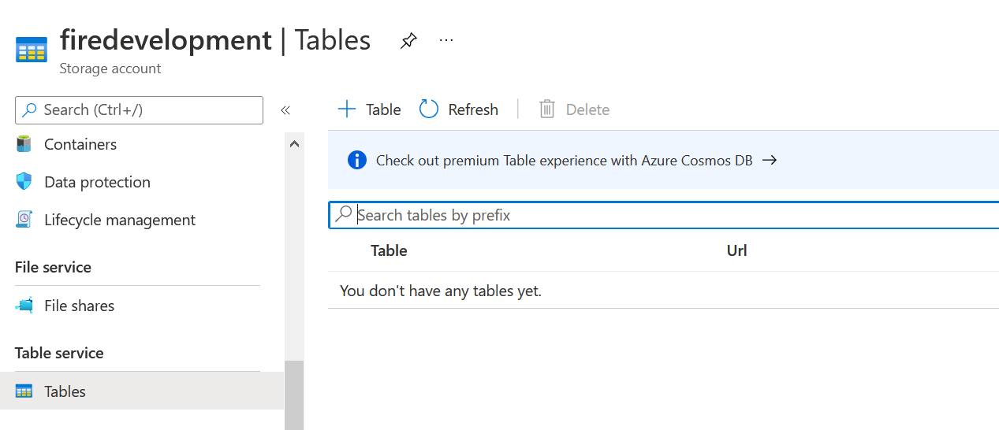
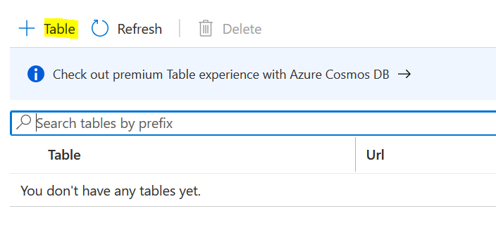

Azure Integration
=================

It explains how to create new table in ADLS.

Create Table in ADLS
--------------------

Below are steps involve in it:

1. Login to Azure account and go inside storage account

2. Select Tables in Table services

