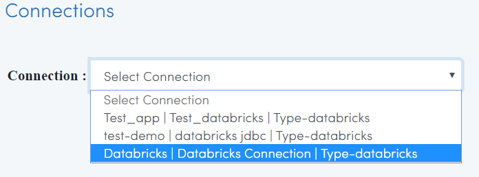

Browsing Databricks Tables
===========================

Fire Insights allows you to Browse your Databricks Database & Table.

Go to DATABROWSERS/Connections 
----------------------

It will display the various Databricks Connections in your Applications.

Select the relevant connection 
----------------------

It will use it for viewing the Databrick database & Table available.

.. figure:: ../_assets/configuration/databricks_database.PNG
   :alt: Databricks
   :align: center
   :width: 60%
   
Select CLUSTER tab  
-----------------------

It will show detail information of databrick cluster

.. figure:: ../_assets/configuration/databricks_cluster_details.PNG
   :alt: Databricks
   :align: center
   :width: 60%

