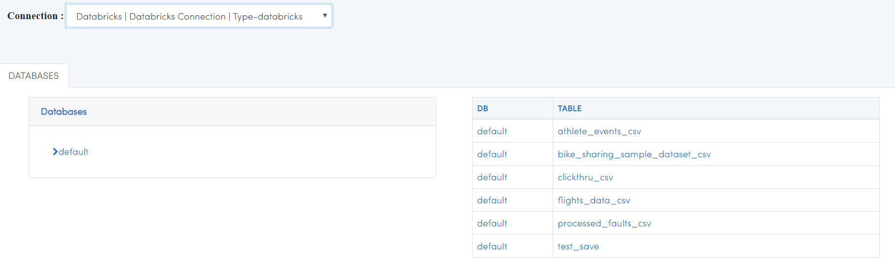

Browsing Databricks Tables
===========================

Fire Insights allows you to Browse your Databricks Database & Table.

Go to DATABROWSERS/Databricks DB
----------------------

It will display the various Databricks Connections in your Applications.

.. figure:: ../_assets/configuration/databricks_db.PNG
   :alt: Databricks
   :align: center
   :width: 60%

Select the relevant connection 
----------------------

It will use it for viewing the Databrick database & Table available.

   

